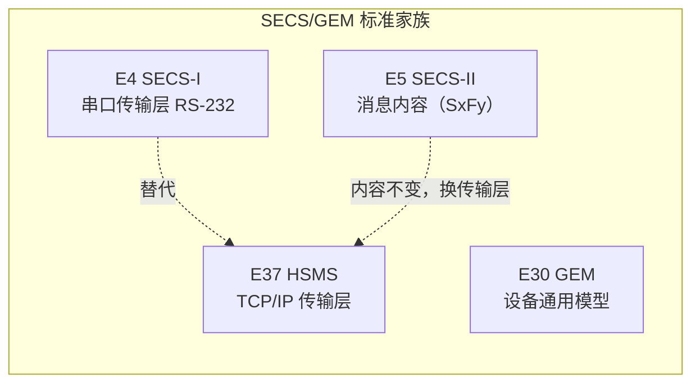

# SEMI 笔记

> 半导体 **SECS/GEM 协议**学习笔记：研读 SEMI 标准原文，按自己的理解逐章梳理成系统性中文笔记。

## 这是什么

**SEMI**（Semiconductor Equipment and Materials International，国际半导体设备与材料协会）制定了一系列规范晶圆厂设备与主机之间通信的标准，统称 **SECS/GEM**。设备厂商、主机软件都按这些标准对接，是半导体工厂自动化的"通用语言"。

这套笔记记录研读标准原文的梳理成果，特点是：

- **按理解重写，不是翻译**——逐章消化后，用更直白的语言和图表重述；
- **图解驱动**——关键机制（状态机、消息格式、通信流程）用 Mermaid 图呈现；
- **查用分离**——每页独立成文，查字段、查超时、查对比可直接跳转。

## 标准家族

| 标准 | 角色 | 笔记状态 |
| --- | --- | --- |
| **E37 HSMS** | TCP/IP 传输层，替代 SECS-I | ✅ 已整理（[进入专题](notes/e37-hsms/index.md)） |
| E4 SECS-I | 串口传输层 RS-232 | 部分涉及（见 [SECS-I 与 HSMS 对比](notes/e37-hsms/secs-vs-hsms.md)） |
| E5 SECS-II | 消息内容（S1F1…SxFy） | ⏳ 计划中 |
| E30 GEM | 设备通用行为模型 | ⏳ 计划中 |

## 阅读路线

- **新读者**：从 E37 专题的 [总览](notes/e37-hsms/index.md) 开始，按"① → ⑦"的顺序阅读，约一小时建立 HSMS-SS 全貌；
- **当工具书用**：查字段去 [消息格式](notes/e37-hsms/message-format.md)，查超时去 [定时器与参数](notes/e37-hsms/timers.md)，查对比去 [SECS-I 与 HSMS 对比](notes/e37-hsms/secs-vs-hsms.md)；
- **查疑答疑**：[FAQ](notes/e37-hsms/faq.md) 汇集学习中的高频疑问，答案标注标准出处。

## 快速入口

| 页面 | 内容 |
| --- | --- |
| [E37 HSMS 总览](notes/e37-hsms/index.md) | HSMS 定位、核心术语、三份标准的关系 |
| [通信模型](notes/e37-hsms/communication.md) | 一次完整通信的五个阶段 |
| [状态机](notes/e37-hsms/state-machine.md) | NOT CONNECTED / NOT SELECTED / SELECTED |
| [消息交换过程](notes/e37-hsms/procedures.md) | 六种消息过程：Select / Data / Deselect / Linktest / Separate / Reject |
| [消息格式](notes/e37-hsms/message-format.md) | 4 字节长度 + 10 字节头部，逐字段拆解 |
| [定时器与参数](notes/e37-hsms/timers.md) | T3 / T5 / T6 / T7 / T8 与超时后果 |
| [E37.1 HSMS-SS](notes/e37-hsms/hsms-ss.md) | 单会话简化版（重点） |
| [FAQ](notes/e37-hsms/faq.md) | 高频疑问答疑 |
