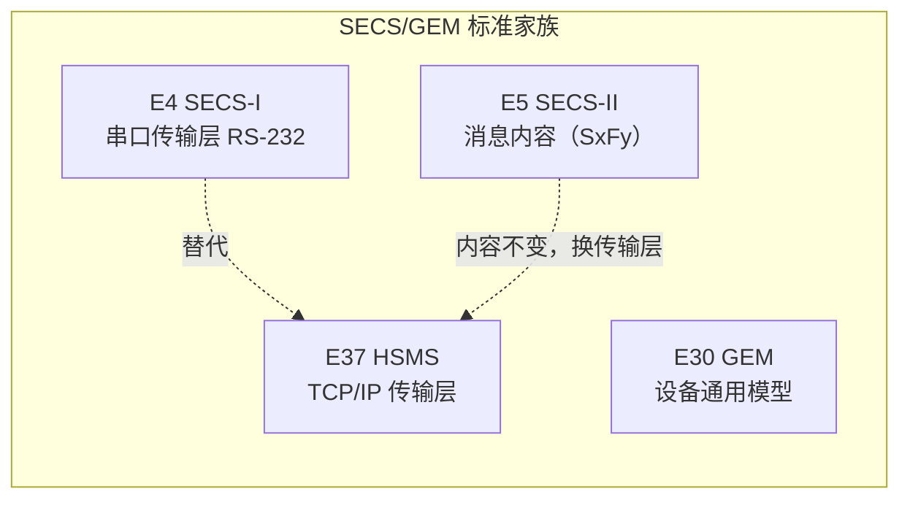

# 从 EFEM 出发，理解半导体工厂自动化

## 前言：为什么整理这份 SEMI 协议笔记？

毕业后我从事半导体设备 `RUNTIME` 控制系统的开发，主攻运动控制领域。这份笔记源于我在两个核心项目开发中的技术沉淀：

### 1. `EFEM` 自动化调度：从“控制硬件”到“理解闭环”

`EFEM` 是我接手的第一块核心业务。最初我的精力集中在机械手（`Robot`）、`Aligner` 及 `Load Port` 等硬件的物理运动控制上。但在实现晶圆调度的过程中，我意识到硬件动作仅仅是执行层，**真正驱动调度逻辑的是上层 SEMI 协议**。

* 为了理清晶圆在 `Load Port` 到腔体间的流转逻辑，我学习了 **SEMI E87**（`Carrier Management`）。

* 为了弄懂天车（`OHT`）放料后，工厂端（`Host`）如何下发指令驱动设备完成 `Mapping` 并开始加工，我进一步补充了 **SEMI E30 (GEM)**、**SEMI E37 (HSMS)** 及 **SEMI E4/E5**。这些协议让我彻底打通了“`Host`-设备-硬件”的交互闭环。

### 2. 研磨系统整机台控制：基于标准协议驱动第三方硬件

在后续研磨系统的项目中，我们的采用多腔体和加 `EFEM` 的组合，集成成为一台设备。我们需要开发中间层软件去控制多个第三方的腔体硬件。由于无法直接操控底层驱动，**SEMI 标准协议成为了软件与硬件通信的唯一接口**。这促使我将之前零散学习的 `E4/E5/E30/E37/E87` 等规范进行系统化串联，并在实战中完成了全套协议的落地。

## 这是什么

`SEMI`（国际半导体产业协会）制定的标准有上百个，贯穿了从晶圆厂建造、设备自动化通信、物料搬运，到安全规范、数据采集的整个制造生命周期。

在半导体设备软件和 `RunTime` 开发中，我们最常接触的是 `SEMI` 软件标准（`Software Standards`），主要分为以下几个层面：

|层面|代表协议|解决什么问题？（业务场景）|
|---|-------|------------|
|底层通信| `SEMI E4 (SECS-I)` `SEMI E37 (HSMS)`|“怎么连上并说话？” 定义数据传输的物理层和网络层。以前用串口（SECS-I），现在基本全用基于 TCP/IP 的 HSMS。|
|消息格式|`SEMI E5 (SECS-II)`|“说的每一句话是什么意思？” 定义了设备与 `Host` 之间传输的消息字典（如 `S1F13` 建立连接，`S2F41` 下发控制指令）。|
|设备行为与状态机|`SEMI E30 (GEM)`|“设备该有哪些状态和反应？” 所有设备通用的模型。定义了设备在线/离线状态、报警（`Alarm`）、事件上报（`Event`）以及 `Remote Command`（远程控制）。|
|晶圆/载具自动化|`SEMI E87 (CMS)` `SEMI E84 (PIOT)` `SEMI E90 (STS)`|“晶圆和 FOUP 怎么自动搬运和追踪？” 定义了 `Load Port` 状态、`FOUP` 的 `Dock/Undock`，以及天车（`OHT`）和设备接驳时的光电信号握手（`E84`）。|
|数据采集与分析|`SEMI E134  (EDA / Interface A)`|“怎么高速采集高密度的设备运行数据？” 随着先进制程对数据要求变高，`GEM` 数据量不够，使用独立的 `EDA` 协议进行高频诊断数据采集。|

## 标准家族

### `SECS/GEM`

| 标准 | 角色 | 笔记状态 |
| --- | --- | --- |
| **`E37 HSMS`** | `TCP/IP` 传输层，替代 `SECS-I` | ✅ 已整理（[进入专题](notes/e37-hsms/index.md)） |
| `E4 SECS-I` | 串口传输层 `RS-232` | 部分涉及（见 [SECS-I 与 HSMS 对比](notes/e37-hsms/secs-vs-hsms.md)） |
| `E5 SECS-II` | 消息内容（`S1F1…SxFy`） | ⏳ 计划中 |
| **`E30 GEM`** | 设备通用行为模型 | ✅ 已整理（[进入专题](notes/e30/index.md)） |

### `EFEM` / 载具管理

围绕 **`EFEM`（设备前端模块）与载具（`FOUP`）自动化**的一组标准——从"载具怎么交接"（信号层）到"载具状态怎么管"（软件层），再到"晶圆在哪儿 / 作业怎么组织"（内容层）：

| 标准 | 角色 | 层级 | 笔记状态 |
| --- | --- | --- | --- |
| **`E84`** | E`nhanced Carrier Handoff Parallel I/O`——载具交接并行 `I/O` 握手（装载端口 ↔ `OHT`/搬运设备） | 信号层 | ✅ 熟悉，待整理 |
| **`E87 CMS`** | `Carrier Management`——载具管理：`FOUP` 在装载端口的状态模型与事件 | 软件层 | ✅ 熟悉，待整理 |
| `E90` | `Substrate Mapping`——晶圆映射（`FOUP` 内晶圆位置） | 内容层 | ⏳ 计划中 |
| `E94 CJM` | `Control Job Management`——控制作业管理（组合多个工艺作业） | 调度层 | ⏳ 计划中 |
| `E62` | `Load Port Operation`——装载端口操作（对接/开门/映射/交接） | 端口行为 | ⏳ 计划中 |

> 注：`E84` 与 `E87` 是 `EFEM` 集成的核心搭档——**`E84` 管"交接握手"（硬件信号），`E87` 管"载具状态"（软件事件）**；`E90/E94` 通常与其配套部署（业界常合称 `GEM300` 的载具管理扩展）。目前我只读过 `E84` 、 `E87` . 后续有机会在阅读和整理 `E9x` 相关的协议

## 快速入口

| 页面 | 内容 |
| --- | --- |
| [`E37 HSMS` 总览](notes/e37-hsms/index.md) | `HSMS` 定位、核心术语、三份标准的关系 |
| [通信模型](notes/e37-hsms/communication.md) | 一次完整通信的五个阶段 |
| [状态机](notes/e37-hsms/state-machine.md) | `NOT CONNECTED / NOT SELECTED / SELECTED` |
| [消息交换过程](notes/e37-hsms/procedures.md) | 六种消息过程：`Select / Data / Deselect / Linktest / Separate / Reject` |
| [消息格式](notes/e37-hsms/message-format.md) | 4 字节长度 + 10 字节头部，逐字段拆解 |
| [定时器与参数](notes/e37-hsms/timers.md) | `T3 / T5 / T6 / T7 / T8` 与超时后果 |
| [`E37.1 HSMS-SS`](notes/e37-hsms/hsms-ss.md) | 单会话简化版（重点） |
| [`FAQ`](notes/e37-hsms/faq.md) | 高频疑问答疑 |
| [`E30 GEM` 总览](notes/e30/index.md) | `GEM` 定位、两种要求、标准结构 |
| [状态模型](notes/e30/state-models.md) | 通信 / 控制 / 加工 三个状态图 |
| [事件通知](notes/e30/event-reporting.md) | `S6F11` 自动上报与报告动态配置 |
| [GEM 合规](notes/e30/compliance.md) | 逐能力合规判定与声明表 |
