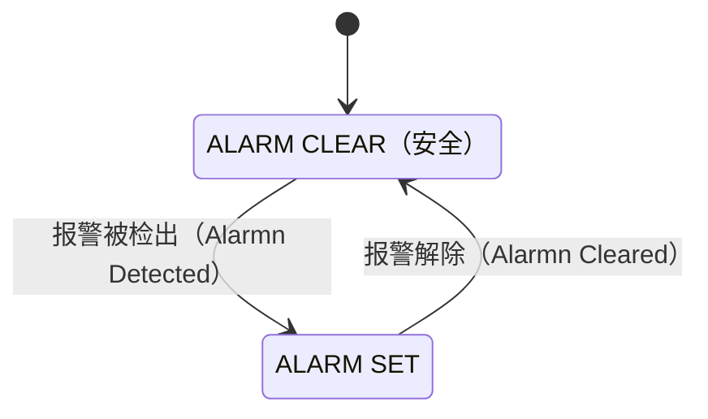
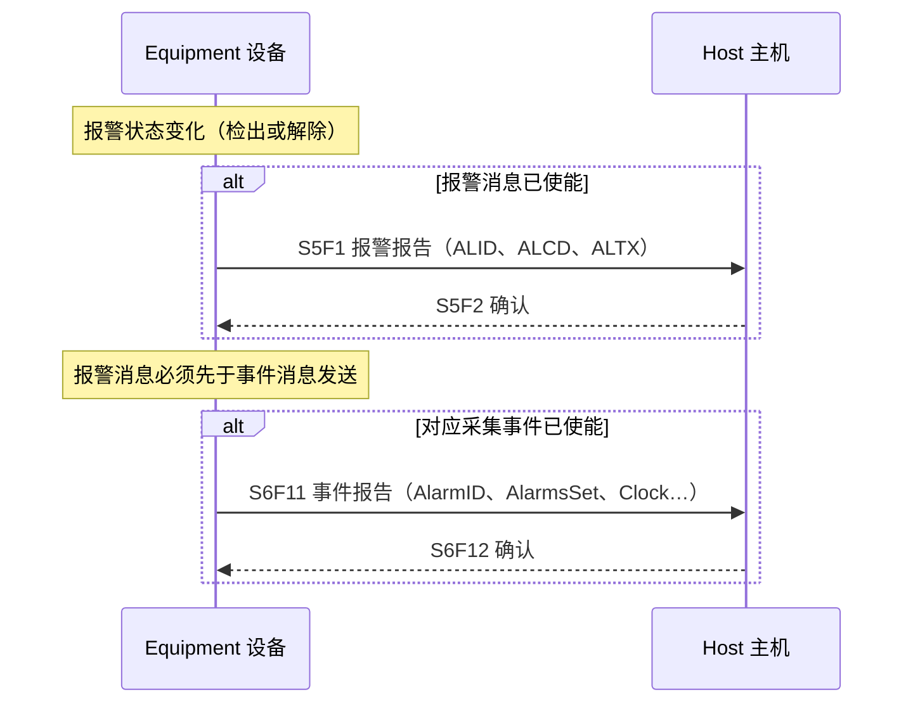
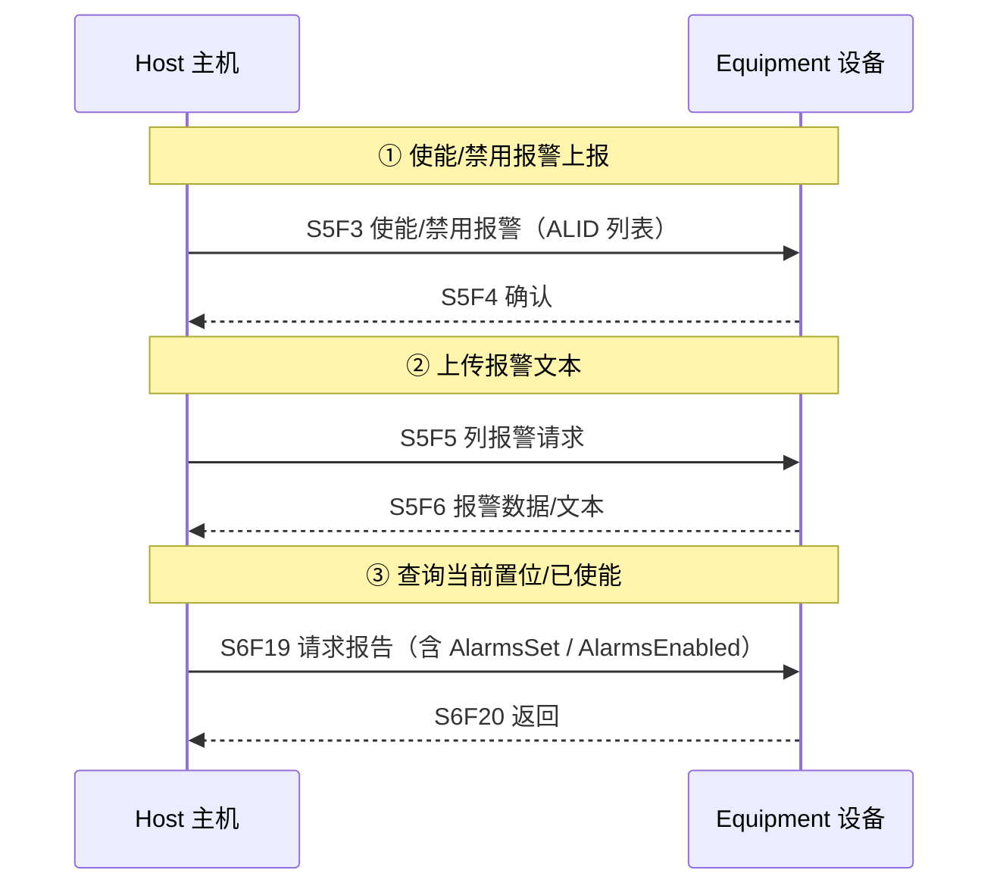

# 报警管理：S5 固定格式 + 事件双通道

> GEM 对"报警"给出**严格定义**（§4.3.2），并设计了**双通道上报**：Stream 5（S5F1/2）固定格式的简要报警消息 + 事件报告（S6F11）的灵活扩展数据。报警发生/清除都会通知主机，还能使能/禁用、查文本、查当前置位。

## 1. 报警的精确定义

- **报警（Alarm）** = 设备上**异常**、**不期望**、且**危及人、设备、被加工材料**的任何状况。是否构成报警由厂商按物理安全极限定义。
- 报警存在时，**可能受影响的活动必须被抑制**（安全优先）。
- **不是报警**：超出工艺容差的控制极限、正常事件（开始/完成加工）。——用事件机制上报即可，别当报警。
- 事件 vs 报警（表 4.3.2）：

| | 事件 EVENT | 报警 ALARM |
| --- | --- | --- |
| 定义 | 设备可检测的任何发生 | 异常 + 不期望 + 危及人/设备/材料 |
| 状态模型 | 可有可无 | 每个报警配一个二态状态模型 |
| 对设备活动 | 不必然抑制（除非关联报警） | **必须抑制**至解除 |
| 时序 | 可能按预期顺序发生 | 随时可能发生 |

## 2. 报警状态模型（图 4.3）

每个报警 ALIDn 有两个状态，转换即采集事件：

**转换动作**（表 4.3.1）：

- **检出**（CLEAR→SET）：先做必要的本地安全动作（如有），更新 `AlarmsSet` 与 `ALCD` 值，若已使能则发报警消息 + 事件消息。
- **解除**（SET→CLEAR）：更新 `AlarmsSet` 与 `ALCD`，若已使能则发消息。
- 被抑制的活动需要**操作员或主机介入**后才能恢复。

## 3. 双通道上报（§4.3.3.2）

- **S5F1**：简要、固定格式（ALID 报警 ID、ALCD 报警码、ALTX 报警文本）。
- **事件通道**：挂任意扩展数据（时间戳、AlarmsSet 等），灵活。
- **顺序要求**：两者都使能时，**报警消息必须先发**，再发事件消息（§4.3.3.2）。

## 4. 使能/禁用与查询

**关键规则（§4.3.3.1、§4.3.4）：**

- 使能/禁用**成对作用于 S5 报警消息和对应事件消息**（一起开或一起关）；但事件通道里的 alarm set / cleared **两个 CEID 可以分别使能**。
- 使能状态存**非易失存储**；变化即时反映到 `AlarmsEnabled` 状态变量。
- 使能/禁用的是**上报**，不是报警本身（设备本地报警灯/喇叭不受影响，标准无意替代本地安全告警）。
- 每个报警必须有：唯一 **ALID**、文本 **ALTX**、状态 **ALCD**（只用第 8 位：1=置位，0=清除；7 位类别码不用）、两个 **CEID**（set 一个、cleared 一个）。
- 设备必须维护 `AlarmsSet`（当前所有置位报警的列表），每次置位/清除先更新再上报。

## 5. 一句话总结

**报警 = 危及安全的异常 → 设备本地安全动作 → S5F1 简报 + S6F11 详报（可选）→ 主机确认 → 解除时同样通知。** 厂商负责定义本机报警清单（附录 A.3 给了按子系统划分的示例表：过压/欠压/温度超高/压力过低…）。
