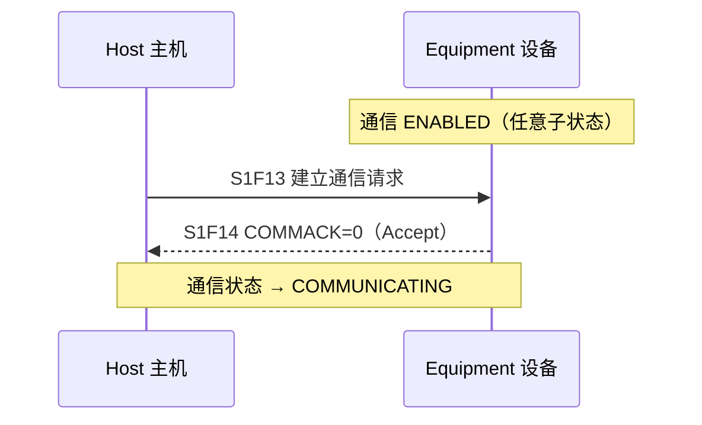
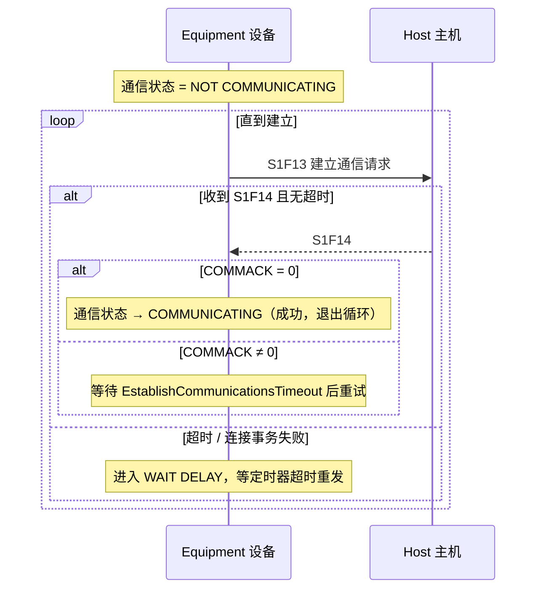
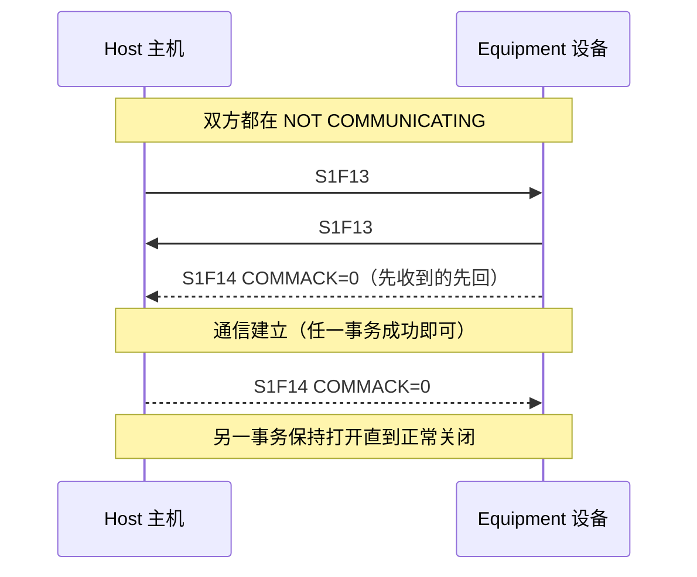
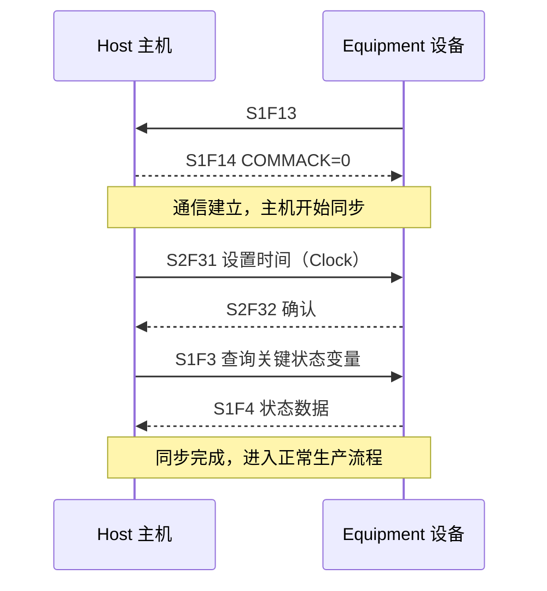

# 建立通信：S1F13/S1F14 握手

> GEM 用 **S1F13（Establish Communications Request）/ S1F14（Acknowledge）** 事务**正式建立**通信——这不仅是"链路通没通"，更是向对方宣告"我们之间有过一段无法通信的时期，请重新同步"。通信状态模型的细节见[状态模型](state-models.md)，本页讲行为场景。

## 1. 为什么不用 S1F1？

- **S1F1/F2（Are You There?）** 用途宽泛（随时可用于识别设备），语义不明确，不能表达"重新同步"的意思。
- **S1F13/F14 专门用于建立通信**：成功完成即通知对方"之前可能丢失了状态，需要同步"（比如主机需要重新对齐设备状态、重新设置时钟、重查状态变量）。

**正式建立通信的条件**（满足其一，§4.1.3）：

1. 设备发出 S1F13，并在事务超时内收到 **COMMACK = 0（Accept）** 的 S1F14；或
2. 设备收到主机 S1F13，并成功发出 COMMACK = 0 的 S1F14。

## 2. 三种握手场景

### 场景一：主机发起（基础要求，§4.1.5.1）

### 场景二：设备发起（周期重试，§4.1.5.2）

### 场景三：双方同时发起（§4.1.5.3）

**要点**：任一 S1F13/F14 事务成功即建立通信，谁先发不重要；角色可以对调。

## 3. 重试机制与定时器

- 设备在 NOT COMMUNICATING 下**周期发送 S1F13**，直到正式建立（§4.1.3）。
- 重试间隔 = 设备常数 **`EstablishCommunicationsTimeout`**（秒），用户可配置；从检测到**连接事务失败**起开始计时。
- **CommDelay 定时器**（§3.2.2）：设备内部定时器，进入 WAIT DELAY 时初始化，超时触发下一次 S1F13 发送；对主机不可见。
- **连接事务失败** = 通信失败（按传输层标准定义）/ S1F14 超时未收到 / S1F14 格式错误或 COMMACK≠0。

## 4. 建立之后：主机同步动作

收到"设备曾中断通信"的信号后，主机典型做法（附录 A.1.2，供参考，非硬性规定）：

**GEM 要求**（§4.1.4）：

- 设备必须支持通信状态模型（§3.2）。
- 设备必须提供 `EstablishCommunicationsTimeout` 设备常数。
- 主机可以在任意时刻发起 S1F13/F14 事务（主机初始化或自行检测到通信失败时）。
