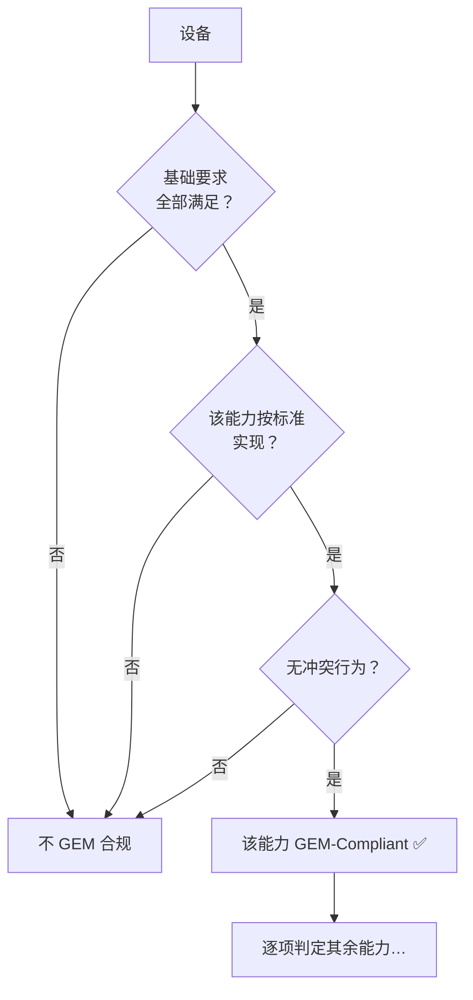

# GEM 合规：怎么算"符合 GEM"

> "GEM 合规"不是一句话的总体声明，而是**逐能力判定**的：每项能力单独问"实现了没有、实现得合不合规"。设备可能只对其中几项合规。这一页讲判定的三条标准和厂商必须交出的文档（§8）。

## 1. 两种规格：基础要求 + 附加能力

- **基础要求**（表 8.1）：所有设备必须满足，是合规的"入场券"。
- **附加能力**（表 8.2）：按设备类型选做，逐项判定合规。

**基础要求清单（§8.1）：**

| 基础要求 | 章节 |
| --- | --- |
| 状态模型 | §3.0、3.1、3.3 |
| 设备加工状态 | §3.4 |
| 主机发起的 S1F13/F14 场景 | §4.1.5.1 |
| 事件通知 | §4.2.1.1 |
| 在线识别 | §4.2.6 |
| 错误消息 | §4.9 |
| 控制（操作员发起） | §4.12（除 4.12.5.2） |
| 文档 | §8.4 |

外加对基础要求的配套：§5 变量数据项、§5 数据项限制、§6 采集事件。

**附加能力清单（§8.2 表 8.2）：**

建立通信、事件通知、动态事件报告配置、变量数据采集、Trace 数据采集、Limits 监控、状态数据采集、在线识别、报警管理、远程控制、设备常数、工艺程序管理、物料搬送、设备终端服务、错误消息、时钟、Spooling、控制（操作员/主机发起）。

## 2. 合规判定：三条标准（§8.3）

某项能力称得上 "GEM-Compliant" **当且仅当**同时满足：

1. **基础要求全部满足**（先拿到入场券）；
2. 该能力按标准中所有适用的定义、描述、要求实现；
3. 设备没有与该能力 GEM 行为**相冲突**的行为。

**例子**：设备提供了工艺程序管理消息，就必须精确实现 GEM 的 Process Program Management 能力，才能宣称 "GEM-Compliant for Process Program Management"。

**Fully GEM Capable**（更强的称号）当且仅当：

1. 设备提供 §8.2 列出的**全部**附加能力；
2. 每项实现的能力都合规。

**允许超出**：设备可以额外实现 SECS-II 里 GEM 没规定的内容，只要不与非 GEM 能力冲突、不阻碍 GEM 行为即可（"non-obstructing extensions"）。

## 3. 必须的文档（§8.4）

设备供应商的 SECS-II 接口文档必须**单卷装订**，包含：消息文档（按 E5 第 8 章格式）、**GEM 合规声明**、以及 §3/§4 要求的文档（状态模型、事件清单等）。

**GEM 合规声明表**（表 8.3）——每项要求/能力两问：

| 要求/能力 | Implemented？ | GEM-Compliant？ |
| --- | --- | --- |
| 基础要求（状态模型、加工状态、S1F13/14 场景、事件通知、在线识别、错误消息、文档、控制） | Yes/No | Yes/No |
| 附加能力（建立通信、动态报告配置、变量/Trace/状态采集、报警、远程控制、常数、PP 管理、物料、终端、时钟、Limits、Spooling、控制） | Yes/No | Yes/No |

**注意事项**：

- 基础要求那行不能随便打 Yes——只有**全部**基础要求实现且合规才勾 Yes。
- 附加能力不能标 GEM-Compliant，除非基础要求已合规。
- 可选：用 **SML（SECS Message Language）** 记法（表 8.4）描述数据项格式（L、B、BOOLEAN、A、I1/I2/I4/I8、U1/U2/U4/U8、F4/F8 等格式码）。

## 4. 一页速记

- **合规 = 逐能力**：基础要求全满足 + 该能力按标准实现 + 无冲突行为。
- **Fully GEM Capable** = 全部附加能力都实现且都合规。
- **文档** = 单卷接口文档 + 合规声明表（两项勾选）。
- **允许加戏**：只要不冲突，SECS-II 扩展随便加。
