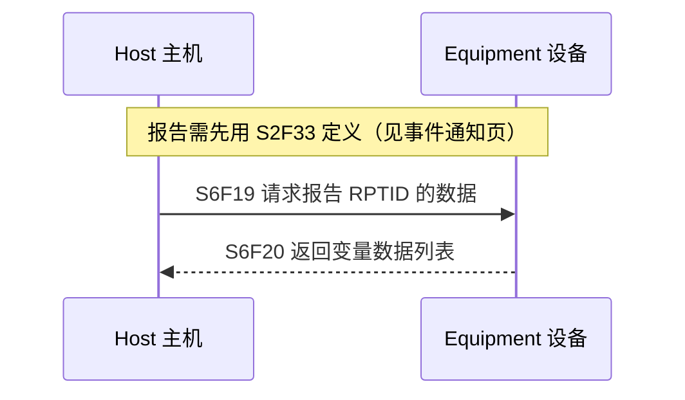
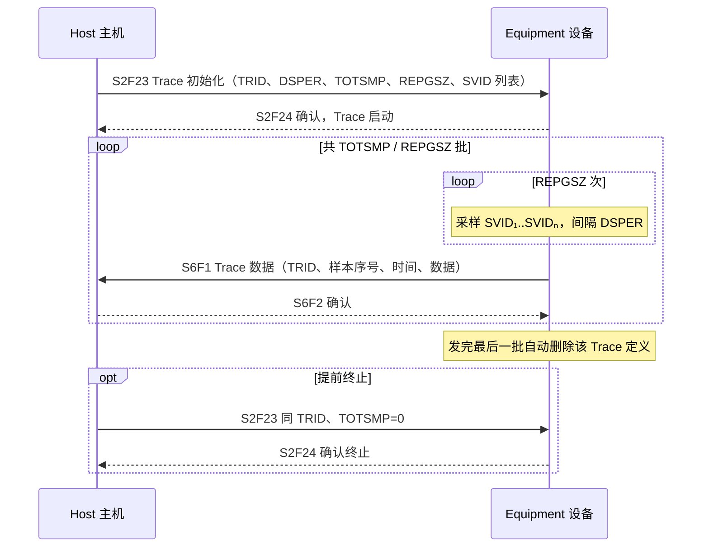
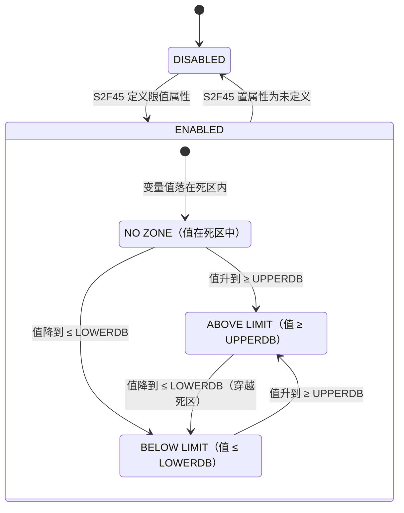
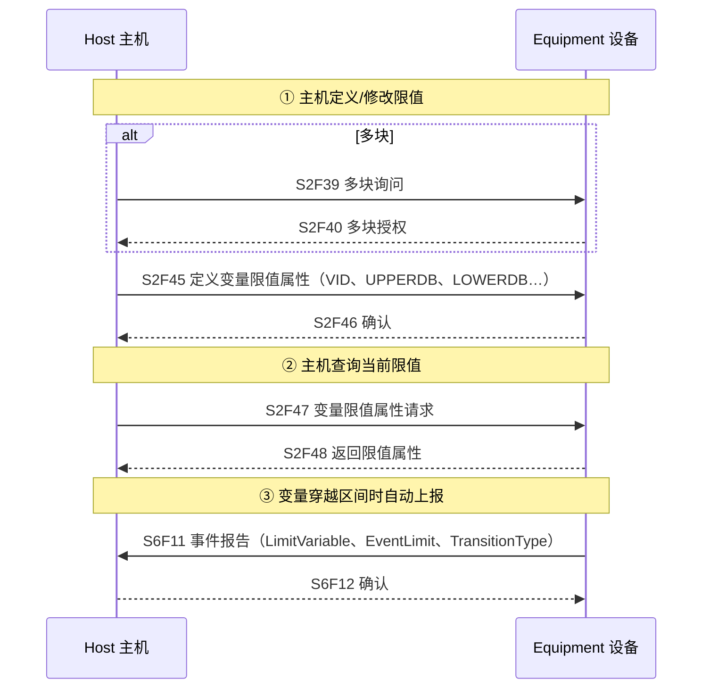
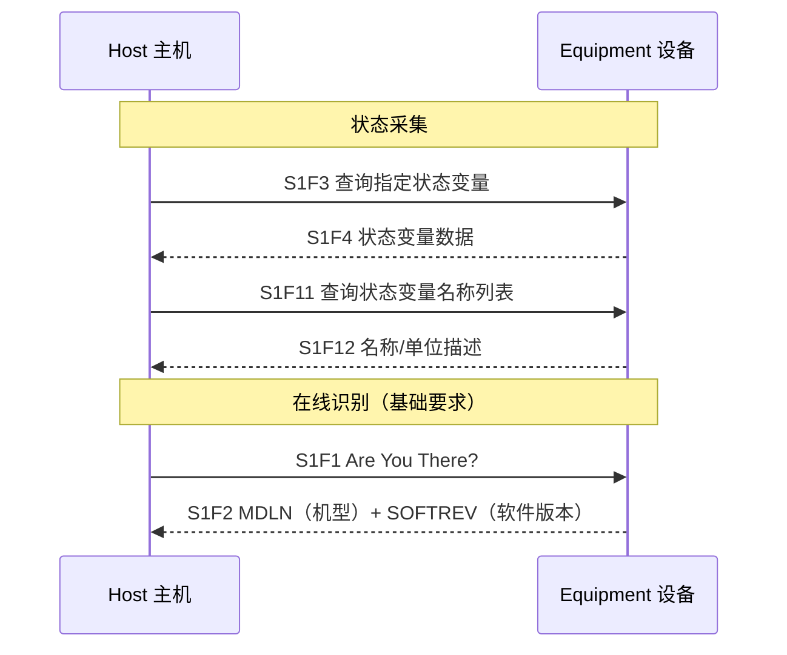

# 数据采集：变量查询、Trace 采样、Limits 监控

> 除了事件上报（[上一页](event-reporting.md)），GEM 还提供三种**按需/周期**取数方式：**变量采集**（主机点名查询）、**Trace**（定时采样）、**Limits 监控**（变量穿越设定区间时主动上报）。本页对应 §4.2.2 ~ §4.2.6。

## 1. 三种方式对比

| 方式 | 数据来源 | 触发方式 | 典型用途 |
| --- | --- | --- | --- |
| 变量采集（§4.2.2） | 报告（RPTID） | 主机点名（S6F19） | 初始化、同步时取当前值 |
| Trace（§4.2.3） | 指定的 SV 列表 | 周期采样（DSPER） | 趋势跟踪、连续数据监控 |
| Limits（§4.2.4） | 单个变量 | 值穿越监控区间 | 阈值告警、SPC、防轮询 |

## 2. 变量数据采集（§4.2.2）

按**报告 ID** 索要一组变量的当前值：



- SV 与 ECV 必须返回**当前值**；DVVAL 只在对应事件发生时保证有效，否则返回零长度项。

## 3. Trace 数据采集（§4.2.3）

主机定义一次"定时采样任务"，设备到点采样、攒够一批就发：



**参数**（§4.2.3.2）：`TRID` 标识、`DSPER` 采样间隔、`TOTSMP` 总样本数、`REPGSZ` 每组样本数（每批 = REPGSZ 个样本）、SVID 列表。

**要求：**

- 设备必须有本地机制触发周期采样（如内部时钟）。
- **至少支持 4 路并发 Trace**；同一 SVID 可同时被多个 Trace 采集。
- 同 TRID 重新定义 = 终止旧 Trace 并启动新 Trace。
- 例外：列表格式（list）的 SV 不支持 Trace（潜在问题，标准提示谨慎使用）。

## 4. Limits 监控（§4.2.4）

监视选定的设备变量（整数/浮点/布尔），**穿过预设"监控区间"边界时产生采集事件**，主机免轮询；主机还可动态改区间。

### 4.1 核心概念：限值、区间、死区

- 每个被监视变量至少有 **7 个限值**（LIMITID 1~7），每个限值 = 一对边界 **UPPERDB / LOWERDB**（死区上下界），外加 `LIMITMAX` / `LIMITMIN` 约束取值范围：

```
LIMITMAX ≥ UPPERDB ≥ LOWERDB ≥ LIMITMIN
```

- 一个限值把变量值域分成**上区间（UPPER ZONE）**和**下区间（LOWER ZONE）**，两区间有重叠部分 = **死区（deadband）**。
- **死区防抖**：值必须到达死区的**另一侧边界**才算换区——防止变量在边界附近抖动导致反复换区（chattering）。例：UPPERDB=LOWERDB=100 时，读数 99→101（换区）→100（换区）→100→99→100（换区）…

### 4.2 限值状态模型（图 4.2.3）



- **ABOVE LIMIT / BELOW LIMIT**：值在死区之上/之下；**NO ZONE**：新定义或开机时值落在死区里，等值到达任一死区边界才离开。
- 每次换区 = **采集事件**（每变量保留一个 CEID，两个方向共用；`TransitionType` 区分方向：0=下→上，1=上→下）。

### 4.3 配置与上报



**规则与要求：**

- 若 UPPERDB/LOWERDB 只定义其一 → 拒绝（要么都定义、要么都不定义）；不合法定义（违反 LIMITMAX≥UPPERDB≥LOWERDB≥LIMITMIN）→ 拒绝。
- 未定义的限值 = 该限值禁用；可用零长度列表一次禁用某变量或全部变量的限值。
- 仅支持整数（格式 11/20）、浮点（3()/4()）、布尔（5()）；**二进制格式不允许**。
- 限值定义存非易失存储；每变量一个 CEID 供换区上报。
- 注意：一个 CEID 同时用于两个方向的换区，**不能只配一个方向**。
- 采样频率需在设备规格中考虑：值变化快于采样频率时可能漏掉换区；`EventLimit` 支持列表，可在一次事件里报多个换区。

**附录 A.7 给了四个实例**：阀门布尔量监视（开关状态）、环境温度多区间（正常/警告/停机区）、校准计数器（5/7/8 三个限值提醒保养）、派生变量（实际温度与理想曲线偏差 ±0.5°C 告警）。

## 5. 状态采集与在线识别（§4.2.5、§4.2.6）



**要求：** SVID 唯一且随时有效；`SOFTREV` 必须能唯一标识软件版本（任何软件改动都要变）。
