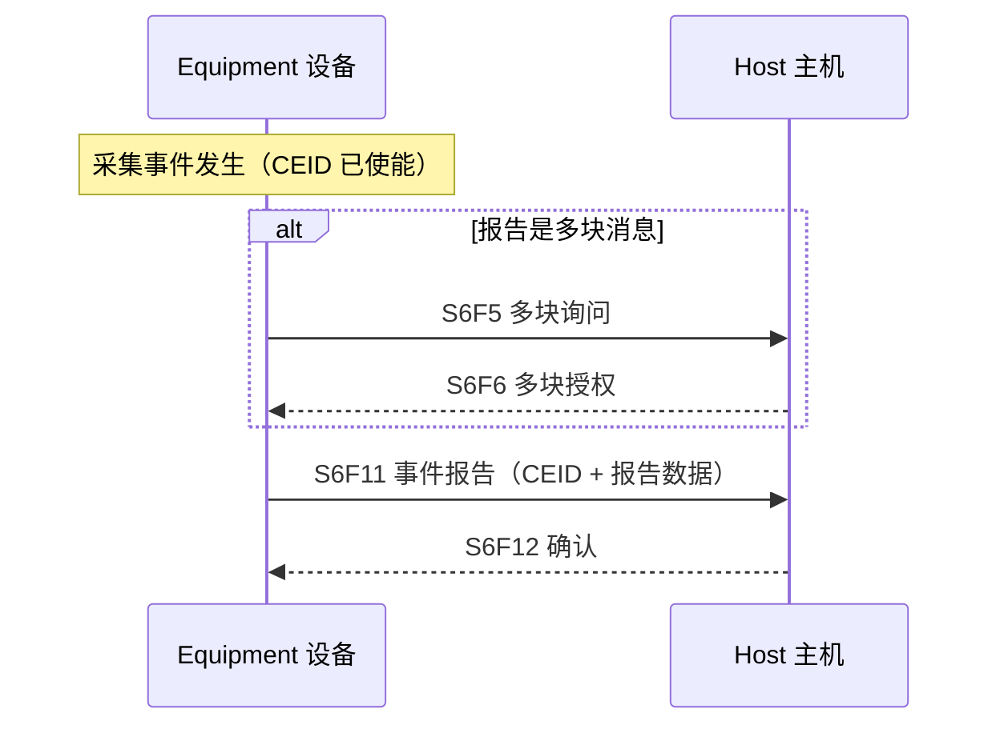
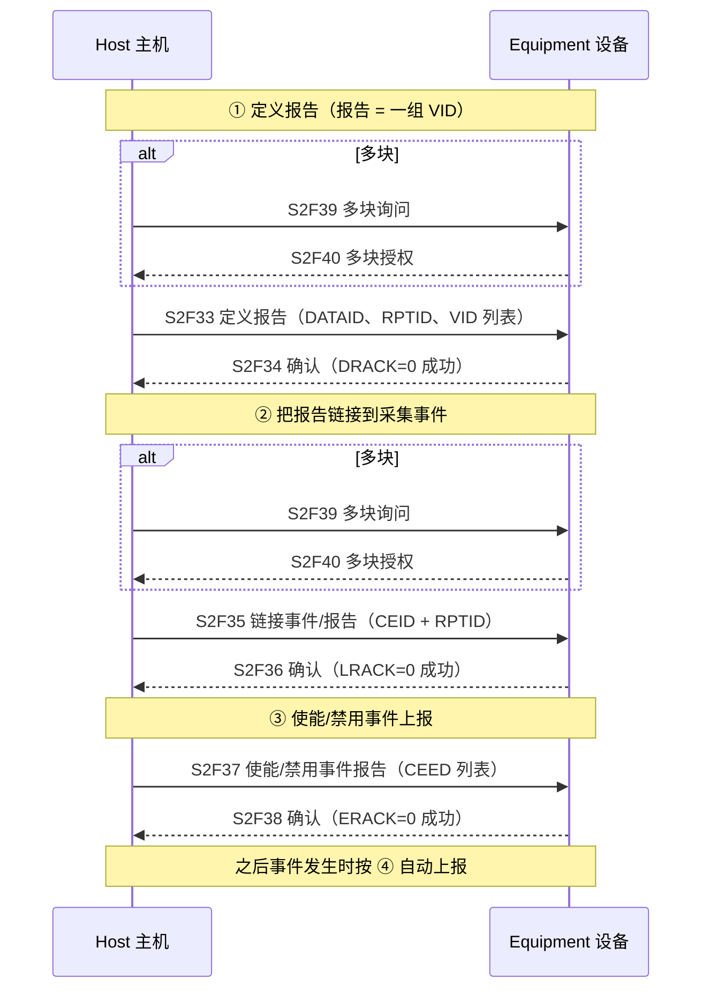

# 事件通知：GEM 的"主动汇报"机制

> GEM 数据采集的核心思想是**设备主动上报**而不是主机轮询：设备定义一组**采集事件（Collection Event）**，事件发生时（若已使能）自动把预挂的报告用 **S6F11** 推给主机。本页讲事件上报 + 主机的动态配置能力（§4.2.1）。

## 1. 概念

| 术语 | 含义 |
| --- | --- |
| **事件 Event** | 设备上可检测、对设备有意义的任何发生（动态的"条件变化"） |
| **采集事件 Collection Event** | 对**主机**有意义的事件（或相关事件的组合），有唯一 **CEID**；只有使能了才会报告 |
| **报告 Report** | 一组预定义变量（RPTID），由设备预置或主机用 S2F33 定义 |
| **事件报告消息** | S6F11，附在事件上的一组报告 |

**关键规则：**

- 厂商必须提供**预定义采集事件集**并文档化（CEID 唯一、触发条件明确）。
- 事件报告里的数据必须是**事件发生时刻的当前值**——报告在事件发生时即时构建。
- 每个事件可单独使能/禁用；`EventsEnabled` 状态变量列出当前已使能的所有 CEID。
- 任何状态迁移（除非另有说明）都对应一个采集事件（§3.1）——所以事件机制天然是设备行为的"镜子"。

## 2. 事件上报流程（§4.2.1.1.5）

- 主机随时可以**索要**某个事件报告的数据：**S6F15 → S6F16**（Event Report Request/Data）。
- 使能/禁用的效果是"该 CEID 是否上报"，不影响事件本身发生。

**典型事件举例**（完整清单见 §6 表 6.1）：控制状态变化（LOCAL/REMOTE/OFF-LINE）、加工开始/完成/停止、报警置位/清除、操作员改设备常数、Limit 穿越监控区间、工艺程序变更、物料进出端口、消息识别、配方上传成功/失败等。

## 3. 动态事件报告配置（§4.2.1.2）

主机通过三个事务完成"报告定义 → 挂接 → 使能"：

**要求（§4.2.1.2.4）：**

- 报告定义、报告↔事件链接、使能状态**全部存入非易失存储**（重启后仍生效）。
- 设备必须文档化所有变量（名称、类型 SV/ECV/DVVAL、单位、格式、范围、含义）。
- 所有 VID 唯一（SV、ECV、DVVAL 之间也不许重复）。
- 报告数据可以是 SV、ECV、DVVAL；DVVAL 只在特定事件/状态下保证有效，实现者须文档化。

## 4. 事件订阅三件套速记

| 顺序 | 做什么 | 消息 | 确认码 |
| --- | --- | --- | --- |
| ① | 定义报告（选哪些变量） | S2F33 → | S2F34（DRACK） |
| ② | 链接报告到事件 | S2F35 → | S2F36（LRACK） |
| ③ | 使能事件上报 | S2F37 → | S2F38（ERACK） |

之后：事件发生 → **S6F11 上报 → S6F12 确认**（或 S6F15/16 主机主动索要）。

## 5. 为什么这是 GEM 的"地基"

事件通知是**基础要求**（§8.1），不是可选能力——因为状态同步、报警、加工监控全部依赖它。后续页面的很多流程（报警 S5 之外的扩展数据、远程命令完成通知、PP 变更通知、Spool 状态通知）最终都走 S6F11 这条通道。
