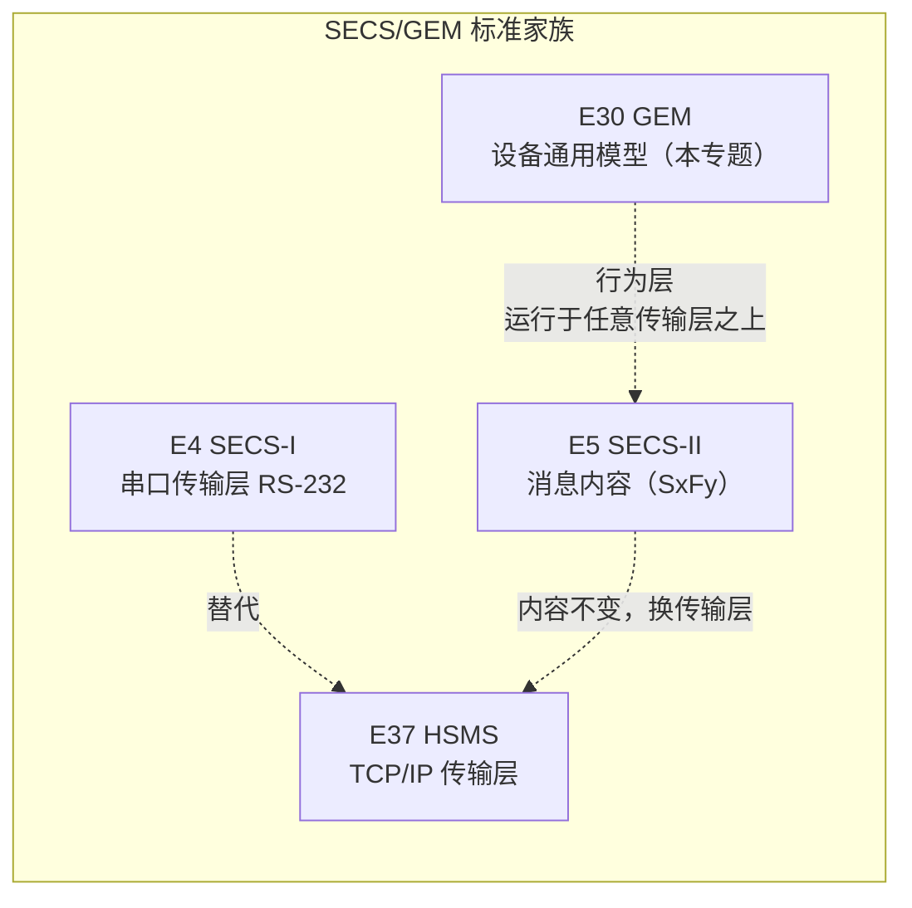
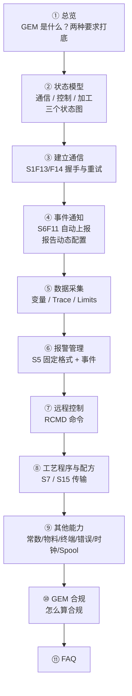
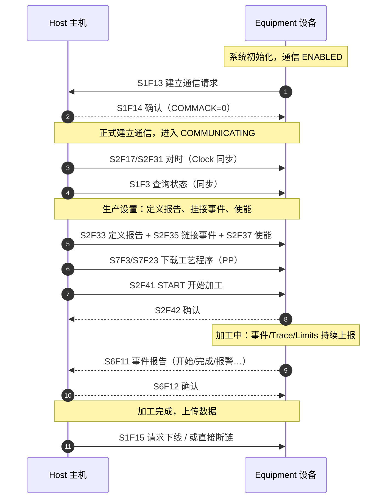

# 总览：E30 GEM 简介

> **GEM**（Generic Model for Communications and Control of Manufacturing Equipment，制造设备通信与控制通用模型，SEMI **E30**）规定半导体制造设备**在 SECS-II 通信链路上应当表现出的行为**——用哪些 E5 消息、在什么场景下、产生什么行为。它是 SECS/GEM 家族的"行为层"，也是整座标准化大厦的顶点。

## 1. E30 的定位

GEM 在 SECS/GEM 标准家族中的位置

**要点：**

- **E5 只定义"消息长什么样"**（S1F13 是什么、COMMACK 有哪些值）；**E30 定义"什么时候该发、发完设备要做什么"**——选哪个场景、产生什么行为、触发什么事件，都由 E30 规定。
- **E30 不定义主机行为**：主机可以随时发起任何 GEM 场景，设备必须按标准响应。
- **E30 与传输层无关**：标准明确说能力不依赖底层协议（SECS-I、SMS、点对点、面向连接/非连接均可），也不要求必须使用哪种。所以 E37 笔记里的 HSMS 和 E30 是两层，互不干扰。
- E30 的"设备"视角是**从通信链路往里看的行为黑盒**，不规定设备内部如何实现。

## 2. 两种要求：基础要求 + 附加能力

E30 把所有规定分成两类（§1.3、§8）：

| 类型 | 含义 | 判定 |
| --- | --- | --- |
| **基础要求**（Fundamental Requirements） | 所有设备必须满足 | 不满足 = 不 GEM 合规 |
| **附加能力**（Additional Capabilities） | 按设备类型/工厂自动化需求选做 | 逐项判定是否合规 |

**基础要求清单**（§8.1 表 8.1）：状态模型（§3.0/3.1/3.3）、加工状态（§3.4）、主机发起的 S1F13/F14 场景（§4.1.5.1）、事件通知（§4.2.1.1）、在线识别（§4.2.6）、错误消息（§4.9）、控制（操作员发起，§4.12）、文档（§8.4）。

**附加能力清单**（§8.2 表 8.2）：建立通信、事件通知、动态事件报告配置、变量数据采集、Trace 采集、Limits 监控、状态采集、在线识别、报警管理、远程控制、设备常数、工艺程序管理、物料搬送、终端服务、错误消息、时钟、Spooling、控制（操作员/主机发起）。

## 3. 标准正文结构

| 章节 | 内容 | 笔记对应页 |
| --- | --- | --- |
| §1 简介 | 修订历史、范围、意图、概述 | 本页 |
| §2 定义 | 术语（alarm、collection event、scenario…） | [FAQ](faq.md) 及各处 |
| §3 状态模型 | 通信 / 控制 / 加工 三个状态模型 | [状态模型](state-models.md) |
| §4 能力与场景 | 十二项能力的描述、要求、场景 | 各能力页 |
| §5 数据项 | 数据项格式限制 + 必需变量清单 | 见本页「数据项速查」 |
| §6 采集事件 | GEM 定义的标准采集事件表 | [事件通知](event-reporting.md) |
| §7 消息子集 | 所需的 SECS-II 消息清单 | 见本页「消息子集速查」 |
| §8 GEM 合规 | 合规判定与文档 | [GEM 合规](compliance.md) |
| 附录 A | 应用笔记（示例、Harel 符号、前面板…） | 各处引用 |

## 4. E30 与 E30.1 / E30.5：一份 PDF 里的三份标准

`pdf/E30.pdf` 是**三份独立标准的合订**，不是同一标准的多个版本：

| 标准 | 全名 | 定位 | 笔记状态 |
| --- | --- | --- | --- |
| **E30-1103**（2003-11） | GEM 通用模型 | 所有设备的通用行为模型（**母标准**） | ✅ 本专题 |
| **E30.1-0200**（2000-02） | ISEM（Inspection and Review SEM） | 检测 / 复查设备专用模型（晶圆缺陷检测） | ⏳ 未整理 |
| **E30.5-0302**（2002-03） | MSEM（Metrology SEM） | 计量设备专用模型 | ⏳ 未整理 |

E30.1 / E30.5 属于 SEMI 的 **SEM（Specific Equipment Model）** 体系：在 E30 基础要求与附加能力**之上**，针对某一类设备补充专用状态模型、事件、命令、数据项（E30.1 还有缺陷分类码与 M20 坐标系）。只有需要写检测/计量设备专题时才涉及。

## 5. 阅读路线

- [**① 总览**](index.md)：GEM 是什么、两种要求、标准结构——先建立整体印象。
- [**② 状态模型**](state-models.md)：设备行为的"骨架"——通信状态、控制状态、加工状态，三个状态图是理解后面所有能力的前提。
- [**③ 建立通信**](communication.md)：S1F13/F14 事务 + 通信状态机的行为细节，回答"设备怎么宣布自己上线了"。
- [**④ 事件通知**](event-reporting.md)：GEM 最核心的机制——事件自动上报（S6F11/12）+ 主机动态配置报告（S2F33~38）。
- [**⑤ 数据采集**](data-collection.md)：按需查询（S6F19/20）、周期采样 Trace（S2F23/24 + S6F1/2）、区间监控 Limits（S2F45-48）。
- [**⑥ 报警管理**](alarm-management.md)：报警的精确定义、双通道上报（S5F1/2 + 事件）、使能/禁用。
- [**⑦ 远程控制**](remote-control.md)：START / STOP / PAUSE / ABORT 等 RCMD 命令（S2F41/42、S2F49/50）。
- [**⑧ 工艺程序与配方**](process-programs.md)：S7 / S15 的上传下载、验证，以及超大文件的 Stream 13 数据集传输。
- [**⑨ 其他能力**](other-capabilities.md)：设备常数、物料搬送、终端服务、错误消息、时钟、Spooling（通信中断缓冲）。
- [**⑩ GEM 合规**](compliance.md)：逐能力判定合规、Fully GEM Capable、合规声明表。
- [**⑪ FAQ**](faq.md)：高频疑问答疑，答案标注标准出处。

## 6. 一个典型 GEM 设备的工作循环

把各能力串起来看（摘自附录 A.1 工厂运营脚本）：

## 7. 消息子集速查

E30 需要的 SECS-II 消息集中在九个流（§7；完整清单含大文件功能）：

| 流 | 用途 | 主要消息 |
| --- | --- | --- |
| **S1** 设备状态 | 在线识别、状态查询、上下线 | F1/F2、F3/F4、F11/F12、F13/F14、F15~F18 |
| **S2** 设备控制与诊断 | 常数、时钟、报告配置、Trace、命令、Limits | F13~F18、F23/F24、F29/F30、F31/F32、F33~F40、F41~F50 |
| **S5** 异常报告 | 报警 | F1~F6 |
| **S6** 数据采集 | 事件报告、Trace 数据、报告查询、Spool | F1/F2、F5/F6、F11/F12、F15/F16、F19/F20、F23/F24 |
| **S7** 工艺程序加载 | 上传/下载/删除/验证（含大文件） | F1~F6、F17~F20、F23~F30、F37~F44 |
| **S9** 系统错误 | 消息/通信故障上报 | F1~F13（全支持） |
| **S10** 终端服务 | 显示与键盘交互 | F1~F7 |
| **S14** 对象服务 | 配方属性查询（GetAttr） | F1/F2 |
| **S15** 配方管理 | 下载/上传/删除/验证（含大文件） | F1/F2、F21/F22、F27~F32、F35/F36、F49~F54 |

## 8. 数据项速查

**格式限制**（§5.1，部分）：`ALCD` 只用第 8 位（置位/清除）；`CEID`/`RPTID`/`VID`/`SVID`/`ECID`/`DATAID` 等 ID 用 U4（格式 5()）；`CPNAME`/`RCMD`/`PPID`/`TEXT` 用 ASCII（格式 20），`CPNAME` 最长 40 字符。

**必需变量**（§5.2）：

- **SV 状态变量**：`AlarmsEnabled`、`AlarmsSet`、`Clock`、`ControlState`、`EventsEnabled`、`PPExecName`、`PPFormat`、`ProcessState`、`PreviousProcessState`、`RcpExecName`、`SpoolCountActual`、`SpoolCountTotal`、`SpoolFullTime`、`SpoolStartTime`、`PPError`
- **ECV 设备常数**：`EstablishCommunicationsTimeout`、`MaxSpoolTransmit`、`OverWriteSpool`、`TimeFormat`
- **DVVAL 数据值**：`AlarmID`、`EventLimit`、`LimitVariable`、`PPChangeName`、`PPChangeStatus`、`RcpChangeName`、`RcpChangeStatus`、`TransitionType`、`PPError`
