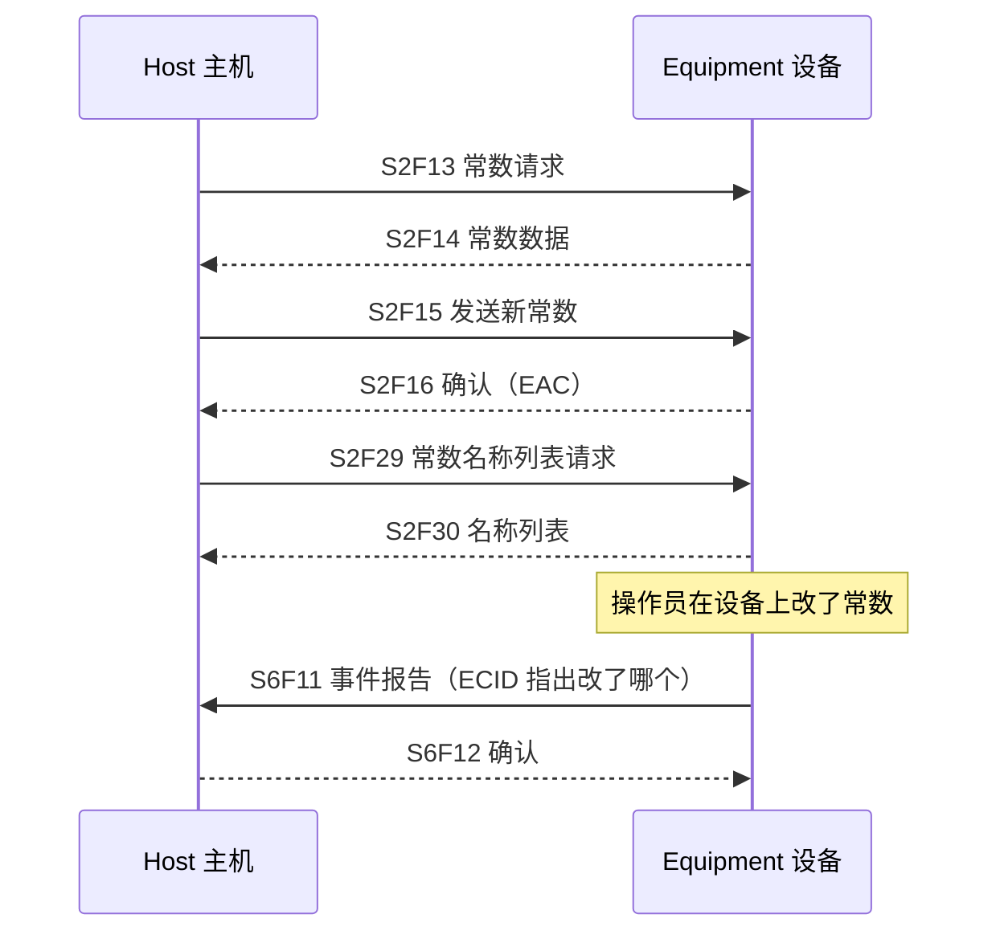
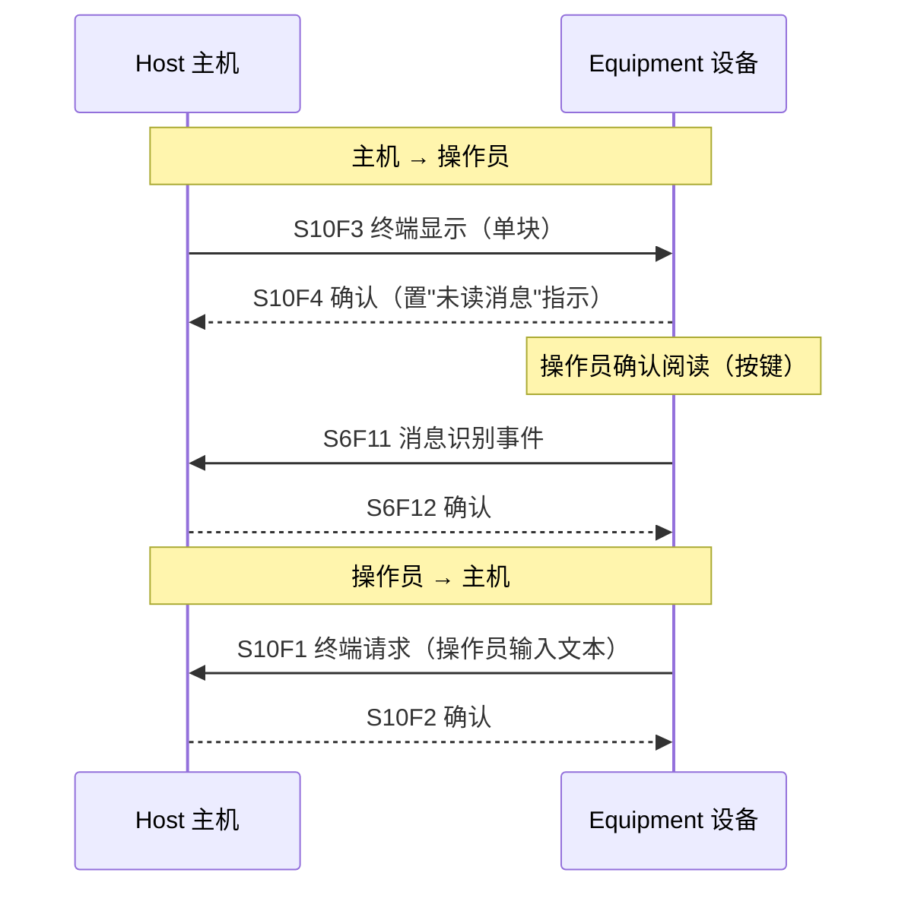
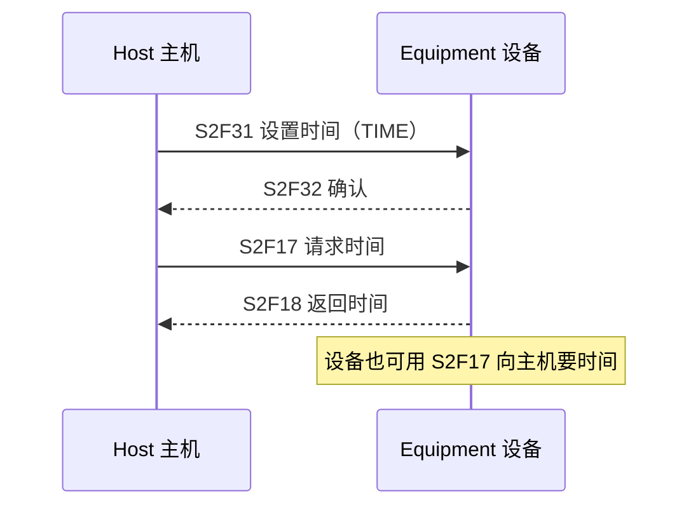
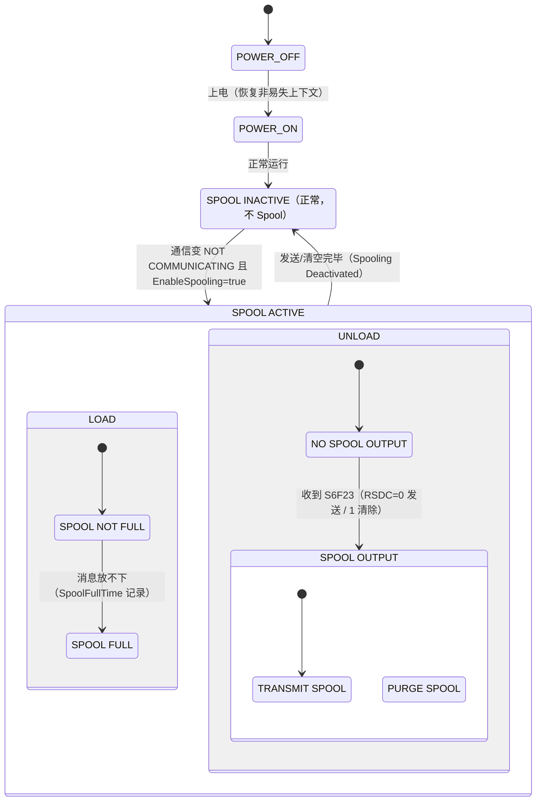
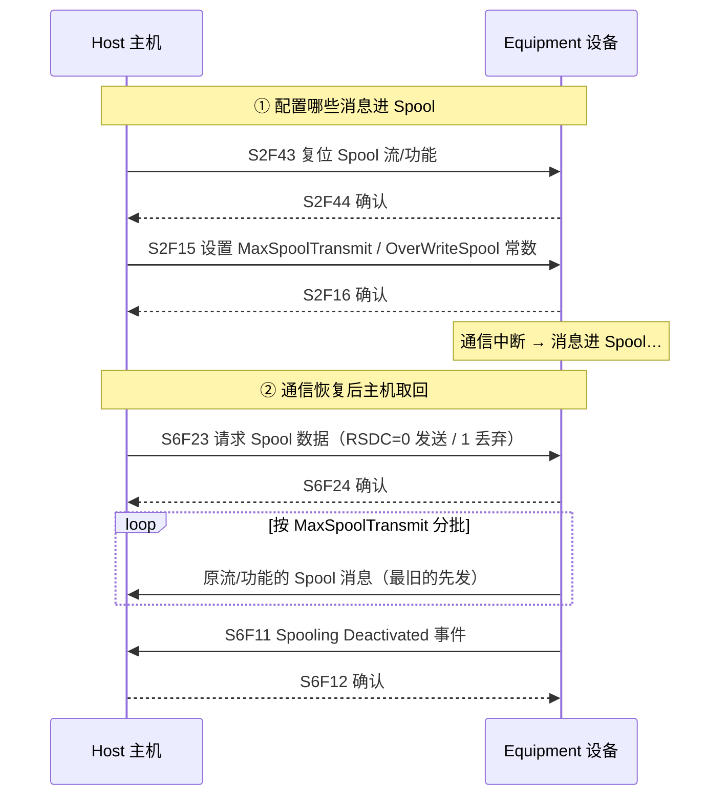

# 其他能力：常数、物料、终端、错误、时钟、Spooling

> 剩下六项能力打包成一页：**设备常数**（读写配置）、**物料搬送**（端口通知）、**终端服务**（人机交互）、**错误消息**（S9 故障上报）、**时钟**（时间同步）、**Spooling**（断线缓冲）。Spooling 最复杂，配状态图 + 序列图。

## 1. 设备常数（§4.5）

主机可读写设备上的配置参数（ECV，非易失存储）：

- 改值须在"安全"条件下接受（厂商定义）；操作员改动必须发采集事件。

## 2. 物料搬送（§4.7）

只做"通知"，不做控制：设备在端口收到/送出物料时上报。

- 两个 CEID：**Material Received**（端口收到）/ **Material Removed**（端口送出），经 S6F11 上报。
- 端口 ID、物料 ID 等附加信息留给实现（DVVAL 自行定义）。

## 3. 终端服务（§4.8）

主机在设备显示屏上显示信息（须操作员"确认阅读"），操作员也可发文本给主机：

- 多块显示用 **S10F5/6**；设备不支持多块 → **S10F7**（Multi-block Not Allowed）。
- 新显示消息会**覆盖未读消息**；零长度 TEXT 只清指示、不算消息。
- 要求：显示 ≥160 字符、输入 ≥160 字符、必须有"未读消息"指示和确认机制。

## 4. 错误消息（§4.9）

设备发现**消息故障**（收到的消息有缺陷）或**通信故障**（超时等）时用 **S9 流**上报。**S9F1~F13 全部必须支持**：

| 消息 | 故障 | 触发例 |
| --- | --- | --- |
| S9F1 | 未识别设备 ID | 设备 ID 不对 |
| S9F3 | 未识别流类型 | Stream 不认识 |
| S9F5 | 未识别功能类型 | Function 不认识 |
| S9F7 | 非法数据格式 | 数据格式错 |
| S9F9 | 事务定时器超时 | 等回复超时（对应 E37 的 T3 概念） |
| S9F11 | 数据过长 | 超过设备处理能力 |
| S9F13 | 会话定时器超时 | 会话中期待的下一条消息没来 |

**要点**：检测到故障的设备**不再对该消息做任何进一步处理**（应用级错误）；通信故障定义转交传输层标准（E4/E37）。

## 5. 时钟（§4.10）

- `Clock` 状态变量供事件/报警报告做**时间戳**；分辨率到**厘秒**（百秒位用于区分几乎同时发生的事件顺序，不是更精确的钟点）。
- 设备无法分辨厘秒时可固定报 `00`，但必须文档化。
- 目的：解析事件/报警的先后顺序、主机排程。

## 6. Spooling（§4.11）：断线缓冲

通信中断期间，把**发给主机的主消息**暂存非易失存储，恢复后再转发——防止丢失宝贵的过程数据（追踪材料、质量数据）。

### 6.1 状态模型（图 4.11）

**要点：**

- 只 Spool **用户选择的流/功能**的主消息（Stream 1 除外，如 S1F1、S1F13 不 Spool）；**副消息不 Spool**（发不出就丢弃）。
- 满时按 `OverWriteSpool`：True=覆盖最旧消息，False=丢弃新消息（计数仍累加）。
- **SPOOL FULL 只能经 SPOOL INACTIVE 复位**——卸载腾出的空间不会被新消息复用，避免新旧消息互相覆盖（§4.11.3.1）。
- 与通信状态联动：NOT COMMUNICATING（且 EnableSpooling=true）→ SPOOL ACTIVE。

### 6.2 配置与恢复流程

**关键规则（§4.11.3、§4.11.4）：**

- 恢复后**必须由主机发起 S6F23** 才能取回（设备不会自动发）。
- 流控：卸载时**同一时刻只允许一个打开的事务**；`MaxSpoolTransmit` 限制一次 S6F23 发送条数（0=不限，发完为止）。
- 发送从**最旧**开始，无优先级；发成功才删除。
- Spool 存储容量至少够存**一个正常加工周期**产生的全部主消息；所有 Spool 状态与上下文**断电保持**（POWER ON 后继续）。
- 事件：**Spooling Activated / Deactivated / Spool Transmit Failure**；状态变量 `SpoolCountActual`（当前存量）、`SpoolCountTotal`（累计投入量）、`SpoolStartTime`、`SpoolFullTime`。

## 7. 一页速记

| 能力 | 核心消息 | 一句话 |
| --- | --- | --- |
| 设备常数 | S2F13~16、S2F29/30 | 读写配置，非易失 |
| 物料搬送 | S6F11（两事件） | 只通知不控制 |
| 终端服务 | S10F1~7 | 显示 + 确认阅读 |
| 错误消息 | S9F1~13 | 全部支持，故障不继续处理 |
| 时钟 | S2F17/18、S2F31/32 | 厘秒时间戳定序 |
| Spooling | S2F43/44、S6F23/24 | 断线缓冲，主机主动取回 |
