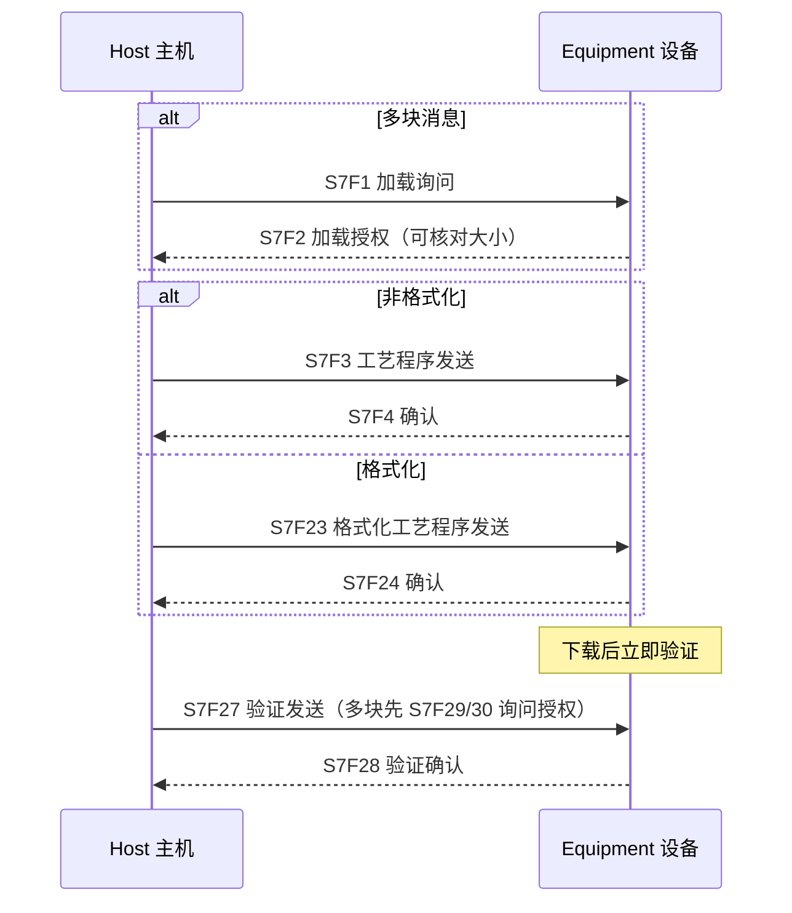
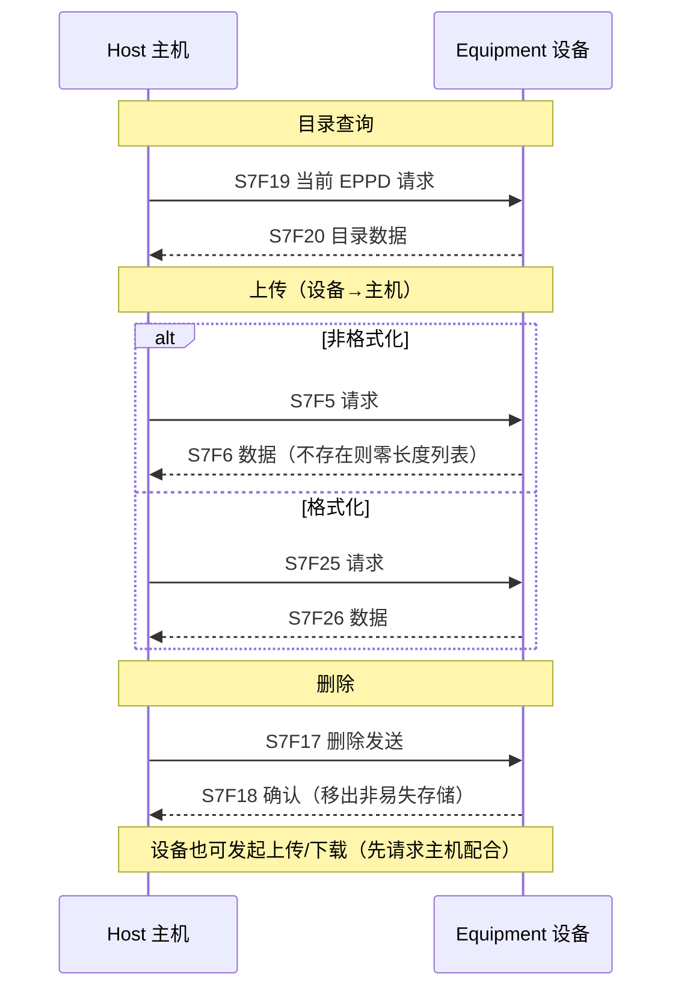
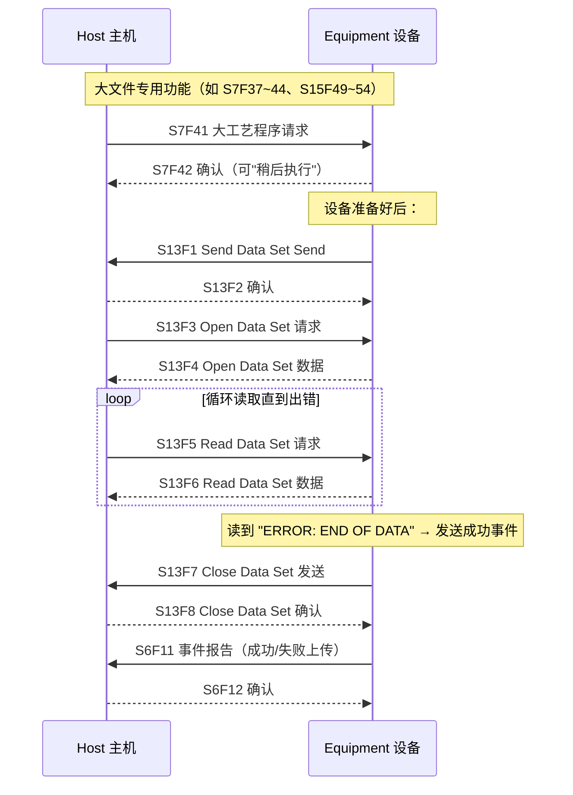

# 工艺程序与配方管理：S7 / S15 传输

> 工艺程序（Process Program，S7）和配方（Recipe，S15）是设备"怎么加工"的指令集。GEM 规定它们在主机与设备间的**上传、下载、删除、验证**流程，并为超大文件提供 **Stream 13 数据集传输协议**（§4.6）。配方细则参照 **SEMI E42**。

## 1. 概念区分

| 术语 | 说明 |
| --- | --- |
| **工艺程序 PP** | 决定加工环境的指令/设置/参数集合（S7 传输）；分**格式化**（有序命令码序列，S7F23/F26）与**非格式化**（整块 PPBODY 无结构，S7F3/F6） |
| **配方 Recipe** | 工艺程序 + 属性集（修改时间等）；GEM 语境下特指 **E42 执行配方**（execution recipe），用 S15 传输；体分**源格式**（可离线编辑文本）/ **对象格式**（专有格式） |
| **验证 Verification** | 语法/结构检查（下载后必须做） |
| **校验 Validation** | 类型/范围检查（选择执行时做，比验证更进一步） |

**标识**：PPID（工艺程序）/ RCPID（配方）；工程师/操作员用的名字 = 主机用的标识。

## 2. 下载流程（主机发起，S7 示例）

**规则：**

- 同名 PP 已存在 → **旧程序被替换**（工艺程序可以覆盖；配方**默认拒绝覆盖**，除非主机在 S15F27 里置 `RCPOWCODE=TRUE` 强制覆盖）。
- 正在被编辑的配方受保护，不被同名下载覆盖；被覆盖后操作员须另存或丢弃原编辑。
- 格式化 PP 下载后**必须立即验证**。
- 设备至少能存储**执行三个独特工艺周期**所需的程序；执行中的程序不能被修改影响。

## 3. 上传与删除

- 配方上传/删除对应 S15F31/32、S15F35/36；目录用 S14F1/2（GetAttr）。
- 设备发起的上传/下载：先发 S15F21/22（Recipe Action Request，RCPCMD=Upload/Download）请主机配合。

## 4. 大文件：Stream 13 数据集传输协议（§4.6.3.3）

大程序/大配方（如含图像数据、可能超过单条多块消息上限约 800 万文本字节）走 S13：

- **数据集传输协议对数据大小没有上限**。
- 完成标志：`ACKC13 = "ERROR: END OF DATA"`。
- 上传成功/失败都会发对应采集事件（Successful Upload / Bad Upload）。

## 5. 变更通知

操作员在设备上新建/编辑/删除程序或配方 → 设备自动上报（§4.6.5）：

| 事件 | 数据 | 场景 |
| --- | --- | --- |
| **Process Program Change** | PPChangeName（PPID）、PPChangeStatus（1=新建/2=编辑/3=删除） | 工艺程序变更 |
| **New Execution Recipe Event** | RcpChangeName、RcpChangeStatus（1=新建） | 新配方标识创建 |
| **Execution Recipe Change Event** | RcpChangeName、RcpChangeStatus（2=修改/5=删除） | 已有配方体被修改/删除 |

## 6. 要求清单（§4.6.4 摘录）

- 提供创建/修改/删除程序或配方的方法（设备本地或独立计算系统）。
- 响应主机/操作员请求执行：**上传、下载、删除、列目录**（非易失存储）。
- 下载的程序/配方必须做**验证**；配方还需按 E42 满足执行配方要求。
- 提供 `PPFormat` 变量说明支持的类型；文档化 PPID 长度/格式限制（可短于 SECS-II 上限）。
- 配方下载同标识已存在时：仅当 `RCPOWCODE=TRUE` 才覆盖，否则拒绝。
