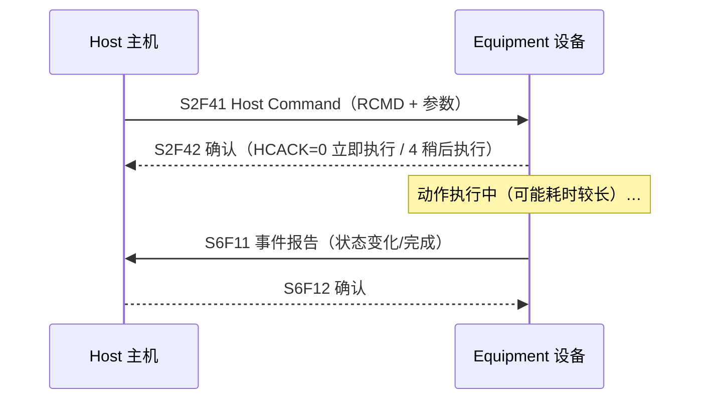
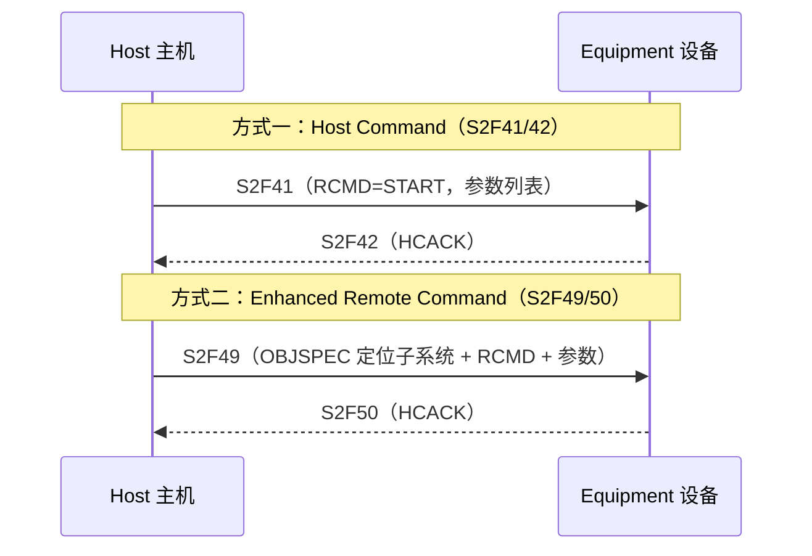

# 远程控制：RCMD 命令

> 远程控制让主机通过 SECS-II 消息**指挥设备动作**（启动/停止/暂停加工、选配方等）。核心语义：命令是"**请求开始执行**"而非"立即执行"——设备回执（HCACK=0 或 4）只代表接受，**动作完成通过事件报告通知**（§4.4）。

## 1. 命令语义：请求，不是命令

- **HCACK = 0**：命令已接受并执行；**HCACK = 4**：接受且"稍后执行，完成时会通知"（避免长命令卡事务超时）。
- 命令**完成**（正常或异常）必须产生**状态迁移或其他动作 → 采集事件**，主机靠事件得知结果。
- 远程命令**格式**：ASCII，最长 **20 字符**，只允许可打印字符（0x21~0x7E），**不允许空格**；全大写形式必须被识别（小写/混合大小写可选）。

## 2. 标准 RCMD 清单（§4.4.3）

| 命令 | 作用 | 说明 |
| --- | --- | --- |
| **START** | 启动加工 | 需先选好配方且在 READY 状态；可带变量参数（CPNAME/CPVAL/CEPVAL） |
| **PP-SELECT** | 选择工艺程序 | 参数列表给 PPID；`PPExecName` 显示当前选中 |
| **RCP-SELECT** | 选择配方（增强版） | 用 S2F49，可带参数；`RcpExecName` 显示当前选中 |
| **STOP** | 完成当前周期后安全停机 | 回到 IDLE；材料可能部分加工（可后续完成） |
| **PAUSE** | 下个安全断点挂起 | 可从同一点 RESUME / STOP / ABORT |
| **RESUME** | 从暂停点继续 | — |
| **ABORT** | 立即终止当前周期 | 不保证材料后续状态；可用 AbortLevel 参数（1=下个安全断点终止并回收材料） |

**最低要求**：至少实现 **START 和 STOP**（§4.4.4）。

## 3. 两种命令通道（§4.4.5）

- **S2F49 增强版**用消息头的 **OBJSPEC** 字段把命令定位到设备内部对象：子系统、处理站、端口、交换站、机械手、腔体等（§4.4.2）。
- 设备按适用性支持其中一种或两种。

## 4. 与状态模型的关系

- 命令效果由**加工状态模型**承载：START 要求 READY 状态；START → EXECUTING；STOP/ABORT → IDLE；PAUSE → PAUSE；RESUME → 回到 PROCESS 子状态（§3.4 表 3.4）。
- **REMOTE 状态**下主机可全权操作；**LOCAL 状态**下禁止会引起物理移动/启动加工的远程命令（见[状态模型](state-models.md)第 3 节）。
- 参数（CPNAME/CPVAL/CEPVAL）由厂商定义（标准不规定），可参考设备类专用模型（如 E30.1/E30.5 对检测/计量设备的命令扩展）。

## 5. 要点

- 命令=请求，**完成靠事件**（S6F11）确认——这是 GEM 异步风格的核心。
- 全大写、无空格、≤20 字符——RCMD 字符串的硬约束。
- 至少 START/STOP；复杂设备用 S2F49 精确定位到腔体/端口。
