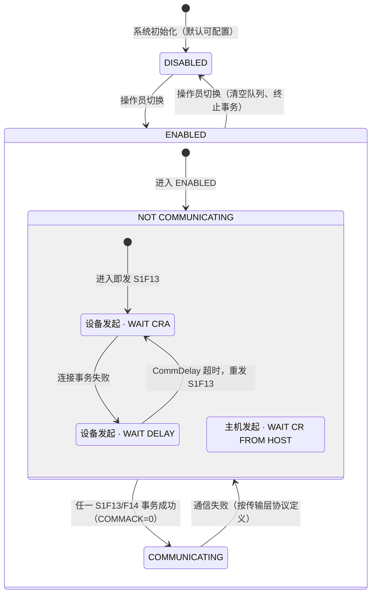
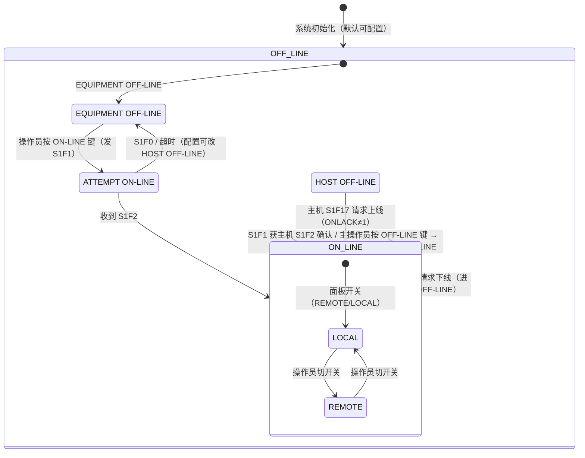
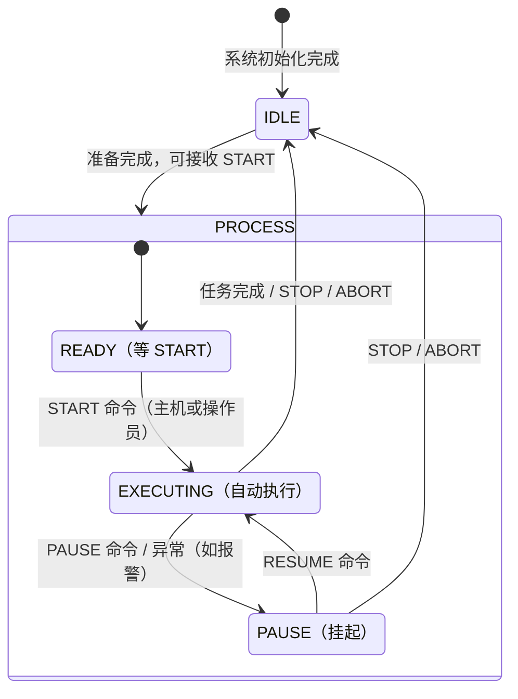

# 状态模型：设备行为的骨架

> E30 用**三个状态模型**描述设备行为：**通信状态模型**（能不能收发消息）、**控制状态模型**（主机能管到什么程度）、**加工状态模型**（设备正在干什么）。所有能力（报警、远程控制、数据采集…）都挂在这三个模型之上——先看懂骨架，再看血肉。

## 1. 三个模型的分工

| 模型 | 回答的问题 | 核心状态 | 章节 |
| --- | --- | --- | --- |
| 通信状态模型 | 消息链路通不通？ | DISABLED / ENABLED → COMMUNICATING | §3.2 |
| 控制状态模型 | 主机管到什么程度？ | OFF-LINE / ON-LINE（LOCAL / REMOTE） | §3.3 |
| 加工状态模型 | 设备在干什么？ | IDLE / READY / EXECUTING / PAUSE | §3.4 |

三个模型**互不直接联动**：通信模型的转换不会直接改变控制模型状态；但通信不通（NOT COMMUNICATING）时，几乎所有消息事务都无法执行，其他能力全部受影响。

## 2. 通信状态模型

回答"设备与主机之间是否有正式的通信关系"。注意这里是**逻辑连接**（S1F13/F14 成功即建立），不是物理链路。

**状态定义（§3.2.4）：**

- **DISABLED**：不存在 SECS-II 通信。切换到 DISABLED 必须立即停止所有收发、丢弃排队消息、终止所有打开的事务和会话。可作系统默认状态。
- **ENABLED / NOT COMMUNICATING**：只允许收发 **S1F13、S1F14 和 S9Fx**；收到其他消息直接丢弃。设备周期性地发 S1F13 直到建立通信（同时只允许一个设备发起的 S1F13 事务打开）。此状态含两个 **AND 子状态**（并行活跃）：
  - **EQUIPMENT-INITIATED CONNECT**：进入时立即发 S1F13 → WAIT CRA（等主机 S1F14）；失败 → WAIT DELAY（CommDelay 定时器 = `EstablishCommunicationsTimeout` 秒）→ 超时重发 S1F13。
  - **HOST-INITIATED CONNECT**：WAIT CR FROM HOST——收到主机 S1F13 就回 S1F14（COMMACK=0）。
- **ENABLED / COMMUNICATING**：正常工作状态，可收发任何消息；收到 S1F13 也应回 S1F14。保持到被禁用或通信失败；失败后回到 NOT COMMUNICATING 并尝试重建。

**关键规则：**

- **通信 = 逻辑建立**：任一 S1F13/F14 事务以 COMMACK=0（Accept）成功完成即建立通信，不论谁发起的（§4.1.3）。
- **连接事务失败** = 通信失败、或 S1F14 在回复超时内未收到、或收到的 S1F14 格式错误 / COMMACK≠0。
- 双方同时发起 S1F13 也可：谁先成功谁先建立通信，另一个事务保持打开直到正常关闭（§3.2.4、§4.1.5.3）。

## 3. 控制状态模型

回答"主机能控制设备到什么程度"。三档：**REMOTE（全权）→ LOCAL（信息全通、操作受限）→ OFF-LINE（几乎无控制）**。

**各状态的行为（§3.3）：**

- **OFF-LINE**：操作员在控制台上操作。仍能传输消息，但自动化用途被严格限制——只响应 **S1F13、S1F17**（主机请求上线），对其他主机主消息回 **Sx,F0**；设备自己只主动发 S1F13、S9Fx、S1F1。
  - **EQUIPMENT OFF-LINE**：等操作员指示尝试上线。
  - **ATTEMPT ON-LINE**：操作员按了 ON-LINE，已发 S1F1，等主机 S1F2（接受）或 S1F0/超时（拒绝→按配置回 EQUIPMENT OFF-LINE 或 HOST OFF-LINE）。
  - **HOST OFF-LINE**：操作员想上线但主机没同意（或主机 S1F15 把它拉下线）——此时主机可用 S1F17 请求上线，设备**必须**正面响应。
- **ON-LINE / LOCAL**：操作员直接操作设备；主机**禁止**使用会引起物理移动或启动加工的远程命令；加工中禁止修改影响该工艺的设备常数；可上传/下载/选择配方（不影响当前执行）；可配置事件、trace、报警上报；可查询各种数据。
- **ON-LINE / REMOTE**：主机可全权操作完整工艺周期；设备不限制主机任何能力。但**操作员至少保留**：改变 CONTROL 状态、急停（Emergency Stop）、中断加工（STOP/ABORT/PAUSE）。厂商可配置在非紧急程序里限制操作员（改常数、下载/选择/启动配方、物料搬动等，可按命令逐项配置）。

**上线/下线交互（§4.12.3、§4.12.5）：**

- 操作员按 ON-LINE → 设备发 **S1F1** → 主机 S1F2 = 同意（进入 ON-LINE）、S1F0/无响应 = 拒绝。
- 主机 **S1F15** 请求下线 → 设备确认（S1F16）进入 HOST OFF-LINE；主机 **S1F17** 请求上线 → S1F18（ONLACK=0 接受，1=拒绝）。
- 只有操作员能切换 ON-LINE 的子状态（LOCAL ↔ REMOTE）。
- 任何控制状态变化都是**采集事件**（Control State LOCAL/REMOTE、Equipment OFF-LINE），自动上报主机。

## 4. 加工状态模型

加工模型高度依赖设备工艺，E30 只给**示例模型**（§3.4）：不强制这些具体状态，但**每个状态迁移必须产生采集事件**，并提供 `ProcessState` / `PreviousProcessState` 状态变量。

**要点：**

- **IDLE**：等待指令；**READY**：工艺条件齐备，等 START；**EXECUTING**：自动执行；**PAUSE**：挂起等命令（RESUME 续跑、STOP/ABORT 终止）。
- 状态迁移与采集事件的对应：进入 EXECUTING = "Processing Started"，正常退出 = "Processing Completed"，STOP = "Processing Stopped"，任意迁移 = "Processing State Change"（§6 表 6.1）。
- 具体设备的加工模型由厂商定义，集群工具（cluster tool）等多腔体设备的加工模型可参考 E30.1 / E30.5 等专用模型（ISEM/MSEM）的写法。

## 5. 状态模型方法论（§3.1）

E30 全书用 **Harel 状态图**（Statechart）表示法描述行为（附录 A.5 有完整符号说明）：

- **状态**：圆角框，静态条件集合；**事件**：条件变化（收到消息、定时器超时、操作员输入、传感器变化）。
- **迁移**：从旧状态到新状态的箭头，有触发条件 + 动作；有向。
- **OR 子状态**（XOR）：父状态活跃时恰好一个子状态活跃（如 OFF-LINE 的三个子状态）。
- **AND 子状态**（并行）：父状态活跃时全部子状态同时活跃（如 NOT COMMUNICATING 下的设备发起 + 主机发起两条线）。退出任一 AND 子状态 = 退出父状态。
- **默认入口点**、**历史符号 H/H\***：进入父状态时默认/恢复到上次的子状态。

**文档三要素**（每个模型必须配套）：状态图（标注全部状态与迁移）、迁移表（编号、起点、触发、终点、动作、注释）、每个状态的定义文本。
