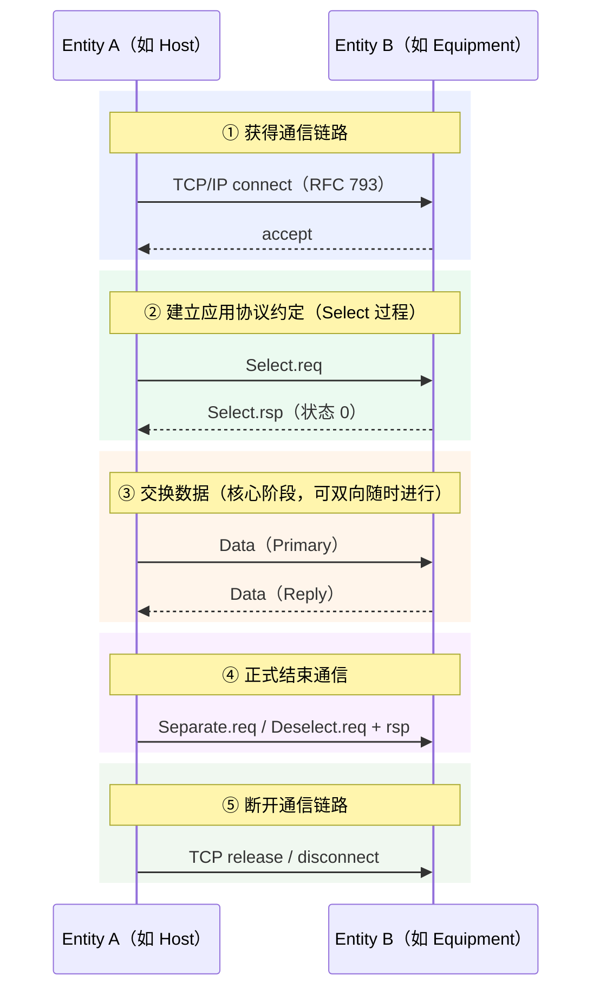
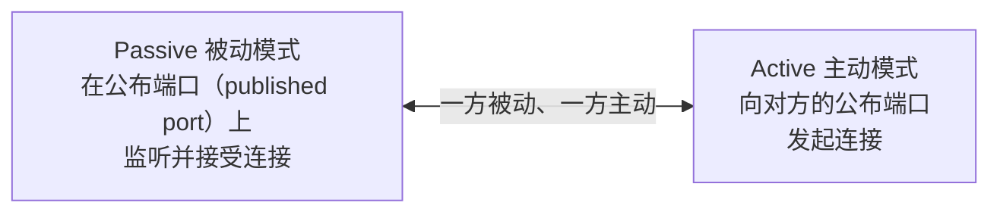
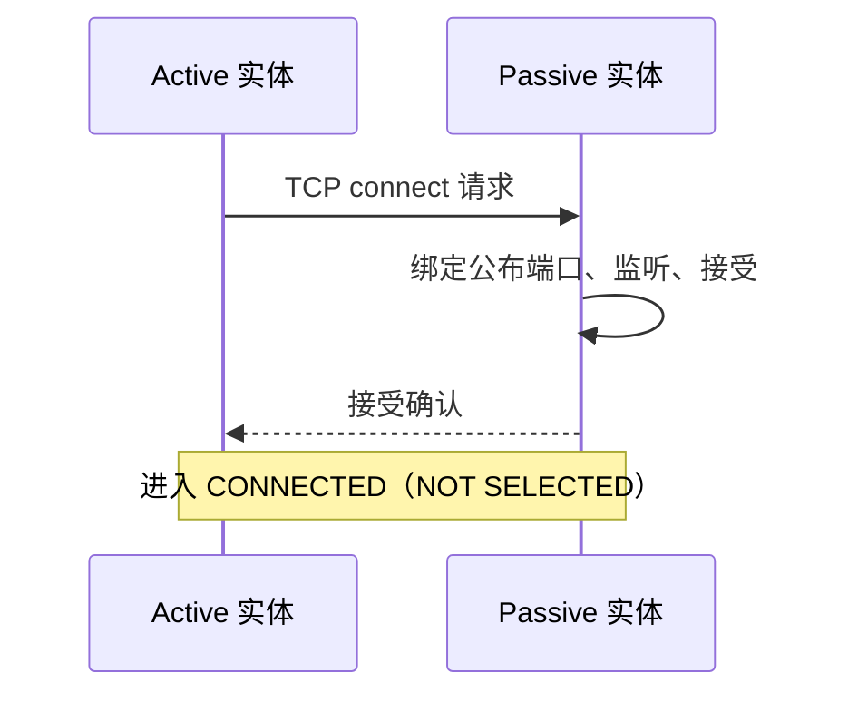

# 通信模型：一次完整的 HSMS 通信

> HSMS 的通信过程与 SECS-I 一脉相承，只是把 "RS-232 线" 换成了 "TCP/IP 连接"。理解五个阶段，就理解了 HSMS 的骨架。

## 1. 五步通信流程

标准（E37 §5）把任何一次 HSMS 通信抽象为五个步骤，与 SECS-I 一一对应：

对照 SECS-I：

| 步骤 | SECS-I | HSMS |
| --- | --- | --- |
| ① 建链 | 物理连接 RS-232 线 | TCP connect 建立连接 |
| ② 协议约定 | 隐含（两端物理相连即 SECS-II） | **Select 过程**确认此连接专用于 HSMS |
| ③ 数据交换 | SECS-II 消息 | SECS-II 消息（内容不变） |
| ④ 结束通信 | 无正式要求，直接下线 | Deselect（双方向）或 Separate（单方向） |
| ⑤ 断链 | 拔线 | TCP release / disconnect（逻辑断开） |

**要点：**

- 为什么需要 Select？TCP/IP 是共享网络，一条物理链路上可能跑着别的协议（FTP 等）。Select 让双方确认：这条 TCP 连接**专用于 HSMS**。
- 为什么需要 Separate/Deselect？让双方确认 TCP 连接**不再需要用于 HSMS**，然后才断链。
- 除了五个步骤，HSMS 还多了两个诊断工具：**Linktest**（链路完整性测试）和 **Reject**（拒绝不合时宜的消息，用于排查配置错误/软件 bug）。

## 2. TCP/IP 连接模式

TCP/IP 允许双方同时发起连接，但大多数 API 不支持，所以 HSMS 把实体限定为两种模式（E37 §6.3.1）：

- **Passive（被动）**：本地实体监听自己的 published port，等远端来连。三步：取端点并绑定公布端口 → 监听 → 收到请求后接受（RFC 793）。
- **Active（主动）**：本地实体发起连接。三步：取端点 → 连到对方的公布端口 → 等接受。

***主动方建连时序***

***Alternating（交替）模式***

双方都无法确定自己是主动还是被动时（附录 A1-3），可**交替尝试**：先试 Active（超时 ≥ T5）→ 失败再试 Passive（超时 ≥ T5）→ 循环直到连上。

连接组合规律（A1-3.2）：

| 本端配置 | 可连的对端 | 谁建立连接 |
| --- | --- | --- |
| ACTIVE | PASSIVE / ALTERNATING | 总是本端 |
| ALTERNATING | PASSIVE | 总是本端 |
| ALTERNATING | ALTERNATING | 任一端（可能同时连上两条，需约定保留一条） |
| PASSIVE × 2 或 ACTIVE × 2 | — | **不允许** |

**要点：** 两个实体不能都是被动（没人发起）也不能都是主动（没有监听方）。设备通常配置为 Passive，主机通常配置为 Active。

## 3. 终止 TCP/IP 连接

- 本地随时可断，但 **HSMS 只允许在 NOT SELECTED 状态下断开**（E37 §6.4）——必须先结束会话，再断链。
- 任一方都可以发起断开。
- 两种方式：
  - **release（释放）**：温和方式（`t_sndrel` / `close`），"礼貌"程度取决于实现。
  - **disconnect（断开）**：立即方式（`t_snddis` / `shutdown`），立即禁止收发。
- 断开后重连要遵守 **T5 连接间隔**（见[定时器与参数](timers.md)）。

## 4. 一个公布端口上的多个连接

TCP/IP 允许被动实体在接受一个连接后继续监听同一公布端口（E37 §9.2.4）。

- **标准允许（但不强制）多连接**：有能力的实体可并行服务多条连接，每条**独立按状态机运行**，互不影响。
- **标准只要求实体至少服务一个连接**：不要求必须支持多个。只支持单连接的实体（典型设备即如此），对额外连接请求用以下三种方式拒绝（§9.2.4.1）：

| 方式 | 行为 | 评价 |
| --- | --- | --- |
| a. 接受但 Select 总是返回"通信已激活"（SelectStatus=1） | 对端能明确知道被拒原因 | **推荐** |
| b. 主动拒绝连接（`t_snddis`） | 对端 connect 失败 | 部分 API（如 BSD socket）不支持主动拒绝 |
| c. 不监听不接受 | 对端 connect 超时 | 允许但不推荐，对端等待时间长 |

> 两种状态码别混淆（详见[消息格式页](message-format.md)状态码表）：方式 a 用的是 SelectStatus = **1（通信已激活）**；SelectStatus = **3（连接耗尽）** 用于"实体已在服务另一条连接、无法再服务"的场景。
