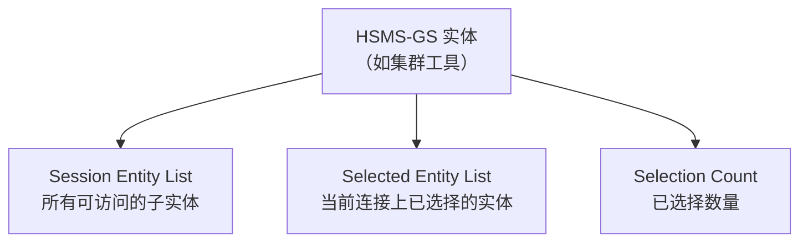
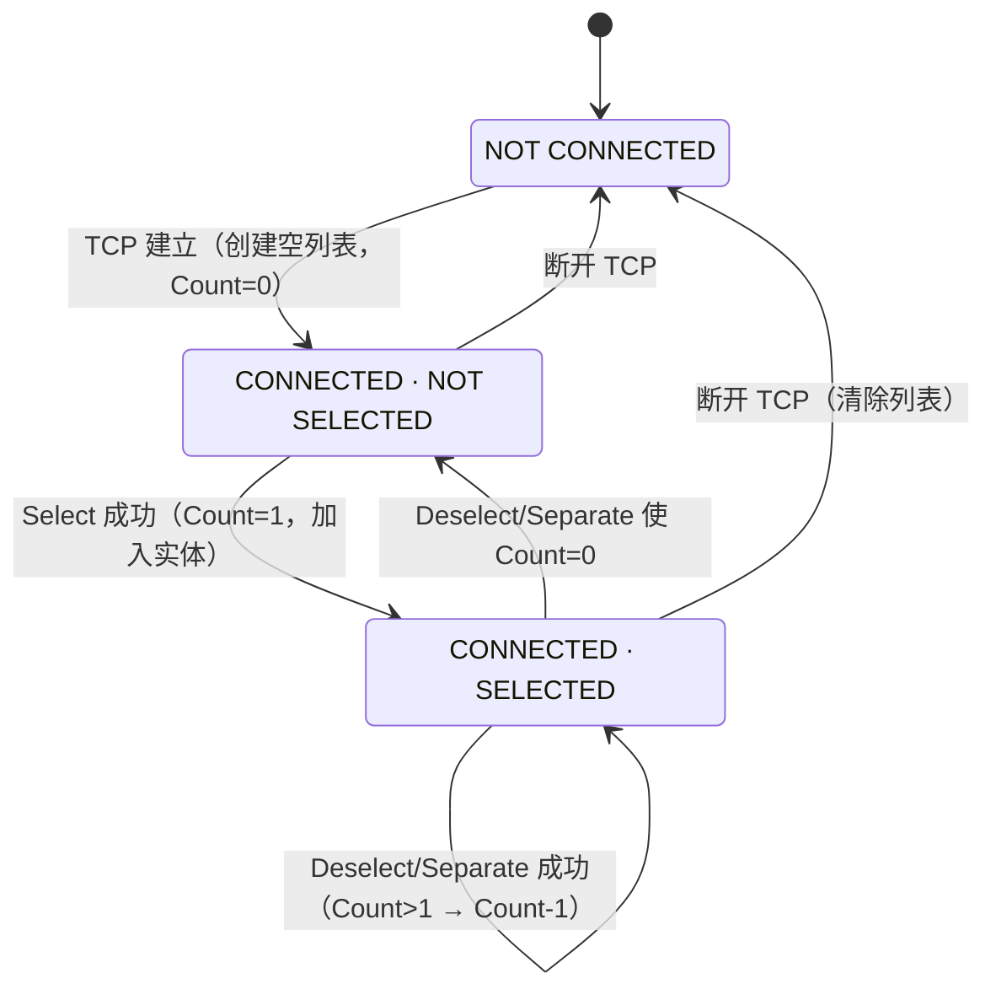

# E37.2 HSMS-GS：通用会话模式

> HSMS-GS（General Session）是 E37 的**扩展子标准**，目标：集群工具（cluster tool）、轨道系统等**复杂设备**——一个连接上可以有多个会话，分别访问不同子系统。

## 1. 核心概念

| 概念 | 含义 |
| --- | --- |
| **Session Entity** | 实体中可单独寻址的子实体（如一个工艺模块、一个数据服务器） |
| **Session Entity List** | 所有可寻址子实体的列表（范围通常覆盖整个实体；也可按端口拆分） |
| **Selected Entity List** | 当前 TCP 连接上**已选择**的实体集合 |
| **Selection Count** | Selected Entity List 里的数量 |

关键规则：

- 建连时创建**空** Selected Entity List；
- Select 一个 Session Entity → 加入列表；Deselect / Separate → 移出列表；
- **数据消息的 SessionID 必须在 Selected Entity List 中**，否则回 Reject（ReasonCode = 4 实体未选择）。

## 2. 扩展状态机

与通用服务相同，只是新增两条转换（#6、#7）并用 Selection Count 约束原转换：

| # | 当前状态 | 触发 | 新状态 | 动作 |
| --- | --- | --- | --- | --- |
| 2 | NC | TCP 建立 | NS | Count=0，创建空列表 |
| 4 | NS | Select 成功 | S | Count=1，加入实体 |
| **6** | S | **Select 成功（Count>0）** | S | **Count+1，加入实体** |
| **7** | S | **Deselect/Separate 成功（Count>1）** | S | **Count-1，移除实体；若变 0 立即触发 #5** |
| 5 | S | Deselect/Separate 使 Count=0 | NS | — |

## 3. 过程差异（§7）

- **Select**：NOT SELECTED 和 SELECTED 状态都允许；可**叠加**选择多个会话实体。新增三种响应状态（见下）；成功后双方都把 SessionID 加入 Selected Entity List。
- **Data**：SessionID 必须匹配 Selected Entity List 中的某个实体，否则 **Reject（ReasonCode = 4）**。
- **Deselect**：两个条件——① SessionID 必须在 Selected Entity List 中；② 该实体当前允许 Deselect（本地决定）。成功后移除实体、Count-1；只有 Count=0 才回到 NOT SELECTED。
- **Separate**：与 Deselect 同样约束（**不是**无条件的立即结束）。
- **Linktest / Reject / 通信失败**：同通用服务；注意**任何突然终止都会清空 Selected Entity List**（所有会话一起结束）。

## 4. 消息格式（§8）

- **Session ID**：Select / Data / Deselect / Reject / Separate 消息中 = **Session Entity ID**（必须是 Session Entity List 中的值）；Linktest 仍为 0xFFFF。
- **PType**：通常为 0（SECS-II）；特定应用领域可限制只允许 PType=0。
- **SType**：只允许 HSMS 定义的 SType。

### Select/Deselect 状态码扩展（E37.2 表 2）

在通用服务的 0-3 之外，GS 新增：

| 值 | 含义 |
| --- | --- |
| 4 | **No Such Entity**：Session ID 不对应任何可用会话实体 |
| 5 | **Entity In Use**：该实体不支持跨连接共享，且已被另一连接选择 |
| 6 | **Entity Selected**：该实体在当前连接上已被选择 |

## 5. 文档要求（§10）

HSMS-GS 实现需额外文档化：Session Entity List——可用的会话实体数量及各自 ID 值。
