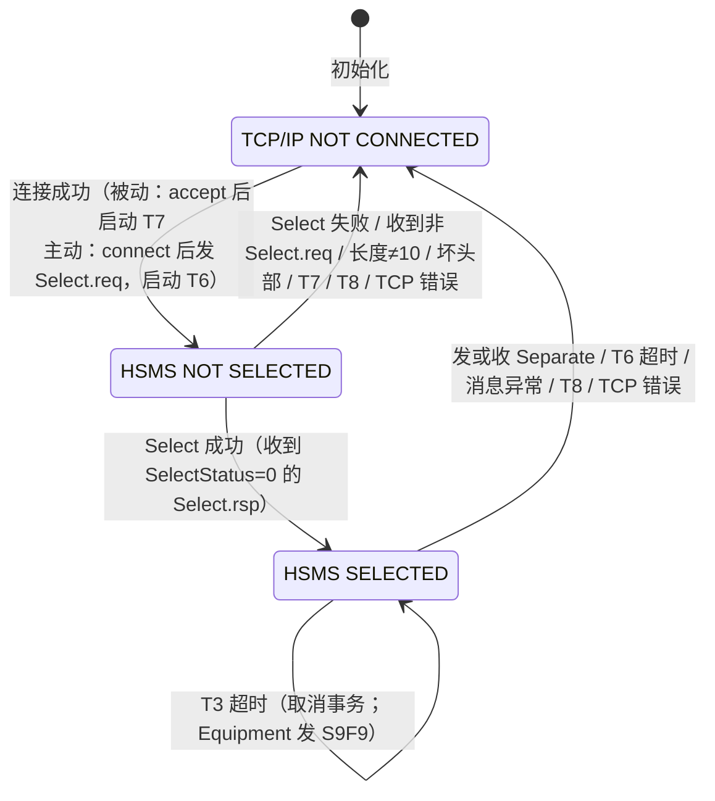
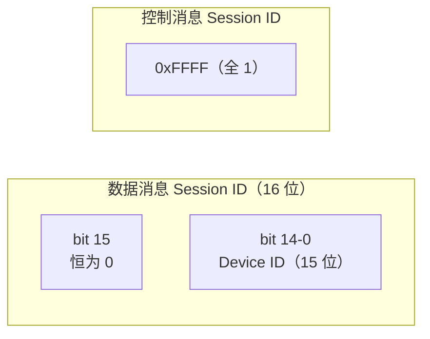
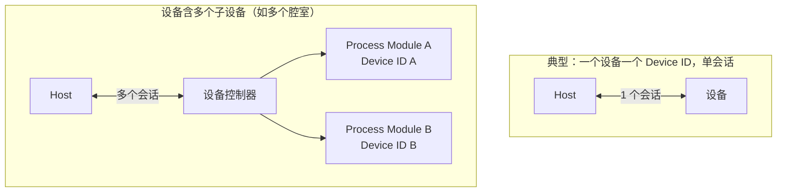

# E37.1 HSMS-SS：单会话模式

> HSMS-SS（Single Selected-Session Mode）是 E37 的**简化子标准**，目标：为"简单 SECS-I 替代"提供最小可用功能。做法就是砍：**禁 Deselect、Reject 可选、Select 只有主动方能发起**。

## 1. 与通用服务的三大差异（§5.1）

| # | 通用服务（E37） | HSMS-SS |
| --- | --- | --- |
| 1 | Deselect 可用（温和结束） | **禁用**，结束通信只用 Separate |
| 2 | Reject 必需 | **可选**（不实现时异常一律断开） |
| 3 | Select 双方都可发起 | **只有主动建连方（Active）能发起** |

另外：通用服务的 SelectionCounter 概念在 SS 中不需要。

## 2. 状态机

SS 只有三个状态：**TCP/IP NOT CONNECTED → HSMS NOT SELECTED → HSMS SELECTED**。

***被动方转换表（E37.1 表 1 简化）***

| # | 状态 | 触发 | 动作 |
| --- | --- | --- | --- |
| 2 | NC → NS | TCP accept 成功 | 启动 T7 |
| 3 | NS → S | 收到 Select.req 且允许 | 取消 T7，回 Select.rsp(0) |
| 4 | NS → NC | T7 超时 / 拒绝 Select / 收到非 Select.req / 长度≠10 / 坏头部 / T8 / TCP 错误 | 关闭连接 |
| 5 | S → NC | 发或收 Separate.req / T6 超时 / 消息异常 / T8 / TCP 错误 | 关闭连接 |
| 6 | S → S | T3 超时 | 取消事务；Equipment 发 S9F9 |

***主动方转换表（E37.1 表 2 简化）***

| # | 状态 | 触发 | 动作 |
| --- | --- | --- | --- |
| 2 | NC → NS | 决定连接 | connect + 发 Select.req + 启动 T6 |
| 3 | NS → S | 收到 Select.rsp(0) | 取消 T6 |
| 4 | NS → NC | T6 超时 / Select.rsp 非零 / 收到非 Select.rsp / 长度≠10 / 坏头部 / T8 / TCP 错误 | 关闭连接 + 启动 T5 |
| 5 | S → NC | 同被动方 #5 | 关闭连接 |
| 6 | S → S | T3 超时 | 同被动方 |

**与通用状态的差别**：SS 把通用服务的 "CONNECTED" 拆成主动/被动两套更严格的转换，且**任何异常（坏消息、超时、错误消息类型）都直接断开连接**——SS 只留最简路径。

***允许的事务（E37.1 表 3）***

| 事务 | 允许状态 | 谁发起 |
| --- | --- | --- |
| Select | NOT SELECTED | **主动方** |
| Linktest | SELECTED | 任一方 |
| Data | SELECTED | 任一方 |
| Separate | SELECTED | 任一方 |

## 3. 过程细节（§7）

- **Select**：仅主动方、仅 NOT SELECTED 状态；SessionID 用 **0xFFFF**（表示所有 device ID 可用）；Select 失败（非零状态）→ **立即关闭连接**回到 NOT CONNECTED。
- **Data**：与通用相同；SELECTED 状态下，SessionID 只要对应本设备支持的 DeviceID 就合法。
- **Deselect**：不使用。
- **Linktest**：与通用相同，但**严格限定 SELECTED 状态**（通用服务允许 CONNECTED 任意时刻）。
- **Reject**：可选。不实现时，需要 Reject 的情形一律按通信失败处理（立即断连）。
- **Separate**：SessionID 固定 0xFFFF；只在 CONNECTED 状态有效；发出或收到后**立即关闭连接**。

## 4. Session ID = Device ID（§8.1）

SS 对 Session ID 的用法做了明确限定：

- **数据消息**：最高位（bit 15）= 0，低 **15 位 = Device ID**（占字节 0 的低 7 位 + 整个字节 1）；
- **控制消息**：固定 **0xFFFF**。

Device ID 是设备的属性：一台设备**至少一个** Device ID；有多个子设备（如腔室）可以各有一个，含义由设备商定义。

其他格式约定：PType 全部为 0（SECS-II）；只允许使用 HSMS 定义的 SType（禁止用户自定义）。

## 5. 254 字节限制（§9.1，SECS-I 兼容）

E5 SECS-II 会区分"单块消息"和"多块消息"——这对 HSMS 没有意义（HSMS 不分块）。但为了兼容老 SECS-I 应用：

> 发送单块 SECS-II 消息时，**HSMS 消息长度不应超过 254 字节**（10 字节头部 + 244 字节文本）。

## 6. 连接场景（附录 R1）

- 实体可以有多个会话：设备若可分成多个逻辑子设备（腔室、工艺资源），每个可分配独立 Session ID（= Device ID）；
- **注意**：若多个子设备**共享一个资源**（如传片子系统），不建议给每个子设备独立会话——共享子系统没有自己的 Device ID，事件可能报错 Device ID（比如不知道晶圆盒是发给哪个腔室的）。
- 连接数量：设备通常只接受**一个**主机连接；主机可同时连**多个**设备；Cell Controller 可对上层是设备、对下层是主机。

## 7. 文档要求（§10）

HSMS-SS 实现需额外文档化：支持的 Device ID 数量及取值、是否支持 normal / restricted 结束流程、Host vs Equipment 参数设置。
