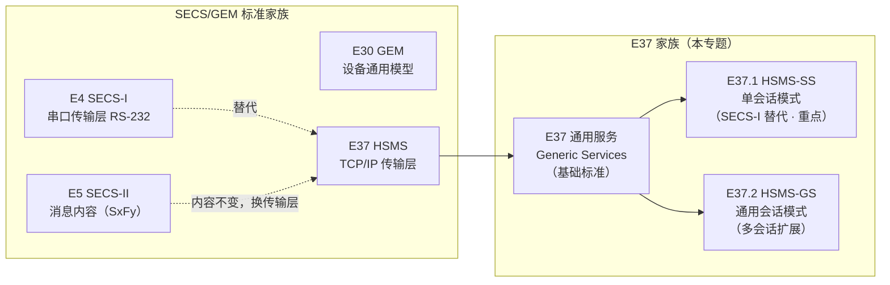
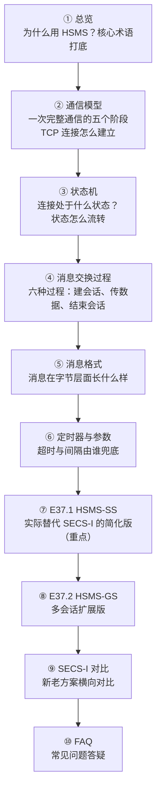

# 总览：HSMS 简介

> **HSMS**（High-Speed SECS Message Services，高速 SECS 消息服务）用 **TCP/IP 网络**在半导体工厂中传输 SECS 消息，是 **SECS-I（E4）串口通信**的现代替代方案。
>

## 1. HSMS 的定位

HSMS 在 SECS/GEM 标准家族中的位置

**要点：**

- **SECS-I 和 HSMS 处于同一层**——都是传输层。E5 SECS-II 定义的消息内容（S1F1、S2F17…）完全不变，只是换了一条更快的"路"来传输。
- E30 GEM 站在更上层，定义设备的通用行为模型，不关心底层是 SECS-I 还是 HSMS。
- **E37 是基础标准**，定义全部机制（状态机、消息过程、消息格式、定时器）；
- **E37.1 做减法**（砍掉用不到的功能，只留最简路径）；
- **E37.2 做加法**（支持一个连接上多个会话，服务集群工具等复杂设备）。

## 2. HSMS的作用

为什么要用 HSMS 取代 SECS-I

| 对比项 | SECS-I（E4） | HSMS（E37） |
| --- | --- | --- |
| 通信协议 | RS-232 串口 | TCP/IP 网络 |
| 速度 | 约 1000 字节/秒（9600 波特） | 典型 10 Mbit/s（以太网） |
| 连接 | 一条串口线只能连一对设备 | 一条网线可承载多条连接 |
| 消息分块 | 拆成 ~256 字节的块，带校验码 | 整条消息一个流，不分块 |

（完整对比见 [SECS-I 与 HSMS 对比](secs-vs-hsms.md)）

## 3. HSMS的核心术语

术语定义见 E37 §4 Terminology，按主题分组讲解。

***连接与会话***

- **entity 实体** — TCP/IP 连接端点上的应用程序。标准刻意用 "entity" 而不是 "host / equipment"：因为 HSMS 的应用不限于主机连设备（还可能是设备之间、Cell Controller 等）。在 SECS-I 替代场景里，主机和设备各是一个 entity。
- **initiator / responding entity 发起方 / 响应方** — 请求服务的 entity 是发起方（initiator），提供服务的是响应方（responding entity）。
- **connection 连接** — 两个 entity 在 TCP/IP 上建立的逻辑链路，对应状态机的 CONNECTED 状态，通过标准的 TCP connect 流程建立。
- **session 会话** — 为交换 HSMS 消息而建立的关系，通过 **Select 过程**建立，进入 SELECTED 状态。**数据消息只能在 SELECTED 状态下交换**，这是 HSMS 最核心的规则。
- **session ID 会话 ID** — 消息头里 16 位的字段，把控制消息和后续数据消息关联到同一个会话。
- **port / published port 端口 / 公布端口** — 监听方公布、用于接收连接请求的 IP + 端口。

***消息与报文***

- **message 消息** — 一次单向通信的完整单元，由三部分组成：

|L|H|T|
|--------------------------------------------|-------------------------|------------------------|
|4 字节 Message Length （头 + 文本总长）|10 字节 Message Header|0-n 字节 Message Text|

- **header 消息头** — 每条消息前的 10 字节数据（Session ID、PType/SType、System Bytes 都在这里）。
- **message length 消息长度** — 4 字节无符号整数，等于头部 + 文本的总字节数。
- **control message 控制消息** — 管理会话的消息：Select / Deselect / Linktest / Separate / Reject。
- **data message 数据消息** — 传应用数据的消息，分 **Primary**（奇函数号，事务的第一条）和 **Reply**（偶函数号，对 Primary 的响应）。
- **transaction 事务** — 一个 Primary 消息 + 它对应的 Reply（如果有）。控制事务同理：`Select.req` + `Select.rsp`。
- **PType 表示类型** — 消息编码方式，0 = SECS-II 编码。
- **SType 会话类型** — 区分数据消息（0）和控制消息（1-9）。
- **stream / function 流 / 功能号** — SECS-II 消息编号，如 S1F1 = 流 1 功能 1。
- **W-Bit 等待位** — Primary 消息是否期待 Reply（1=期待，0=不期待）。

***其他***

- **API 应用编程接口** — 使用 TCP/IP 的编程接口，如 BSD Socket、TLI。
- **confirmed / unconfirmed service 确认 / 非确认服务** — 发起方是否要求响应方回消息确认。
- **定时器** — HSMS 定义了五个定时器 **T3 / T5 / T6 / T7 / T8**，分别约束回复等待、连接间隔、控制事务、空闲、字节间隔（详见 [定时器与参数](timers.md)）。

## 4. HSMS 三份标准各介绍什么

| | E37 通用服务 | E37.1 HSMS-SS | E37.2 HSMS-GS |
| --- | --- | --- | --- |
| 定位 | 基础标准，定义全部机制 | 单会话，做减法 | 多会话，做加法 |
| 典型场景 | — | 简单 SECS-I 替代（1 主机 ↔ 1 设备） | 集群工具 / 轨道系统等复杂设备 |
| Select | 双方都可发起 | 只有主动建连方（Active）能发起 | 双方可发起，可叠加选择多个会话实体 |
| Deselect | 可用 | **禁用**（结束会话用 Separate） | 可用 |
| Reject | 必需 | 可选 | 必需 |
| Session ID | 由子标准定义 | 控制消息固定 `0xFFFF`；数据消息低 15 位为 Device ID | 等于 Session Entity ID |
| 会话数 | 1 | 1 | 多个 |

## 5. HSMS笔记组织方式

本笔记是沿着**一次 HSMS 通信的生命周期**展开：先搭好整体框架，再逐层下钻细节，最后落到实际使用的子标准，收尾用对比和答疑。

***第一层：总览（地基）***

- [**① 总览**](index.md)：HSMS 是什么、为什么取代 SECS-I、三份标准的关系、核心术语——先建立整体印象。后面所有页面引用术语（entity、session、PType…）时不再重复解释，回到这一页查即可。

***第二层：一次通信的骨架***

先建立连接，再管状态，这是 HSMS 的两块地基：

- [**② 通信模型**](communication.md)：把一次通信拆成**五个阶段**——建链 → Select 建立协议约定 → 数据交换 → 正式结束 → 断链。同时讲 TCP 连接本身怎么建立：Active / Passive / Alternating 三种模式，谁主动、谁监听。
- [**③ 状态机**](state-machine.md)：把连接抽象成三个状态（NOT CONNECTED / NOT SELECTED / SELECTED），回答"**建完连接之后，HSMS 层面的会话如何流转**"——状态机里 6 条转换，就是通信模型五阶段的"状态视角"。

***第三层：通信的细节***

骨架搭好后，下钻到"消息"层面：

- [**④ 消息交换过程**](procedures.md)：状态机的转换靠什么触发？六种消息过程（Select / Data / Deselect / Linktest / Separate / Reject），每种过程谁发起、什么时候用、有没有响应。
- [**⑤ 消息格式**](message-format.md)：过程里交换的"消息"在字节层面长什么样——4 字节长度 + 10 字节头部 + 文本，头部各字段（Session ID / PType / SType / System Bytes）逐一拆解。
- [**⑥ 定时器与参数**](timers.md)：通信的可靠性由谁保证？T3 / T5 / T6 / T7 / T8 五个定时器分别约束回复等待、连接间隔、控制事务、空闲、字节间隔，超时了各有什么后果。

***第四层：落地实现（子标准）***

- [**⑦ E37.1 HSMS-SS**](hsms-ss.md)：**实际部署中最常用**的一版——简单设备的 SECS-I 替代方案。重点看它"砍了什么"（禁 Deselect、Reject 可选、Select 仅主动方），以及 Session ID = Device ID、254 字节兼容限制。
- [**⑧ E37.2 HSMS-GS**](hsms-gs.md)：复杂设备（集群工具、轨道系统）的多会话扩展版。一个连接上可以同时 Select 多个会话实体，看它"加了什么"。

***第五层：疑问与答案***

- [**⑨ SECS-I 与 HSMS 对比**](secs-vs-hsms.md)：回到第 2 节的动机，逐项对比新旧方案的差异（协议、速度、消息格式、参数），理解"为什么换"。
- [**⑩ FAQ**](faq.md)：学习过程中的高频疑问，按主题归类，答案都标注标准出处。

***复习锦囊***

- **快速回忆**：① → ⑦，一小时建立 HSMS-SS 全貌；
- **当工具书用**：查字段去 ⑤，查超时去 ⑥，查状态码去 ⑤，查对比去 ⑨。
