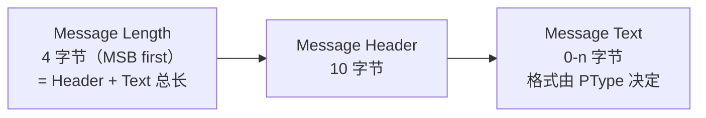
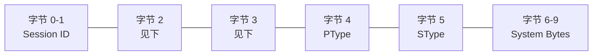
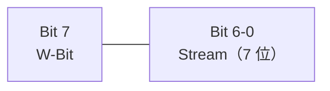
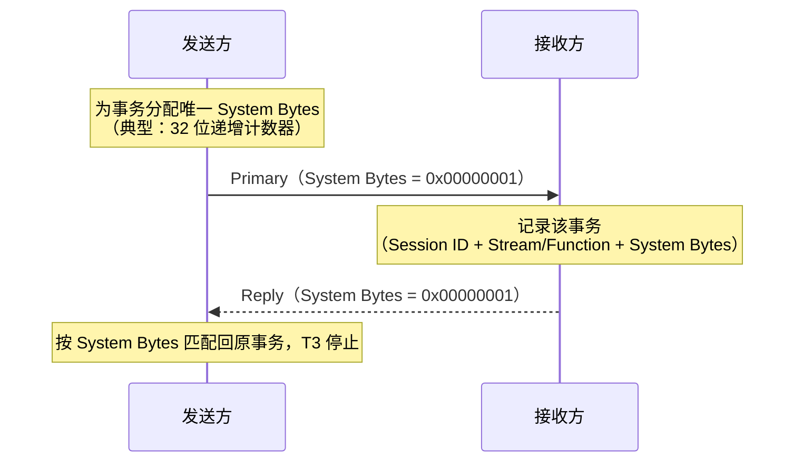

# 消息格式：字节层面的 HSMS

> HSMS 消息 = **4 字节长度 + 10 字节头部 + 0-n 字节文本**，所有字段大端（MSB first）传输。这是 HSMS 最"硬核"的一页，以表格为主。

## 1. 消息总体结构

- 最小长度 = 10（只有头部）；最大长度由实现决定。
- 字节顺序刻意与 SECS-I 头部尽可能对应。

## 2. 消息头部：10 个字节

| 字节 | 字段 | 说明 |
| --- | --- | --- |
| 0-1 | **Session ID** | 16 位无符号整数，把控制消息（尤其 Select/Deselect）与后续数据消息关联到同一会话 |
| 2 | Header Byte 2 | 控制消息：0 或状态码；数据消息（PType=0）：**W-Bit + Stream** |
| 3 | Header Byte 3 | 控制消息：0 或状态码；数据消息（PType=0）：**Function** |
| 4 | **PType** | 表示类型（消息怎么编码），0 = SECS-II |
| 5 | **SType** | 会话类型（0=数据，1-9=控制） |
| 6-9 | **System Bytes** | 事务标识（见下） |

***字节 2 的位布局（数据消息，PType=0）***

- **W-Bit**：Primary 是否期待 Reply（1=期待，0=不期待；Reply 消息恒为 0）
- **Stream**（字节 2 低 7 位）：SECS-II 消息的流号（如 S1F1 的 "1"）
- **Function**（字节 3，8 位）：功能号；最低位决定 Primary（1）/ Reply（0）

***PType 取值***

| 值 | 含义 |
| --- | --- |
| 0 | SECS-II 编码 |
| 1-127 | 子标准保留 |
| 128-255 | 保留，不使用 |

***SType 取值***

| 值 | 消息 | 值 | 消息 |
| --- | --- | --- | --- |
| 0 | Data（数据消息） | 6 | Linktest.rsp |
| 1 | Select.req | 7 | Reject.req |
| 2 | Select.rsp | 8 | （未使用） |
| 3 | Deselect.req | 9 | Separate.req |
| 4 | Deselect.rsp | 10 | （未使用） |
| 5 | Linktest.req | 11-127 / 128-255 | 子标准保留 / 保留不用 |

***System Bytes 规则***

System Bytes 是 4 字节字段（头部字节 6-9），**用来在"打开的事务"集合中唯一标识一个事务**（§8.1.4.6）——对端靠它把 Reply 匹配回对应的 Primary。

- **怎么产生**：由发送方决定，标准不规定具体算法，常见实现是 32 位递增计数器。为每条 Primary / `.req` 分配一个值，并保证：
  - 与**同一端发起的其他打开事务**不同；
  - 与**最近刚完成**的事务也不同（防止对端按"刚完成值"误判）；
  - 计数器绕回（wrap around）时，跳过仍在打开或刚完成用过的值。
- **怎么用**：接收方收到 Reply / `.rsp` 时，用 **System Bytes（配合 Session ID、Stream、Function）** 找到对应的打开事务完成配对；T3 定时器也按事务（以 System Bytes 区分）分别计时、超时后关闭对应事务。

## 3. 各消息类型格式汇总（PType=0）

| 消息 | SType | 长度 | Session ID | 字节 2 | 字节 3 | System Bytes | 文本 |
| --- | --- | --- | --- | --- | --- | --- | --- |
| Data | 0 | ≥10 | 子标准定义 | W-Bit + Stream | Function | Primary 唯一 / Reply 同 Primary | SECS-II 文本 |
| Select.req | 1 | 10 | 子标准定义 | 0 | 0 | 唯一 | 无 |
| Select.rsp | 2 | 10 | 同 req | 0 | SelectStatus | 同 req | 无 |
| Deselect.req | 3 | 10 | 子标准定义 | 0 | 0 | 唯一 | 无 |
| Deselect.rsp | 4 | 10 | 同 req | 0 | DeselectStatus | 同 req | 无 |
| Linktest.req | 5 | 10 | 0xFFFF | 0 | 0 | 唯一 | 无 |
| Linktest.rsp | 6 | 10 | 0xFFFF | 0 | 0 | 同 req | 无 |
| Reject.req | 7 | 10 | 同被拒消息 | 被拒消息的 PType/SType | ReasonCode | 同被拒消息 | 无 |
| Separate.req | 9 | 10 | 子标准定义 | 0 | 0 | 唯一 | 无 |

**要点：** 控制消息（SType≠0）恒为 10 字节（只有头部）；只有 Data 消息可以有文本。

## 4. 状态码表

***SelectStatus（Select.rsp 字节 3）***

| 值 | 含义 |
| --- | --- |
| 0 | 通信建立，Select 成功 |
| 1 | 通信已激活（之前已 Select 过） |
| 2 | 连接未就绪（还不能接受 Select） |
| 3 | 连接耗尽（已在服务另一条连接，无法再服务） |
| 4-127 | 子标准保留（HSMS-GS 定义了 4/5/6） |
| 128-255 | 本地实体特定原因 |

***DeselectStatus（Deselect.rsp 字节 3）***

| 值 | 含义 |
| --- | --- |
| 0 | 通信结束，Deselect 成功 |
| 1 | 通信未建立（还没 Select 或已 Deselect 过） |
| 2 | 通信忙（响应方会话仍在用，无法优雅释放；此时可用 Separate 兜底） |
| 3-127 / 128-255 | 子标准保留 / 本地原因 |

***ReasonCode（Reject.req 字节 3）***

| 值 | 含义 |
| --- | --- |
| 1 | SType 不支持 |
| 2 | PType 不支持 |
| 3 | 事务未打开（收到没有对应请求的响应控制消息） |
| 4 | 实体未选择（未 SELECTED 时收到数据消息） |
| 4-127 / 128-255 | 子标准保留 / 本地原因 |
