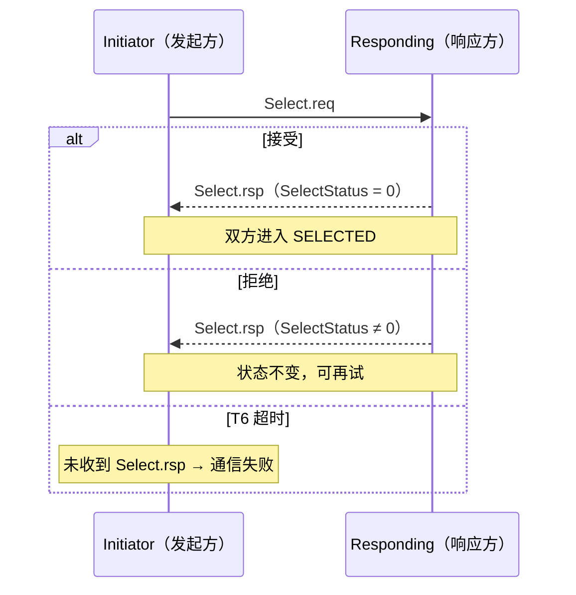
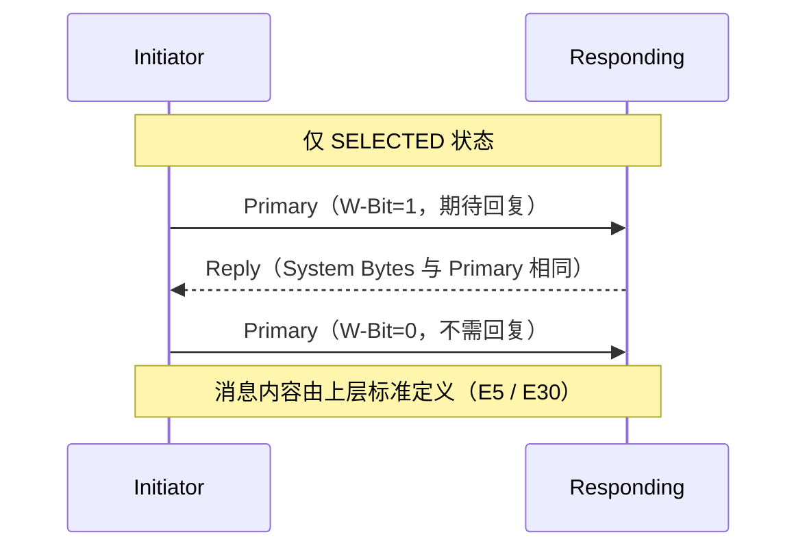
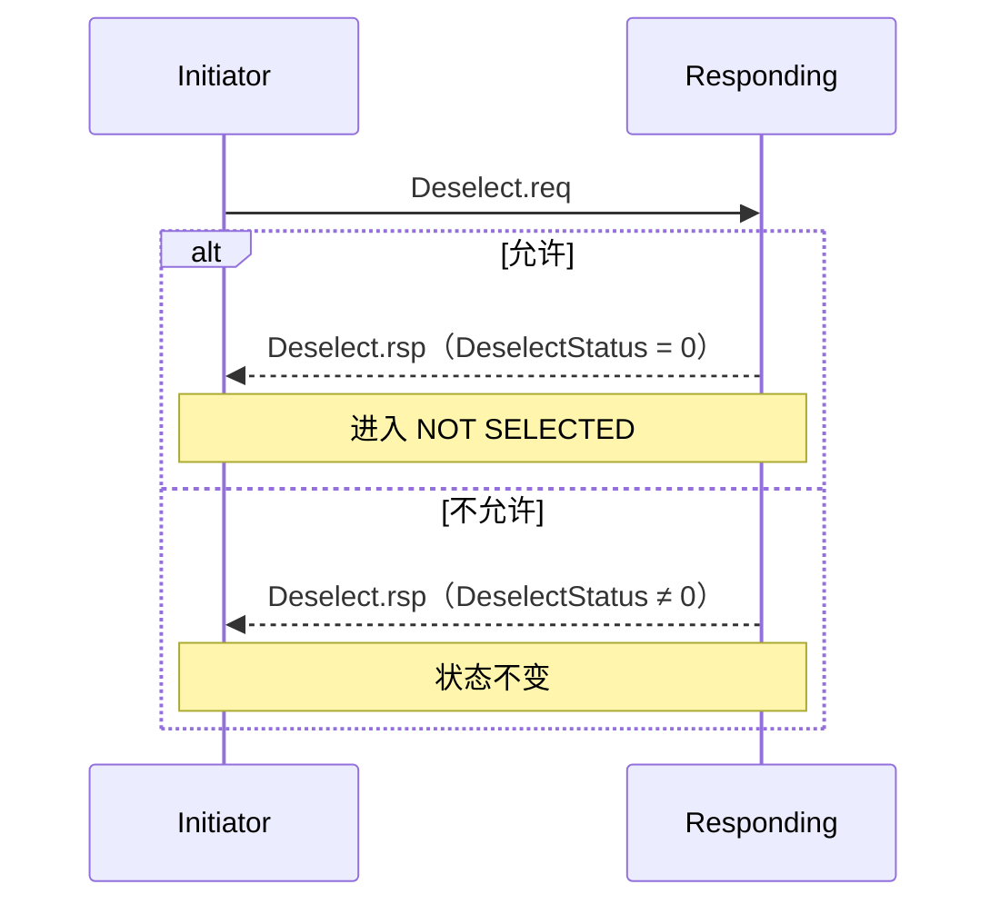
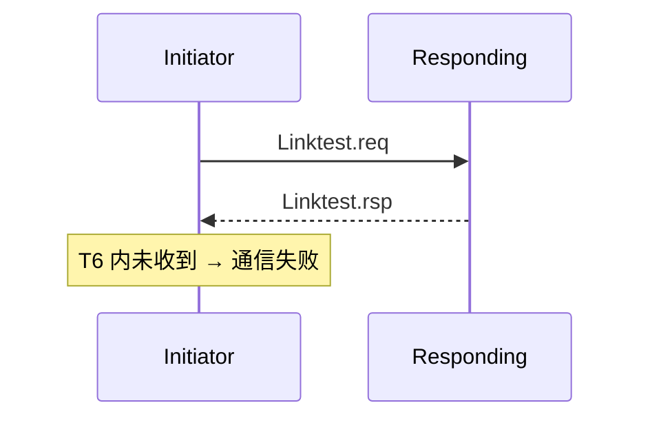
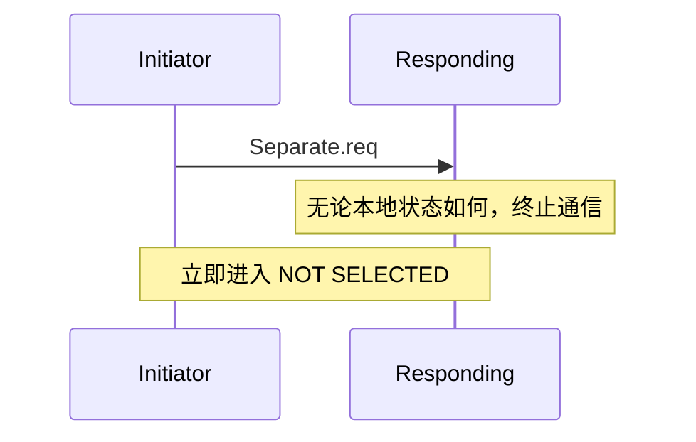
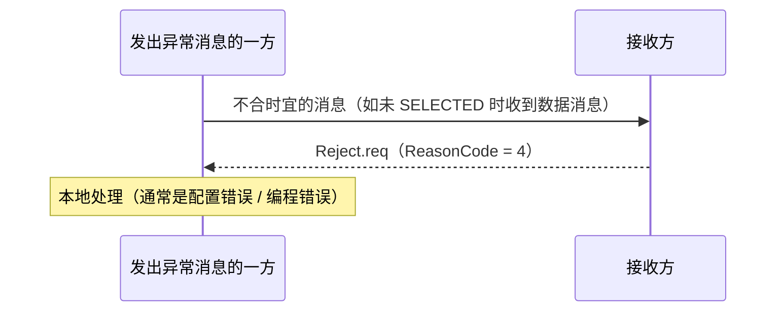

# 消息交换过程：六种 HSMS 过程

> HSMS 定义了六种消息交换过程，一句口诀：**Select 建会话、Data 传数据、Deselect/Separate 结束会话、Linktest 测链路、Reject 拒异常**。

## 0. 过程总览表

| 过程 | 目的 | 谁发起 | 有效状态 | 有响应？ |
| --- | --- | --- | --- | --- |
| Select | 建立 HSMS 会话 | 任一方 | NOT SELECTED（子标准可限制） | 有（Select.rsp） |
| Data | 交换应用数据 | 任一方 | SELECTED | 视 W-Bit |
| Deselect | 温和结束会话 | 任一方 | SELECTED | 有（Deselect.rsp） |
| Linktest | 测试链路完整性 | 任一方 | CONNECTED 任意 | 有（Linktest.rsp） |
| Separate | 立即结束会话 | 任一方 | SELECTED | 无 |
| Reject | 拒绝不合时宜的消息 | 消息接收方 | 任意 | 无 |

所有过程都通过交换 HSMS 消息完成：消息作为 TCP 流以**普通优先级**发送/接收（HSMS 不支持 TCP "Urgent" 数据）。

## 1. Select 过程——建立会话

目的：在 TCP 连接上建立 HSMS 通信（`.req` / `.rsp` 构成一个控制事务）。

- 通用服务允许在 CONNECTED 任意时刻发起 Select；子标准可能限制只能在 NOT SELECTED（如 HSMS-SS）。
- 双方同时发起 Select（相同 Session ID）也可以：各自接受对方即可（§7.2.3）。

## 2. Data 过程——数据交换

目的：交换 SECS-II 应用数据。**只有 SELECTED 状态下有效**，否则触发 Reject。

两种数据事务：

1. Primary 期待回复（W-Bit=1）+ 对应的 Reply；
2. Primary 不期待回复（W-Bit=0）。

**回复匹配规则**（§9.4.1，SECS-II 相关）：Reply 的 SessionID、Stream、System Bytes 必须与 Primary 相同；Function 必须比 Primary 大 1，或为 0（Function Zero Reply）。等待 Reply 受 **T3** 超时约束。

## 3. Deselect 过程——温和结束会话

目的：在断链前**优雅地**结束 HSMS 通信（要求 SELECTED 状态）。

- 响应方只有在 SELECTED 且本地条件允许时才接受；否则返回非零状态（如"通信忙"，此时可改用 Separate 作为最后手段）。
- T6 超时未收到 Deselect.rsp → 通信失败。

## 4. Linktest 过程——链路测试

目的：确认 TCP/IP 和 HSMS 通信仍然健康（可作周期心跳）。CONNECTED 任意时刻都有效。

- 标准不规定发送频率，由实现决定（典型做法是周期发送心跳）。

## 5. Separate 过程——立即结束会话

目的：**立即、无条件**终止 HSMS 通信（要求 SELECTED）。与 Deselect 的区别：**无响应消息**、接收方**无论本地状态如何都必须终止通信**。

- 接收方若不在 SELECTED 状态，则忽略 Separate.req。

## 6. Reject 过程——拒绝异常消息

目的：对"在错误情境下收到的合法 HSMS 消息"给出反馈，帮助排查配置错误或软件 bug。

HSMS **必须**使用 Reject 的情形（§7.7）：

1. NOT SELECTED 状态收到数据消息；
2. 收到 SType 或 PType 未定义的（或本实体不支持的）消息；
3. 收到"没有对应打开事务"的响应控制消息（如凭空冒出的 Select.rsp）。

子标准可定义更多触发条件。ReasonCode 详解见[消息格式页](message-format.md)。

## 7. 无状态事务（§9.3.2）

控制过程大多构成"请求-响应"事务，但这类事务是**无状态**的：

- 发起方等响应期间，可能收到任何当时状态下合法的其他消息（例如双方同时发起事务）；
- 因此状态机中**没有**"事务打开/未打开"状态——是否跟踪事务是纯实现细节（本地实体自行决定）。
