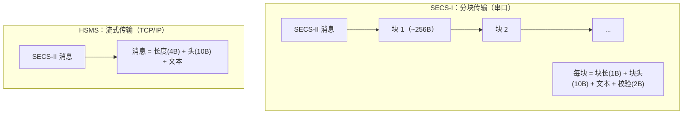

# SECS-I 与 HSMS 对比

> 附录 A1-11 给出了官方的逐项对比。核心一句话：**同样的 SECS-II 消息内容，SECS-I 用串口分块传，HSMS 用 TCP/IP 流式传**。

## 1. 分块 vs 流式

## 2. 逐项对比表（A1-11）

| 特性 | SECS-I | HSMS |
| --- | --- | --- |
| 通信协议 | RS-232 串口 | TCP/IP |
| 物理层 | 25 针连接器 + 4 线串口线 | 未定义（任意 TCP/IP 支持的介质，典型以太网） |
| 通信速度 | 约 1000 字节/秒（9600 波特） | 典型 10 Mbit/s（以太网） |
| 连接 | 一条串口线一个连接 | 一条网线可承载多个连接 |
| 消息格式 | SECS-II 数据项；分块传输（每块 ~256B，含 1B 块长 + 10B 块头 + 文本 + 2B 校验） | SECS-II 数据项；整条消息流式传输（4B 长度 + 10B 头 + 文本） |
| 头部 | 每个块一个 10B 头；字节 4-5 = E-Bit + 块号 | 整条消息一个 10B 头；字节 4-5 = PType/SType；字节 2-3 = W-Bit/Stream/Function（数据消息）；无 R-Bit |
| 最大消息 | 约 7.9 MB（32767 块 × 244 字节） | 4 字节长度上限 ≈ 4 GB（实际受实现限制） |
| 共同参数 | T3、Device ID | T3、Session ID（对应 Device ID） |
| SECS-I 独有参数 | Baud、T1、T2、T4、RTY、Host/Equipment | — |
| HSMS 独有参数 | — | IP 地址/端口、T5、T6、T7、T8 |

## 3. 要点

- **内容不变，载体变**：SECS-II 消息数据项在两种协议下都一样，上层应用基本无感。
- **速度差距**：约 1000 B/s vs 10 Mbit/s，相差约万倍——这也是 HSMS 存在的最大理由。
- **拓扑灵活**：网线复用、多连接并行；串口一对一直连。
- **可靠性与错误模型不同**：SECS-I 靠块校验（checksum）+ 重试（RTY）；HSMS 靠 TCP/IP 保证字节流 + T3-T8 定时器兜底。
- **254 字节提醒**：HSMS 消息理论上能到 4GB，但为兼容老 SECS-I 单块应用，单块消息建议 ≤254 字节（见 [E37.1 HSMS-SS](hsms-ss.md)）。
