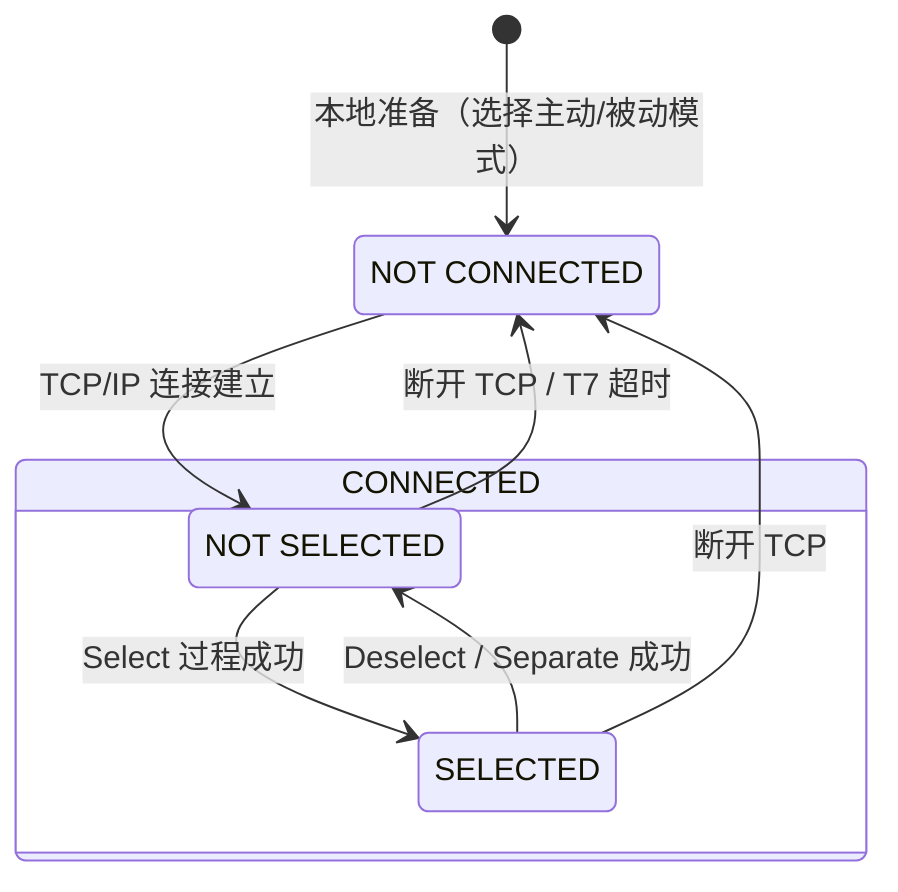

# 状态机：连接的三种状态

> HSMS 用三个状态描述一条连接的生命周期。记住一句话：**建连 → Select 选中 → 数据交换 → 结束回退 → 断连**，状态机就是这句话的形式化。

## 1. 状态图

## 2. 三个状态的含义

| 状态 | 含义 | 能否交换数据 |
| --- | --- | --- |
| **NOT CONNECTED** | 准备好监听或发起连接，但当前没有任何连接 | ❌ |
| **CONNECTED · NOT SELECTED** | TCP 连接已建立，但 HSMS 会话尚未建立（或已结束） | ❌ |
| **CONNECTED · SELECTED** | 至少一个 HSMS 会话已建立——**正常"工作"状态**（标准状态图中用粗框标注） | ✅ |

**要点：**

- "CONNECTED" 是 TCP 层面的，代表有一条 TCP 连接；
- "SELECTED" 是 HSMS 层面的，代表双方完成了 Select 握手、可以交换数据消息；
- SELECTED 是唯一允许数据交换的状态，HSMS 的日常数据交换都在这里发生。

## 3. 状态转换表（E37 表 1）

| # | 当前状态 | 触发事件 | 新状态 | 动作/说明 |
| --- | --- | --- | --- | --- |
| 1 | — | 本地准备 TCP/IP 通信 | NOT CONNECTED | 决定使用主动还是被动连接流程 |
| 2 | NOT CONNECTED | 为 HSMS 建立了 TCP 连接 | CONNECTED · NOT SELECTED | — |
| 3 | CONNECTED | 断开 TCP 连接 | NOT CONNECTED | 仅允许在 NOT SELECTED 子状态断开（§6.4） |
| 4 | NOT SELECTED | Select 过程成功完成 | SELECTED | HSMS 通信完全建立，允许交换数据消息 |
| 5 | SELECTED | Deselect 或 Separate 成功 | NOT SELECTED | 通常随后立即断开 TCP（转换 3） |
| 6 | NOT SELECTED | T7 超时 | NOT CONNECTED | 防止长时间"占着连接不 Select"（§9.2.2） |

## 4. 关键规则

- **数据消息只能在 SELECTED 状态交换**——在 NOT SELECTED 收到数据消息会触发 Reject（通用服务）或直接视为通信失败（HSMS-SS）。
- **断链前必须回到 NOT SELECTED**——先结束会话（Deselect/Separate），再断开 TCP。
- **T7 超时**：建连后迟迟不 Select，实体就一直"占着"连接——对只能接受一条连接的设备是灾难（别的实体连不进来），所以超时后必须断开（转换 6）。
- 状态机只有连接级状态；**事务**（transaction）的"打开/未打开"不在状态机里（无状态事务，见[消息交换过程](procedures.md)）。
