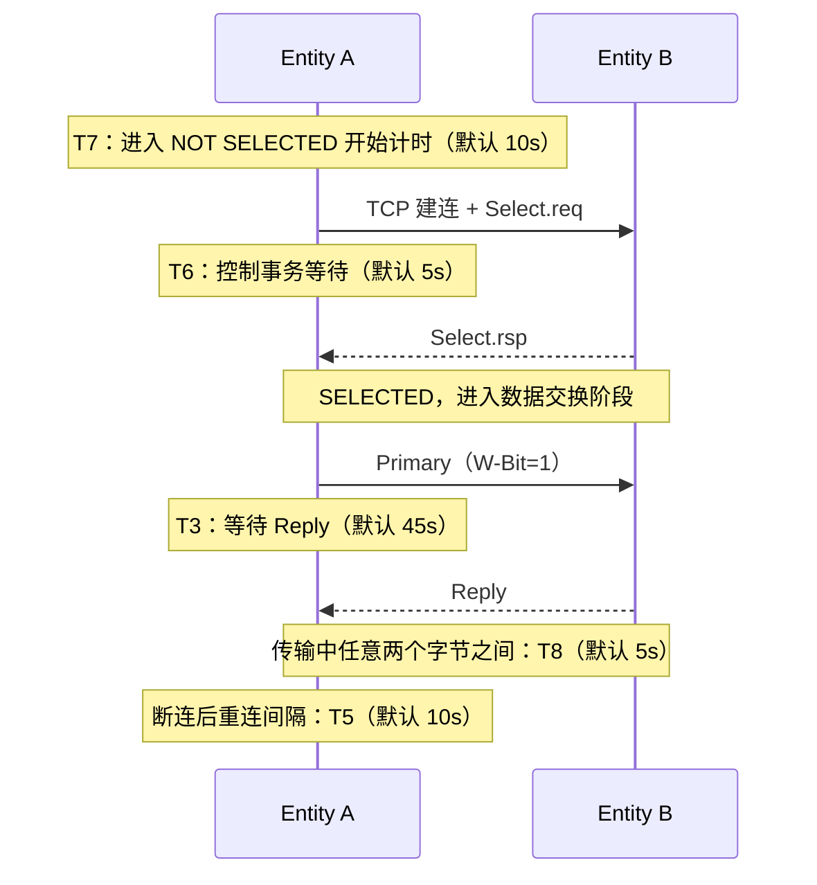

# 定时器与参数：T3-T8 五个定时器

> HSMS 用五个定时器兜住可靠性：**等回复、控制事务、连接间隔、空闲、字节间隔**。一张时序图看它们各自在哪个阶段"值班"。

## 1. 定时器在通信中的位置

## 2. 五个定时器速查表（E37 表 10）

| 定时器 | 全名 | 范围 | 典型值 | 计时从…到… | 超时后果（状态转换） |
| --- | --- | --- | --- | --- | --- |
| **T3** | Reply Timeout | 1-120s | 45s | Primary（W-Bit=1）发出 → Reply 收到 | 关闭该事务，不再期待回复；**连接状态不变（保持 SELECTED）** |
| **T5** | Connect Separation Timeout | 1-240s | 10s | 断开/失败 → 下次主动连接 | **无状态转换**（不是看门狗，只约束下次连接的最早时间） |
| **T6** | Control Transaction Timeout | 1-240s | 5s | .req 发出 → .rsp 收到 | 事务关闭 + 通信失败 → **断开连接（回 NOT CONNECTED）** |
| **T7** | NOT SELECTED Timeout | 1-240s | 10s | 进入 NOT SELECTED → Select/断开 | **NOT SELECTED → NOT CONNECTED**（状态转换 6） |
| **T8** | Network Intercharacter Timeout | 1-120s | 5s | 一条消息内上一字节 → 下一字节 | 收到不完整消息 → 通信失败 → **断开连接（回 NOT CONNECTED）** |

> 注：典型值为 ≤10 节点小网络的推荐值，更大网络需要调整。
>
> **超时后的状态走向**：只有 **T7** 是明确的状态机转换（NOT SELECTED → NOT CONNECTED，转换 6）；**T6 / T8** 走"通信失败"路径——HSMS 对通信失败的处理就是终止 TCP 连接，因此连接回到 NOT CONNECTED；**T3** 超时连接不降级（仍保持 SELECTED）；**T5** 只是节流，与状态机无关。

## 3. 逐个讲解

***T3 回复超时（数据层面）***

- 发出 W-Bit=1 的 Primary 后，发起方启动回复定时器，**每个打开事务各一个**；
- 定时器到点还没收到 Reply → **T3 超时错误**：关闭该事务、不再期待回复；
- HSMS-SS 额外规定：若本端是 **Equipment**，还要发 SECS-II **S9F9** 错误消息。

***T5 连接间隔（建连层面）***

- 主动连接过程会制造网络活动；频繁对"还没就绪"的实体发起连接是**网络敌意行为**；
- 规则：一次主动连接无论成功失败，到下一次主动连接，间隔必须 ≥ T5（间隔 = T5 + 本次连接耗时本身，§9.2.1）。

***T6 控制事务超时（控制消息层面）***

- Select / Deselect / Linktest 这类 .req/.rsp 事务从 .req 发出开始计时（§9.3.1）；
- 到点未收到 .rsp → 事务关闭，并视为一次**通信失败**（断开连接，回到 NOT CONNECTED）。

***T7 未选择超时（空闲层面）***

- 建连后进入 NOT SELECTED 开始计时（§9.2.2）；
- 迟迟不 Select，实体就一直"占着"连接——对只能接受一条连接的设备是灾难（别的实体连不进来）；
- 到点仍未进入 SELECTED → 断开连接（状态转换 6）。

***T8 字节间隔超时（传输层面）***

- TCP/IP 是字节流不是消息协议：一条 HSMS 消息的字节可能分散在多个 TCP 报文里，中间可能隔很久（§9.2.3）；
- 接收方若收到部分消息后 T8 到点还没收完 → 通信失败（断开连接，回到 NOT CONNECTED）；
- 与 SECS-I 的 T1 类似，但 T8 只看**接收方**（因为消息分包的间隔不完全在发送方控制范围内）。

## 4. 参数配置要求（§10）

HSMS 实现**必须**支持安装时配置以下参数，且断电/重装系统后设置要保留：

| 参数 | 范围 | 分辨率 | 典型值 |
| --- | --- | --- | --- |
| T3 | 1-120 秒 | 1 秒 | 45 秒 |
| T5 | 1-240 秒 | 1 秒 | 10 秒 |
| T6 | 1-240 秒 | 1 秒 | 5 秒 |
| T7 | 1-240 秒 | 1 秒 | 10 秒 |
| T8 | 1-120 秒 | 1 秒 | 5 秒 |
| Connect Mode | PASSIVE / ACTIVE | — | — |
| 本地实体 IP 地址和端口 | 由 TCP/IP 约定 | — | 被动模式需要 |
| 远端实体 IP 地址和端口 | 由 TCP/IP 约定 | — | 主动模式需要 |

另外，HSMS 实现文档还必须写明（§10）：参数设置方法、各参数允许范围与分辨率、拒绝连接的方式（被动模式下）、最大可接收消息大小、最大预期发送消息大小、最大并发打开事务数。
