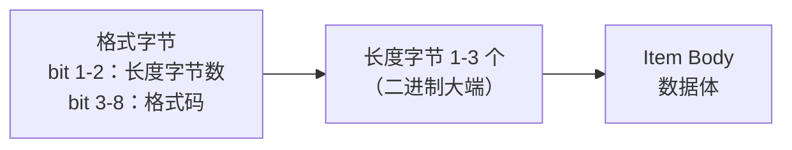

# 数据结构：`Item` 与 `List`

> `E5` 的消息体由两种数据结构组成：**`Item`（数据项）** 和 **`List`（列表）**。它们让消息**自描述**——接收方不需要外部定义就能解析数据。这是 `SECS-II` 最核心的设计。

## 1. 两种结构的分工

| 结构 | 作用 | 头格式 |
| --- | --- | --- |
| **`Item`** | 携带一段实际数据（一个数、一串字符、一组同格式数据…） | `Item Header`（`IH`）：格式字节 + 1-3 个长度字节 |
| **`List`** | 把一组元素（`Item` 或其他 `List`）组织成有序结构 | `List Header`（`LH`）：格式 0 + 1-3 个长度字节（**长度 = 元素个数**，不是字节数） |

**要点：**

- `Item` 的长度指**紧随头之后的 `Item Body`（数据体）的字节数**，不含头本身。
- `List` 的长度指**元素的个数**（元素可以是 `Item` 或 `List`），不是字节数。
- 一条消息的最外层通常就是一个 `List`，里面嵌 `Item` 或嵌套 `List`——形成树状结构（§9.3）。

## 2. `Item Header` 的结构（§9.2）

| 位 | 含义 |
| --- | --- |
| `bit` 1-2 | **长度字节数**：`1` = 1 个长度字节（最大 255）；`2` = 2 个（最大 64K）；`3` = 3 个（最大 7.99M）；`0` = **非法**（数据格式错误） |
| `bit` 3-8 | **格式码**：6 位，决定数据体如何解释（见下表） |

**编码示例**（§9.5 例 a）：一个二进制数 `10101010`：

| 字节 | 值 | 含义 |
| --- | --- | --- |
| 头 1 | `00100001` | 格式码 10（`Binary`）+ 1 个长度字节 |
| 头 2 | `00000001` | 数据体长 1 字节 |
| 数据 | `10101010` | 数据本身 |

## 3. 数据格式码（§9.2.2 表 1）

格式字节的 `bit` 3-8 共 64 种可能，标准定义了 **16 种**：

| 格式码（八进制） | 含义 | 说明 |
| --- | --- | --- |
| `00` | `LIST` | 列表（长度 = 元素个数） |
| `10` | `Binary` | 任意二进制串 |
| `11` | `Boolean` | 布尔：`0` = `false`，非 `0` = `true`（字节量） |
| `20` | `ASCII` | `ASCII` 字符串 |
| `21` | `JIS-8` | `JIS-8` 字符串（日本字符集） |
| `22` | `Localized String` | 本地化字符串（多字节字符，见下） |
| `30` | 8 字节整数（有符号） | 负数用二进制补码 |
| `31` | 1 字节整数（有符号） | 同上 |
| `32` | 2 字节整数（有符号） | 同上 |
| `34` | 4 字节整数（有符号） | 同上 |
| `40` | 8 字节浮点 | `IEEE 754` |
| `44` | 4 字节浮点 | `IEEE 754` |
| `50` | 8 字节整数（无符号） | — |
| `51` | 1 字节整数（无符号） | — |
| `52` | 2 字节整数（无符号） | — |
| `54` | 4 字节整数（无符号） | — |

**要点：**

- 其余格式码**未定义**，留给未来扩展。
- 有符号整数一律**二进制补码**；浮点一律 **`IEEE 754`**（含符号位的字节先发）；多字节整数**大端（`MSB first`）**。
- 一个 `Item` 内可以放**多个同格式数据**（如一个 `32` 格式的 `Item` 装 3 个 2 字节整数），长度字节给出总字节数，接收方按格式码换算个数（§9.5 例 c）。

## 4. 本地化字符串（§9.4）

多字节字符（如日文、中文）需要额外信息才能正确解释，于是有了格式码 `22` 的本地化字符串：

- `LSH` 跟在 `Item Header` 之后、字符串之前，是 **2 字节无符号整数**，指定编码方式；**`LSH` 本身算在 `Item` 长度里**。
- 字符串长度指**占用的字节数**，与字符个数无关（如 2 字节编码下 1 个字符占 2 字节，加上 2 字节 `LSH`，`Item` 长度 = 4）。

**已定义的编码方式**（表 2，节选）：

| 编码码 | 含义 |
| --- | --- |
| `1` | `ISO 10646` `UCS-2`（`Unicode 2.0`） |
| `2` | `UTF-8`（`ISO 10646` `UCS-2` 的变换） |
| `3` | `ISO 646-1991` `ASCII`（7 位） |
| `4` | `ISO 8859-1` `ISO Latin-1`（西欧） |
| `5` | `ISO 8859-11`（提议的泰语） |
| `6` | `TIS 620`（泰语） |
| `7` | `IS 13194` (1991) `ISCII`（印度） |
| `8` | `Shift JIS`（日本） |
| `9` | 日文 `EUC-JP` |
| `10` | 韩文 `EUC-KR` |
| `11` | 简体中文 `GB` |
| `12` | 简体中文 `EUC-CN` |
| `13` | 繁体中文 `Big5` |
| `14` | 繁体中文 `EUC-TW` |
| `15`-32767 | 保留扩展 |
| 32768-65535 | 自定义 |

**要点**：多字节字符的代码必须在 `TEXT` `Item` 的前 2 字节中指定（注 4）——即 `LSH` 固定占前 2 字节。

## 5. 完整示例（§9.5 例 e）

设备 66 向 `Host` 上报 `S5F1` 报警：`T1` 温度超限。整条消息（含 `SECS-I` 头部）逐字节如下：

| 字节 | 二进制 | 含义 |
| --- | --- | --- |
| 1 | `10000000` | `R=1`（发往主机） |
| 2 | `01000010` | `Device ID` = 66 |
| 3 | `00000101` | `Stream 5`，`W=0` |
| 4 | `00000001` | `Function 1` |
| 5 | `10000000` | `E=1` |
| 6 | `00000001` | `Block 1` |
| 7-10 | `00000000` ×4 | `System Bytes = 0` |
| 11 | `00000001` | `List` |
| 12 | `00000011` | 3 个元素 |
| 13 | `00100001` | `Binary`，1 个长度字节 |
| 14 | `00000001` | 长 1 字节 |
| 15 | `00000100` | 报警集 4（类别 4） |
| 16 | `01100101` | 1 字节整数（有符号） |
| 17 | `00000001` | 长 1 字节 |
| 18 | `00010001` | 报警 17 |
| 19 | `01000001` | `ASCII`，1 个长度字节 |
| 20 | `00000111` | 7 个字符 |
| 21-27 | `T1 HIGH` | 报警文本 |

> 用 `E4 SECS-I` 传输时：1 字节长度（未显示）+ 10 字节头 + 17 字节数据 + 2 字节校验（未显示）= 30 字节；9600 波特下约 31 毫秒发完（§9.5.1）。

## 6. 数据项字典的记法（§9.6）

§10 的消息定义引用"数据项字典"（`Data Item Dictionary`）里的标准数据项，如 `<MDLN>`、`<COMMACK>`。字典条目给出：**名称**（唯一助记符）、**允许的格式**、**描述/取值**、**使用处**。

**格式记法**（§9.6）：

| 记法 | 含义 |
| --- | --- |
| `3()` | 任一有符号整数格式（`30`/`31`/`32`/`34`） |
| `4()` | 任一浮点格式（`40`/`44`） |
| `5()` | 任一无符号整数格式（`50`/`51`/`52`/`54`） |
| `0` | 允许用户定义结构的 `List` |
| 多个格式 | 实现时可选其中任一 |

**常用数据项示例**：

| 名称 | 格式 | 含义 |
| --- | --- | --- |
| `MDLN` | 20 | 设备型号（`Model Number`） |
| `SOFTREV` | 20 | 软件版本 |
| `COMMACK` | 51 | 建立通信确认码（`0` = 接受） |
| `SVID` | 3(),5() | 状态变量 ID |
| `SV` | 由 `SVID` 决定 | 状态变量值 |
| `ECID` | 3(),5() | 设备常数 ID |
| `ECV` | 由 `ECID` 决定 | 设备常数值 |
| `CEID` | 3(),5() | 采集事件 ID |
| `RPTID` | 3(),5() | 报告 ID |
| `DATAID` | 3(),5() | 数据 ID（多块/多组数据关联） |
| `VID` | 3(),5() | 变量 ID（`S2F33` 报告引用） |
| `V` | 由 `VID` 决定 | 变量值 |
| `RCMD` | 20 | 远程命令名 |
| `CPNAME` / `CPVAL` | 20 / 由参数决定 | 命令参数名 / 参数值 |
| `TEXT` | 20,21,22 | 文本（终端、报警等） |
| `TIME` | 20 | 时间（`YYYYMMDDHHMMSS` 格式的 `ASCII`） |
| `MHEAD` | 10 | 出错消息的块头（`S9Fx` 回传用） |

**要点**：`SV`/`ECV`/`V` 这类"值"数据项的格式**由对应的 ID 定义**（字典里标 `8()` 之类按 ID 引用），实际编码时按设备定义。
