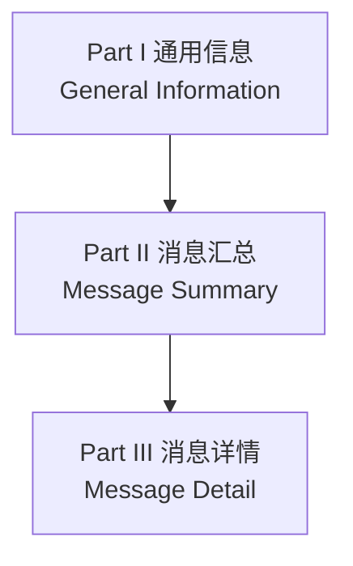

# 消息文档化与单位

> `SECS-II` 要求设备厂商向 `Host` 设计者交付**标准三段式消息文档**（§11），并规定数据项的**单位符号**怎么书写（§12）。本页讲这两件"工程落地"的事。

## 1. 为什么需要标准文档（§11.1）

使用 `SECS-II` 的设备厂商**必须**把每条设备特定消息的细节传达给 `Host` 设计者，`Host` 才能正确适配设备。这份文档遵循标准形式，最清晰地传递所需信息。

## 2. 标准形式 `SECS-II` 文档（§11.2）

设备文档分**三个明确标注的部分**：

### `Part I` — 通用信息（§11.2.1）

- 制造商与产品号
- 设备功能的一般描述
- 接口的预期用途
- 软件修订码（`Software Revision Code`）
- 相对先前版本的变更

### `Part II` — 消息汇总（§11.2.2）

两张双向对照表：

| 列表 | 列 1 | 列 2 |
| --- | --- | --- |
| **接收列表**：设备接收并理解的消息 | 收到的消息 | 设备回发的响应 |
| **发送列表**：设备发送的消息 | 发送的消息 | 期望的响应 |

- 消息用 `SxxFyy` 格式标识。
- `-`（横线）表示一对中的某一方不包含。
- 未列在"接收侧"的消息，收到后**会**触发向主机的错误消息；未列在"发送侧"的消息假定设备**永不发送**。
- 双向允许的消息可以在两个列表中分别出现（收发顺序互换）；标准允许双向的事务**不要求**双向都实现——列表会指示实现了哪些方向。

### `Part III` — 消息详情（§11.2.3）

对 `Part II` 中列出的**每条消息**（收发双向分别详述）给出：

1. 每个**固定项**：所有可理解/可发送的值或字符串及其对设备的意义；
2. 每个**可变项**：值或字符串长度的限制/可能范围；
3. 其他特殊解释。

每条详述的消息必须**清晰标注其流与功能码**（§11.2.4）。

## 3. 单位（§12）

### 3.1 单位符号（§12.2）

**单位符号（`Units Symbol`）** = 无长度限制的文本串，指定数值的物理意义。可以是：

- `SECS-II` 认可的**单位标识符**（§12.4 列表）；
- 单位标识符 + **前缀符号**（公制倍数）和/或**后缀**；
- 单位标识符的**算术表达式**。

**标识符规则**（§12.2.1）：

- 可以是全名、缩写、或唯一特殊字符；字母大小写**有意义**（`G` 高斯 vs `g` 克）。
- 由字母、数字、`ASCII` 特殊字符组成，**首字符不能是数字**。

**前缀符号**（§12.2.3 表 23）：

| 前缀名 | 倍数 | 符号 | 前缀名 | 倍数 | 符号 |
| --- | --- | --- | --- | --- | --- |
| `exa` | 10¹⁸ | `E` | `deci` | 10⁻¹ | `d` |
| `peta` | 10¹⁵ | `P` | `centi` | 10⁻² | `c` |
| `tera` | 10¹² | `T` | `milli` | 10⁻³ | `m` |
| `giga` | 10⁹ | `G` | `micro` | 10⁻⁶ | `u` |
| `mega` | 10⁶ | `M` | `nano` | 10⁻⁹ | `n` |
| `kilo` | 10³ | `k` | `pico` | 10⁻¹² | `p` |
| `hecto` | 10² | `h` | `femto` | 10⁻¹⁵ | `f` |
| `deka` | 10¹ | `da` | `atto` | 10⁻¹⁸ | `a` |

**前缀规则**：前缀**不能单独使用**，必须连在 §12.4 标识符前；每个标识符前**最多一个前缀**；`mus`（微毫秒）非法——正确写法是 `ns`（纳秒）。是否允许前缀取决于单位本身（公制单位通常可以，英制通常不行）。

**后缀**（§12.2.4）：允许后缀的单位可连接一个**数字串**（`0`-`9`），标识一族符号中的某一个；数字后缀的含义随单位不同，必须在符号定义的描述中说明。

**算术表达式**（§12.2.5）：

- 只含 §12.4 标识符或加前缀的标识符；
- 幂运算用 `^`（指数可为负，负号写在 `^` 与指数之间，如 `A*B^-1`）；
- 除法用 `/`（`A/B` 与 `A*B^-1` 等价）；
- 括号指定运算顺序；无括号时**先幂、后从左到右的乘除**（`A*B^-2*30*C^2` ≡ `(((A/(B^2))*30)*(C^2))`）。

### 3.2 §12.4 条目信息（§12.2.2）

每个单位标识符条目提供六项信息：**单位**（全名）、**单位标识符**、**允许前缀**、**允许后缀**、**等价式**（简单单位表达式，或与非标准单位系统的换算）、**描述**。

### 3.3 合规（§12.3）

- 设备和主机系统**必须只使用** `SECS-II` 允许的单位符号才合规。
- 需要新单位时，厂商可向 `SEMI` 通信分委会提交**提案**（包含 §12.4 条目的全部六项信息），走完整的标准修订流程（委员会接受、投票等）——所以应尽早提交。

## 4. 与笔记其他部分的联系

- **`UNITS` 数据项**（`S1F12`、`S2F30` 等消息中出现）就是按本页规则书写的单位符号。
- **`TIME` 数据项**格式为 `YYYYMMDDHHMMSS` 的 `ASCII` 串（`S2F17/F18` 时钟消息），与单位体系配合构成数据项的"语义"。
- 设备文档（`Part II`/III）实际上是"§10 消息定义"的**设备特定实例**——§10 给出通用结构，文档给出本设备的具体取值与限制。
