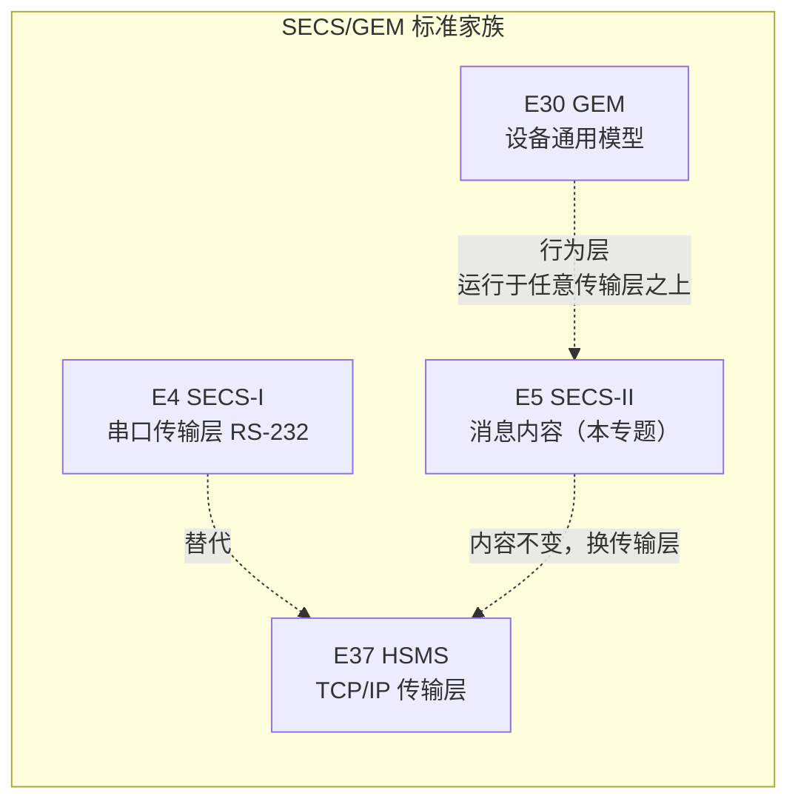
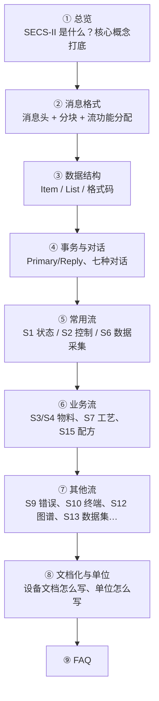

# 总览：`SECS-II` 消息内容标准

> **`SECS-II`**（`SEMI` **`E5`**，`SEMI Equipment Communications Standard Part 2 Message Content`）规定设备与 `Host` 之间交换的**每条消息长什么样**——用什么 `SxFy` 编号、消息体怎么组织成 `Item`/`List`、数据用什么格式编码。它是 `SECS/GEM` 家族中的"消息字典"，`E30` `GEM` 的行为层、`E4`/`E37` 的传输层都在它之上。

## 1. `E5` 的定位

`SECS-II` 在 `SECS/GEM` 标准家族中的位置

**要点：**

- **`E5` 只回答"消息长什么样"**：`S1F13` 是什么、`COMMACK` 有哪些取值、消息体里先放什么后放什么，全部由 `E5` 定义。**`E30` 回答"什么时候发"**（场景、行为、触发条件）。
- **`E5` 与传输层无关**：同样的消息内容可以跑在 `SECS-I`（`E4` 串口）上，也可以跑在 `HSMS`（`E37` TCP/IP）上——`E37` 笔记里的"内容不变，换传输层"就是这个意思。
- **`E5` 的最小合规要求很低**：只要求满足 §8 的事务级要求（回 `S1F2`、发 `S9Fx` 错误消息等），实际实现只需选择设备需要的功能子集（§3.1.1）。
- `E5` 允许设备厂商**自定义消息**：标准保留一部分 `Stream`/`Function` 码给用户定义（§7.3），超出标准能力范围的设备功能用自定义消息表达。

## 2. 一页看懂 `E5` 的核心概念

| 概念 | 英文 | 含义 |
| --- | --- | --- |
| 流 | `Stream` | 一类相关活动的消息集合（如 `S1` 设备状态、`S6` 数据采集） |
| 功能 | `Function` | 流内具体的一条消息（如 `S1F13` 建立通信请求） |
| 消息 | `Message` | 一次单向通信的完整单元，由**消息头 + 消息体**组成 |
| 事务 | `Transaction` | 一条主消息（`Primary`，奇函数号）+ 其回复（`Reply`，偶函数号） |
| 对话 | `Conversation` | 一组相关事务，完成一个特定任务 |
| 项 | `Item` | 消息体内的数据元素，自带格式与长度说明（自描述） |
| 列表 | `List` | 一组有序的元素（元素本身可以是 `Item` 或 `List`） |

**消息编号规则**（§7.2）：

- 编号写作 `S<流>F<功能>`，如 `S1F13` = 流 1、功能 13。
- **主消息（`Primary`）用奇函数号**；它的回复用**偶函数号 = 主消息 + 1**（如 `S1F13` → `S1F14`）。
- **函数 0 在所有流中保留**：用来中止（`Abort`）一个事务（见 [事务与对话协议](transaction.md)）。
- 主消息可通过 `W-Bit`（等待位）声明是否期待回复（详见 [消息格式](message-format.md)）。

## 3. 标准正文结构

| 章节 | 内容 | 笔记对应页 |
| --- | --- | --- |
| §1-4 | 目的、范围、限制、引用标准 | 本页 |
| §5 术语 | `message`、`transaction`、`item`、`stream`… | 本页及各处 |
| §6 消息传输协议 | 分块要求、消息头、事务超时、多开事务 | [消息格式](message-format.md) |
| §7 流与功能 | `Stream`/`Function` 编号与分配规则 | [消息格式](message-format.md) |
| §8 事务与对话协议 | 事务定义、事务级要求、七种对话 | [事务与对话协议](transaction.md) |
| §9 数据结构 | `Item`、`List`、数据格式码、数据项字典 | [数据结构](data-items.md) |
| §10 消息详情 | 各流（`S1`-`S18`）逐条消息定义 | 各流页面 |
| §11 消息文档化 | 设备文档的标准三段式格式 | [消息文档化与单位](documentation.md) |
| §12 单位 | 单位符号与语法 | [消息文档化与单位](documentation.md) |
| 附录 R1 | 消息用法建议、基线实现 | [FAQ](faq.md) 及各处 |

## 4. 各流速查

| 流 | 名称 | 用途 | 笔记 |
| --- | --- | --- | --- |
| `S0` | — | 未使用（`0` 是最可能的错误值） | — |
| `S1` | 设备状态 | 在线识别、状态查询、建立通信、上下线 | [S1 设备状态](stream-1.md) |
| `S2` | 设备控制与诊断 | 常数、时钟、远程命令、报告配置、`Trace`、`Limits` | [S2 设备控制与诊断](stream-2.md) |
| `S3` | 物料状态 | 在制物料状态、完工时间、载具/端口操作 | [S3/S4 物料流](stream-3-4.md) |
| `S4` | 物料控制 | 物料搬运对话、`Transfer Job`、`Handoff` | [S3/S4 物料流](stream-3-4.md) |
| `S5` | 异常处理 | 报警报告、使能/禁用、异常恢复 | [S5/S6 异常与数据采集](stream-5-6.md) |
| `S6` | 数据采集 | `Trace`、事件报告、按需查询、`Spool` | [S5/S6 异常与数据采集](stream-5-6.md) |
| `S7` | 工艺程序管理 | 工艺程序的传输、验证、删除（含大文件） | [S7/S8 工艺与控制程序](stream-7-8.md) |
| `S8` | 控制程序传输 | `Boot Program`、`Executive Program` 传输 | [S7/S8 工艺与控制程序](stream-7-8.md) |
| `S9` | 系统错误 | 消息/通信故障上报 | [S9/S10/S12/S13 各流](stream-9-13.md) |
| `S10` | 终端服务 | 终端文本显示与键盘交互 | [S9/S10/S12/S13 各流](stream-9-13.md) |
| `S11` | 主机文件服务 | **已删除**（被 `S13` 取代） | [S9/S10/S12/S13 各流](stream-9-13.md) |
| `S12` | 晶圆图谱 | 晶圆坐标、`Die` 尺寸与分选（`Bin`）信息 | [S9/S10/S12/S13 各流](stream-9-13.md) |
| `S13` | 数据集传输 | 未格式化数据集的打开/读/写/关闭 | [S9/S10/S12/S13 各流](stream-9-13.md) |
| `S14` | 对象服务 | 对象的通用属性操作（`GetAttr`/`SetAttr`…） | [S14/S15 对象与配方](stream-14-15.md) |
| `S15` | 配方管理 | 配方的命名空间、下载/上传/验证/选择 | [S14/S15 对象与配方](stream-14-15.md) |
| `S16` | 加工管理 | `Process Job` / `Control Job` 的创建与命令 | [S16/S17/S18 各流](stream-16-18.md) |
| `S17` | 设备控制与诊断（续） | `S2` 的延续：报告/`Trace`/事件链接 | [S16/S17/S18 各流](stream-16-18.md) |
| `S18` | 子系统控制与数据 | 子系统与上层控制器之间的简化消息 | [S16/S17/S18 各流](stream-16-18.md) |

## 5. 阅读路线

- [**① 总览**](index.md)：`SECS-II` 是什么、核心概念、各流一览——先建立整体印象。
- [**② 消息格式**](message-format.md)：消息头各字段（`Device ID`、`Stream/Function`、`W-Bit`…）、单块/多块限制、流与功能编号规则。
- [**③ 数据结构**](data-items.md)：`Item` 头怎么编码、16 种数据格式码、`List` 与本地化字符串、数据项字典的记法。
- [**④ 事务与对话协议**](transaction.md)：事务定义、事务级合规要求、七种对话类型（`request/data`、`inquire/grant/send/acknowledge`…）。
- [**⑤ 常用流**](stream-1.md) / [S2](stream-2.md) / [S5/S6](stream-5-6.md)：`GEM` 设备日常打交道最多的消息——状态查询、常数/时钟、远程命令、事件上报。
- [**⑥ 业务流**](stream-3-4.md) / [S7/S8](stream-7-8.md) / [S14/S15](stream-14-15.md)：物料搬运、工艺程序、配方管理。
- [**⑦ 其他流**](stream-9-13.md) / [S16/S17/S18](stream-16-18.md)：系统错误、终端、晶圆图谱、数据集传输、加工管理、子系统。
- [**⑧ 文档化与单位**](documentation.md)：设备必须向 `Host` 交付的三段式消息文档；`SECS-II` 单位符号的写法。
- [**⑨ FAQ**](faq.md)：高频疑问答疑，答案标注标准出处。

***复习锦囊***

- **快速回忆**：② → ④ → ⑤，一小时建立 `SECS-II` 全貌；
- **当工具书用**：查消息编号去"各流速查"表，查格式码去 ③，查消息体结构去各流页面。

## 6. 最小合规：§8 事务级要求速览

`E5` 对"最小合规"的定义非常克制（§3.1.1、§8.3），只要求：

1. 收到 `S1F1` 必须以 `S1F2` 响应（见 [S1 设备状态](stream-1.md)）。
2. 收到**无法处理**的消息，必须发 `Stream 9` 错误消息（`S9F1`/`F3`/`F5`/`F7`/`F11`，见 [S9](stream-9-13.md)）。
3. 其余支持的消息按 §10 的消息定义格式发送。
4. 检测到**事务超时**时，设备向 `Host` 发 `S9F9`。
5. 收到函数 `0` 作为回复时，终止相关事务——**不**向 `Host` 发送错误消息。

除此之外，实现哪些消息、用哪些流，完全由设备功能决定（附录 `R1-5` 给了按设备类型的建议消息集，见 [FAQ](faq.md)）。
