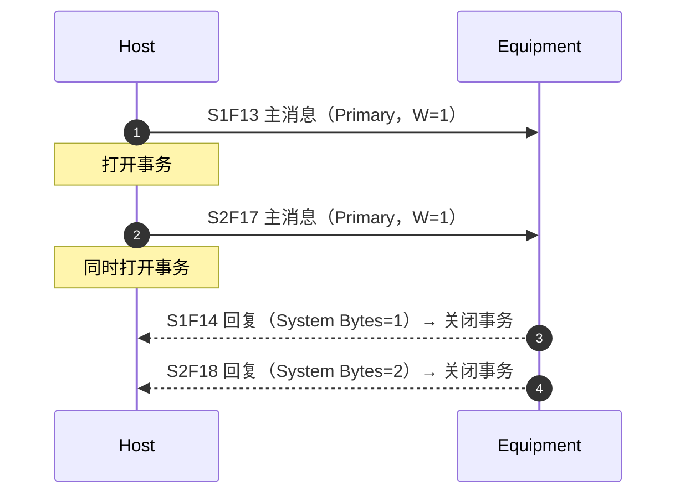

# 消息格式：头、块与编号规则

> `E5` 标准正文（§6）只规定**消息传输协议必须提供哪些信息**（逻辑字段），不规定物理字节布局——物理格式由传输层（`SECS-I` 的 10 字节头、`HSMS` 的头部）负责。本页讲清三层：**逻辑字段 → 物理头 → 消息编号规则**。

## 1. 消息的组成

一条 `SECS-II` 消息 = **消息头（`Message Header`）+ 消息体（`Message Text`）**：

- **消息头**携带：`Device ID`（来源/去向）、`Stream` + `Function`（消息标识）、`Reply Requested`（是否期待回复）。
- **消息体**是自描述的：每个 `Item` 自带格式和长度信息，接收方无需外部定义即可解析（§9.1）。

## 2. 消息头的逻辑字段（§6.4）

`E5` 只定义头部的**内容**，不定义**格式**（"The exact format of the message header passed between the application and the message transfer protocol is not covered as part of this standard"）：

| 字段 | 说明 |
| --- | --- |
| **`Device ID`** | 0-32767（15 位），标识消息的来源或去向设备。`Host` 与多台设备通信时靠它区分（§6.4.1） |
| **`Stream` + `Function`** | 至少 15 位的消息识别码：`Stream` 7 位（0-127）+ `Function` 8 位（0-255），每个组合是一条独立消息（§6.4.2） |
| **`Reply Requested`** | 主消息是否期待回复（对应 `W-Bit`）；回复消息恒不期待回复（§6.4.3） |

**在具体传输层上的样子：**

- **`SECS-I`（`E4`）**：这 10 字节头是每个块的前 10 字节（§6.4 注 1）。字节布局（参考 §9.5 示例）：

| 字节 | 字段 |
| --- | --- |
| 1 | `R`（1 位，0=发往设备/1=发往主机）+ `Device ID` 高 7 位 |
| 2 | `Device ID` 低 8 位 |
| 3 | `W`（1 位）+ `Stream`（7 位） |
| 4 | `Function`（8 位） |
| 5 | `E`（1 位，0=最后一块/1=还有后续块）+ `Block` 高 7 位 |
| 6 | `Block` 低 8 位 |
| 7-10 | `System Bytes`（4 字节，事务标识） |

- **`HSMS`（`E37`）**：同样是 10 字节头，字段布局见 [E37 消息格式](../e37-hsms/message-format.md)（字节 0-1 `Session ID`、字节 2 `W-Bit + Stream`、字节 3 `Function`、字节 6-9 `System Bytes`）。
- **`System Bytes`**：4 字节，唯一标识一个打开的事务，接收方靠它把回复匹配回对应的主消息（细节见 [E37 消息格式](../e37-hsms/message-format.md) 的 `System Bytes` 规则）。

## 3. 分块要求（§6.3）

消息传输协议必须支持**单块**发送，这是最低要求：

| 类型 | 条件 | 说明 |
| --- | --- | --- |
| **单块消息**（`Single-Block`） | 消息长度 ≤ **244 字节** | 与 `SECS-I` 兼容的最大单块长度；标准中标记为单块的 `SECS-II` 消息必须单块发送（§6.3.1） |
| **多块消息**（`Multi-Block`） | 消息长度 > 244 字节 | 长消息拆成多个块；部分消息**允许**多块即便长度未超限（§6.3.2） |

**要点：**

- 244 字节上限是**与 `SECS-I` 兼容**的历史约束；`SECS-II` 本身不限制消息总长，多块消息可以很长。
- 应用层如何告知传输协议"这条要单块发"不属于标准范围。
- 1988 年修订后，**新应用不得对入站块大小施加应用特定限制**；1988 年以前的旧实现可能有此类限制（§6.3.2）。
- 多块发送某些消息（如 `S2F23`、`S2F33`）前必须先走 `Inquire/Grant` 事务（`SxF39/SxF40` 等），详见各流页面与 [事务与对话协议](transaction.md)。

## 4. 事务超时与多开事务（§6.5、§6.6）

- **事务超时**（`Transaction Timeout`）：传输协议在规定的超时周期内未收到期待的回复消息时，要通知 `SECS-II` 层。在 `SECS-I` 中即 `T3`（回复超时）/ `T4`（块间隔超时，§6.5 注 2）。
- **多开事务**（`Multiple Open Transactions`）：标准**允许但不要求**同时打开多个事务（§6.6）——即"发一条消息不等回复就发下一条"是合法的，只要传输层能正确配对。

## 5. 流与功能的编号规则（§7）

### 5.1 基本规则（§7.1、§7.2）

- **`Stream`（流）**：支持相似或相关活动的消息类别。
- **`Function`（功能）**：流内针对特定活动的一条具体消息。
- **奇偶配对**：主消息用**奇函数号**，其回复函数号 = 主消息 + 1（偶数）。主消息若声明不要回复，则紧邻的偶数号**保留不用**。
- **函数 0**：在所有流中保留，用于中止事务（`Abort Transaction`，见 §10.4 与 [事务与对话协议](transaction.md)）。

### 5.2 编号分配（§7.3）

| 范围 | 归属 |
| --- | --- |
| `Stream 0`，函数 0-255 | 本标准保留（实际不使用） |
| `Streams 1-63`，函数 0-63 | 本标准保留 |
| `Streams 64-127`，函数 0 | 本标准保留 |
| `Streams 1-63`，函数 64-255 | **用户自定义** |
| `Streams 64-127`，函数 1-255 | **用户自定义** |

**要点：**

- `Stream` 号只有 0-127（7 位）；`S64` 以上留给用户，标准只占了它们的函数 0。
- 需要超出标准定义的功能时，用**用户自定义区**，但必须遵守 §8 的最小合规指引（错误处理、事务规则仍然适用）。

## 6. 消息用法约定（§10.3）

- **零长度 `Item` / `List`**：消息定义里可以允许零长度元素表达特定含义——
  - 对命令/请求：表示"用默认值"；
  - 对数据上报：表示"该信息不可用或不适用"；
  - 也可表示"信息未提供"。
  - **约束**：只有在消息定义明确给出含义时，才允许零长度元素（§10.3.2）。
- **合规性**：标准消息必须**恰好包含**消息定义中列出的所有 `List` 和 `Item`，不得多、不得少（除非定义明确允许），也不得在未定义时使用零长度（§10.3.2）。

## 7. `S0` 与函数 0（§10.4）

- **`Stream 0`** 定义为"未使用"——`0` 本身就是最可能的错误值，所以不再定义任何功能。
- **函数 0 在所有流中含义相同**：当解释器（`Interpreter`）因传输错误等原因无法给出期待的回复时，用它来**关闭事务**，让发起方不必等到事务超时才继续。函数 0 不是必须发的（§10.4.1）。
