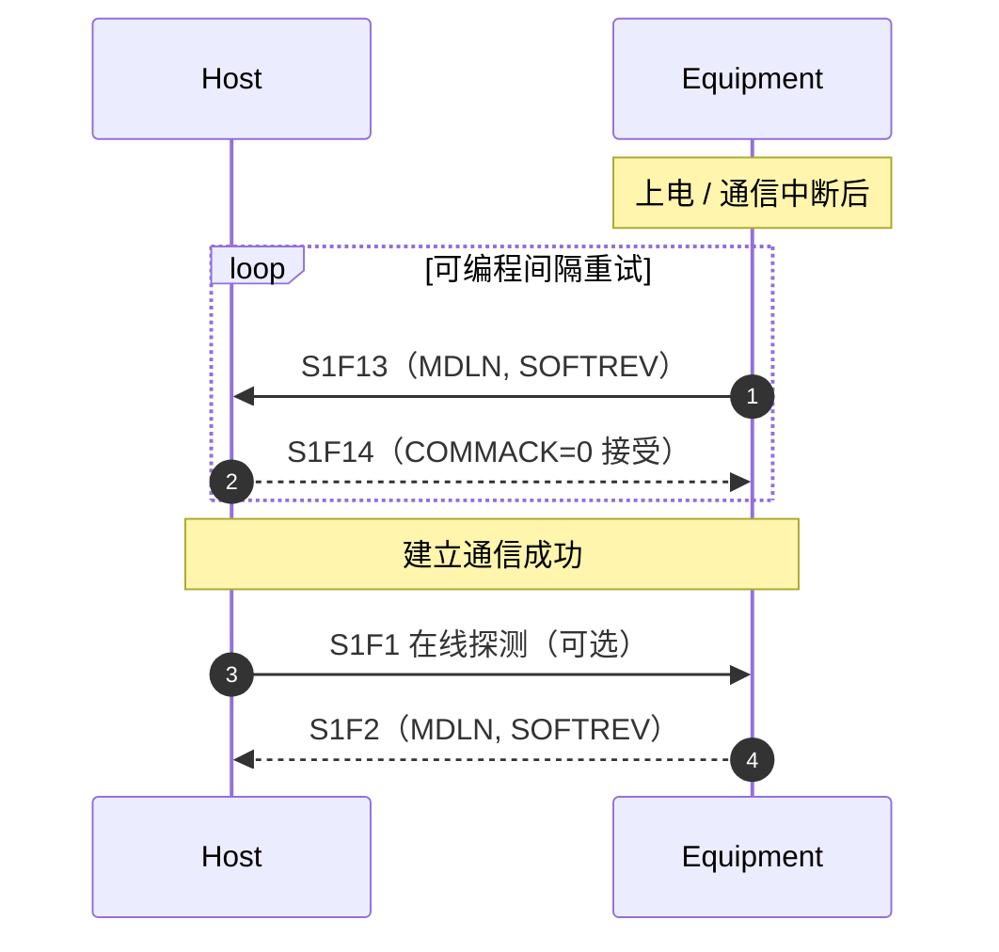

# `S1` 设备状态（`Equipment Status`）

> `S1` 流用于交换设备状态信息：**设备是否在线**、**当前状态变量**、**格式化状态**、**物料端口转移状态**、**建立/断开通信**、**上线/下线**，以及对象属性获取。`S1F13/F14` 是 `GEM` 建立通信的核心消息。

## 1. 流的功能定位（§10.5）

"本流提供交换设备状态信息的手段，包括当前模式、消耗品耗尽情况、转移操作的状态。"

| 功能号 | 名称（助记符） | 方向 | 用途 |
| --- | --- | --- | --- |
| `S1F0` | `Abort Transaction` | H↔E | 中止事务（所有流通用） |
| `S1F1` | `Are You There Request`（`R`） | H↔E, 回复 | 探测设备是否在线 |
| `S1F2` | `On Line Data`（`D`） | H↔E | 设备存活数据：`MDLN` + `SOFTREV` |
| `S1F3` | `Selected Equipment Status Request`（`SSR`） | H→E, 回复 | 按 `SVID` 列表查询状态变量 |
| `S1F4` | `Selected Equipment Status Data`（`SSD`） | H←E | 按请求顺序返回 `SV` 值 |
| `S1F5` | `Formatted Status Request`（`FSR`） | H→E, 回复 | 按预定义固定格式查状态 |
| `S1F6` | `Formatted Status Data`（`FSD`） | H←E | 按 `SFCD` 格式返回 |
| `S1F7` | `Fixed Form Request`（`FFR`） | H→E, 回复 | 请求 `S1F6` 使用的格式定义 |
| `S1F8` | `Fixed Form Data`（`FFD`） | H←E | 返回格式定义（值名 + 数据格式） |
| `S1F9` | `Material Transfer Status Request`（`TSR`） | H→E, 回复 | 请求所有物料端口状态 |
| `S1F10` | `Material Transfer Status Data`（`TSD`） | H←E | 返回 `TSIP`/`TSOP` 端口转移状态 |
| `S1F11` | `Status Variable Namelist Request`（`SVNR`） | H→E, 回复 | 查询状态变量的名称 |
| `S1F12` | `Status Variable Namelist Reply`（`SVNRR`） | H←E | 返回 `SVID` + `SVNAME` + `UNITS` |
| `S1F13` | `Establish Communications Request`（`CR`） | H↔E, 回复 | **建立通信请求** |
| `S1F14` | `Establish Communications Acknowledge`（`CRA`） | H↔E | 接受/拒绝建立通信 |
| `S1F15` | `Request OFF-LINE`（`ROFL`） | H→E, 回复 | 请求设备进入 `OFF-LINE` |
| `S1F16` | `OFF-LINE Acknowledge`（`OFLA`） | H←E | 应答 `OFF-LINE` |
| `S1F17` | `Request ON-LINE`（`RONL`） | H→E, 回复 | 请求设备进入 `ON-LINE` |
| `S1F18` | `ON-LINE Acknowledge`（`ONLA`） | H←E | 应答 `ON-LINE` |
| `S1F19` | `Get Attribute`（`GA`） | H↔E, 回复 | 请求对象/实体的属性 |
| `S1F20` | `Attribute Data`（`AD`） | H↔E | 返回请求的属性集 |

> `S1F19/F20` 属于"宏级消息"（§10.5.1），被 `S14` 对象服务继承。`S1F1/F2`、`S1F13/F14` 是任何合规设备的基础。

## 2. 核心消息详解

### 2.1 `S1F1/F2`：在线探测（§10.5）

- **`S1F1`**：仅头部，无消息体。回答"设备在线吗"。
- **`S1F2`**：消息体 `L,2`：`1. <MDLN>`、`2. <SOFTREV>`——设备型号与软件版本。
- `S1F1` 收到函数 0 回复 = 通信不工作（设备侧等价于发 `S1F1` 后接收超时）。

### 2.2 `S1F13/F14`：建立通信（§10.5）

**`S1F13`**：正式初始化"应用逻辑层"的通信——上电后、以及通信中断之后都应使用。在可编程的间隔重复发送 `S1F13`，直到在事务超时内收到接受建链的 `S1F14`。

- 消息体 `L,2`：`1. <MDLN>`、`2. <SOFTREV>`（主机发给设备时可用零长度列表）。

**`S1F14`**：接受或拒绝建链。

- 消息体 `L,2`：`1. <COMMACK>`、`2. L,2（<MDLN>、<SOFTREV>）`。
- `COMMACK = 0` 接受，此时 `MDLN`/`SOFTREV` 才有效（它们是 `On Line Data`）。

> 这是 `GEM` 建立通信场景的消息基础，通信状态机的完整行为见 [E30 状态模型](../e30/state-models.md)。

### 2.3 `S1F3/F4`：状态变量查询（§10.5）

- **`S1F3`**：请求指定 `SVID` 的状态值。新实现用 `L,n`（每个 `SVID` 一个 `Item`）；旧实现兼容用单个 `<SVID1,...,SVIDn>` 项（仅 `3()`/`5()` 格式）。
- **`S1F4`**：按请求顺序返回 `<SV>` 列表。某个 `SV` 为零长度项 = 对应 `SVID` 不存在。
- 零长度列表/项 = "报告所有 `SVID`"。

### 2.4 `S1F11/F12`：状态变量名称查询（§10.5）

- **`S1F11`**：请求识别某些状态变量（零长度 = 全部）。
- **`S1F12`**：返回 `L,n`，每个元素是 `L,3`：`SVID` + `SVNAME` + `UNITS`。`SVNAME` 与 `UNITS` 都为零长度 `ASCII` = 该 `SVID` 不存在。

### 2.5 `S1F15-F18`：上线 / 下线（§10.5）

| 消息 | 结构 | 说明 |
| --- | --- | --- |
| `S1F15` | 仅头部 | 主机请求设备进入 `OFF-LINE` |
| `S1F16` | `<OFLACK>` | `OFF-LINE` 应答码 |
| `S1F17` | 仅头部 | 主机请求设备进入 `ON-LINE` |
| `S1F18` | `<ONLACK>` | `ON-LINE` 应答码 |

> 这是 `E30` 控制状态模型（`OFF-LINE`/`ON-LINE`）的交互消息，行为细节见 [E30 状态模型](../e30/state-models.md)。

## 3. 数据项速查

| 数据项 | 格式 | 说明 |
| --- | --- | --- |
| `MDLN` | 20 | 设备型号 |
| `SOFTREV` | 20 | 软件版本 |
| `COMMACK` | 51 | `0` = 接受，非 `0` = 拒绝 |
| `SVID` | 3(),5() | 状态变量 ID |
| `SVNAME` | 20 | 状态变量名 |
| `UNITS` | 20 | 单位（按 §12） |
| `SFCD` | 3(),5() | 状态格式码（`S1F5`-`F8`） |
| `TSIP` / `TSOP` | 10 | 输入/输出端口转移状态 |
| `OFLACK` / `ONLACK` | 51 | `0` = 接受 |
| `OBJTYPE` / `OBJID` / `ATTRID` / `ATTRDATA` | 见字典 | 对象属性（`S1F19/F20`、`S14` 共用） |
