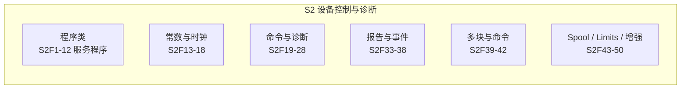

# `S2` 设备控制与诊断（`Equipment Control and Diagnostics`）

> `S2` 是**最庞大、最常用**的流：涵盖设备常数、时钟、远程命令、`Trace`、报告配置、事件链接、`Limits`、`Spooling` 等。`E30` `GEM` 的"附加能力"大多建在这条流上。注意 `S2` 的延续在 `S17`。

## 1. 流的功能定位（§10.6）

"本流处理从主机对设备进行控制的消息，包括所有远程操作、设备自诊断与校准；**明确排除**物料转移控制（`S4`）、引导/执行程序加载（`S8`）、文件与操作系统调用（`S10`、`S13`）。"

## 2. 消息总表（按功能分组）

### 2.1 服务程序（`Service Program`）：`S2F1`-`F12`

| 功能号 | 名称（助记符） | 方向 | 用途 |
| --- | --- | --- | --- |
| `S2F1` | `Service Program Load Inquire`（`SPI`） | H↔E, 回复 | 询问能否发送指定程序（`SPID` + `LENGTH`） |
| `S2F2` | `Service Program Load Grant`（`SPG`） | H↔E | 许可加载（`<GRANT>`） |
| `S2F3` | `Service Program Send`（`SPS`） | H↔E, 回复 | 发送程序数据（多块时须先 `S2F1/F2`） |
| `S2F4` | `Service Program Send Acknowledge`（`SPA`） | H↔E | 确认（`<SPAACK>`） |
| `S2F5` | `Service Program Load Request`（`SPR`） | H↔E, 回复 | 请求程序 |
| `S2F6` | `Service Program Load Data`（`SPD`） | H↔E | 发送程序（零长度 = 无法返回） |
| `S2F7` | `Service Program Run Send`（`CSS`） | H→E, 回复 | 启动程序 |
| `S2F8` | `Service Program Run Acknowledge`（`CSA`） | H←E | 确认（`<CSAACK>`） |
| `S2F9` | `Service Program Results Request`（`SRR`） | H→E, 回复 | 请求程序结果 |
| `S2F10` | `Service Program Results Data`（`SRD`） | H←E | 返回结果（`<SPR>`） |
| `S2F11` | `Service Program Directory Request`（`SDR`） | H↔E, 回复 | 请求程序目录 |
| `S2F12` | `Service Program Directory Data`（`SDD`） | H↔E | 程序名列表（`n=0` = 无程序） |

> `Service Program` 是"设备上的可执行软件例程"（微处理器设备可借 `S2F1-F12` 管理服务软件，附录 `R1-2.7`）。

### 2.2 设备常数与时钟：`S2F13`-`F18`

| 功能号 | 名称（助记符） | 方向 | 用途 |
| --- | --- | --- | --- |
| `S2F13` | `Equipment Constant Request`（`ECR`） | H→E, 回复 | 查询设备常数（校准、伺服增益、报警限、采集模式等） |
| `S2F14` | `Equipment Constant Data`（`ECD`） | H←E | 按请求顺序返回 `ECV` |
| `S2F15` | `New Equipment Constant Send`（`ECS`） | H→E, 回复 | 修改一个或多个设备常数 |
| `S2F16` | `New Equipment Constant Acknowledge`（`ECA`） | H←E | 确认（`<EAC>`；非零错误码时**不得**修改任何 `ECID`） |
| `S2F17` | `Date and Time Request`（`DTR`） | H↔E, 回复 | 查询时间（也可设备侧同步主机时间） |
| `S2F18` | `Date and Time Data`（`DTD`） | H↔E | 返回 `<TIME>` |

**`S2F13` 结构**：新实现 `L,n`（每个 `ECID` 一个项）；旧兼容 `<ECID1,...,ECIDn>`（仅 `3()`/`5()`）。零长度 = 报告全部 `ECV`（按预定义顺序）。

**`S2F14` 结构**：`L,n`，第 `i` 项 `<ECV_i>`；零长度项 = `ECID` 不存在（注：此消息是 `ECV` 允许 `List` 格式的唯一特例）。

**`S2F15` 结构**：`L,n`，每项 `L,2`（`ECID` + `ECV`）。

**`S2F17/F18`**：`GEM` 时钟同步（`TimeFormat`）的基础，`E30` 设备常数的 `Clock` 校验靠它。

### 2.3 命令与诊断：`S2F19`-`F28`

| 功能号 | 名称（助记符） | 方向 | 用途 |
| --- | --- | --- | --- |
| `S2F19` | `Reset/Initialize Send`（`RIS`） | H→E, 回复 | 让设备达到预定义的初始化条件（`<RIC>`） |
| `S2F20` | `Reset Acknowledge`（`RIA`） | H←E | 确认（`<RAC>`） |
| `S2F21` | `Remote Command Send`（`RCS`） | H→E, [回复] | 类似按设备面板按钮，或让某活动开始/停止 |
| `S2F22` | `Remote Command Acknowledge`（`RCA`） | H←E | 确认（`<CMDA>`） |
| `S2F23` | `Trace Initialize Send`（`TIS`） | H→E, 回复 | **初始化 `Trace`**：周期性采样状态变量 |
| `S2F24` | `Trace Initialize Acknowledge`（`TIA`） | H←E | 确认（`<TIAACK>`） |
| `S2F25` | `Loopback Diagnostic Request`（`LDR`） | H↔E, 回复 | 回路诊断：二进制串原样回显 |
| `S2F26` | `Loopback Diagnostic Data`（`LDD`） | H↔E | 回显数据 |
| `S2F27` | `Initiate Processing Request`（`IPR`） | H→E, 回复 | 请求开始处理 |
| `S2F28` | `Initiate Processing Acknowledge`（`IPA`） | H←E | 确认 |
| `S2F29` | `Equipment Constant Namelist Request`（`ECNR`） | H→E, 回复 | 查询常数名称 |
| `S2F30` | `Equipment Constant Namelist`（`ECN`） | H←E | 返回 `ECID` + `ECNAME` + `UNITS` |
| `S2F31` | `Date and Time Set Request`（`DTS`） | H→E, 回复 | 设置设备时间 |
| `S2F32` | `Date and Time Set Acknowledge`（`DTA`） | H←E | 确认（`<DTACK>`） |

**`S2F21`**：消息体 `<RCMD>`（命令名，`ASCII`）。`RCMD` 的具体命令集由设备定义、在消息文档中列出；`GEM` 标准命令（`START`/`STOP`/`PAUSE`/`ABORT`…）见 [E30 远程控制](../e30/remote-control.md)。

**`S2F23` 结构**（`Trace` 初始化，`L,5`）：

| 元素 | 数据项 | 含义 |
| --- | --- | --- |
| 1 | `TRID` | `Trace` 请求 ID（数据回报时用） |
| 2 | `DSPER` | 数据采样周期（多久采一次） |
| 3 | `TOTSMP` | 总采样数（有限值，主机可预留空间） |
| 4 | `REPGSZ` | 报告组大小（多少采样合一条消息发） |
| 5 | `L,n` | 要采样的 `SVID` 列表 |

**`S2F23` 规则**：

- 同 `TRID` 再次收到 `S2F23` → 终止旧 `Trace` 并启动新 `Trace`。
- `TOTSMP = 0` 的 `S2F23` → 终止该 `TRID` 的 `Trace`。
- 多块时须先 `S2F39/S2F40`；部分设备只支持单块 `S6F1`，可拒绝会导致多块 `S6F1` 的 `S2F23`。
- 设备必须文档化其 `Trace` 性能限制；主机不得发送超出设备性能限制的 `S2F23`。

### 2.4 报告与事件配置：`S2F33`-`F38`（GEM 核心）

| 功能号 | 名称（助记符） | 方向 | 用途 |
| --- | --- | --- | --- |
| `S2F33` | `Define Report`（`DR`） | H→E, 回复 | **定义报告**：把 `VID` 归组为一个 `RPTID` |
| `S2F34` | `Define Report Acknowledge`（`DRA`） | H←E | 确认（`<DRACK>`） |
| `S2F35` | `Link Event Report`（`LER`） | H→E, 回复 | **把事件（`CEID`）链接到报告** |
| `S2F36` | `Link Event Report Acknowledge`（`LERA`） | H←E | 确认（`<LRACK>`） |
| `S2F37` | `Enable/Disable Event Report`（`EDER`） | H→E, 回复 | **使能/禁用**事件报告 |
| `S2F38` | `Enable/Disable Event Report Acknowledge`（`EERA`） | H←E | 确认（`<ERACK>`） |

> 这三组消息是 `E30`"动态事件报告配置"的完整消息链：`S2F33` 定义报告 → `S2F35` 链接事件 → `S2F37` 使能。行为细节见 [E30 事件通知](../e30/event-reporting.md)。

### 2.5 多块与命令：`S2F39`-`F42`

| 功能号 | 名称（助记符） | 方向 | 用途 |
| --- | --- | --- | --- |
| `S2F39` | `Multi-block Inquire`（`DMBI`） | H→E, 回复 | 多块发送前询问许可（`DATAID` + `DATALENGTH`） |
| `S2F40` | `Multi-block Grant`（`DMBG`） | H←E | 许可（`<GRANT>`） |
| `S2F41` | `Host Command Send`（`HCS`） | H→E, 回复 | **远程命令 + 参数** |
| `S2F42` | `Host Command Acknowledge`（`HCA`） | H←E | 确认（`<HCACK>` + 无效参数列表） |

**`S2F41` 结构**（`L,2`）：`1. <RCMD>`、`2. L,n`（每个参数 `L,2`：`CPNAME` + `CPVAL`）。

**`S2F42` 结构**（`L,2`）：`1. <HCACK>`、`2. L,n`（每个无效参数 `L,2`：`CPNAME` + `CPACK` 原因）。无无效参数时第 2 项为零长度列表。

> `S2F41` 是 `E30` 远程命令（`RCMD`）的载体，`HCACK` 取值语义见 [E30 远程控制](../e30/remote-control.md)。多块 `S2F41` 也须先 `S2F39/S2F40`。

### 2.6 `Spooling` / `Limits` / 增强命令：`S2F43`-`F50`

| 功能号 | 名称（助记符） | 方向 | 用途 |
| --- | --- | --- | --- |
| `S2F43` | `Reset Spooling Streams and Functions`（`RSSF`） | H→E, 回复 | 选择要 `Spool` 的流/功能 |
| `S2F44` | `Reset Spooling Acknowledge`（`RSA`） | H←E | 确认（`<RSPACK>` + 出错流/功能） |
| `S2F45` | `Define Variable Limit Attributes`（`DVLA`） | H→E, 回复 | 为变量定义 `Limits` 属性 |
| `S2F46` | `Variable Limit Attribute Acknowledge`（`VLAA`） | H←E | 确认 |
| `S2F47` | `Variable Limit Attribute Request`（`VLAR`） | H→E, 回复 | 查询变量 `Limits` 属性 |
| `S2F48` | `Variable Limit Attributes Send`（`VLAS`） | H←E | 返回 `Limits` 属性 |
| `S2F49` | `Enhanced Remote Command` | H→E | 增强远程命令（多块须先 `S2F39/S2F40`） |
| `S2F50` | `Enhanced Remote Command Acknowledge` | H←E | 确认 |

**`S2F43` 要点**：

- `m=0`（零长度列表）= 关闭所有流/功能的 `Spooling`；`n=0` = 打开该流所有功能的 `Spooling`。
- **`Stream 1` 不允许 `Spool`**；同一流的函数列表会被新定义**替换**。
- 设备必须允许主机 `Spool` 一个流的所有主消息（`S1` 除外）。

> `Spooling`（通信中断时本地缓冲、恢复后补发）与 `Limits`（区间监控）的 `GEM` 行为见 [E30 数据采集](../e30/data-collection.md) 与 [E30 其他能力](../e30/other-capabilities.md)。

## 3. 数据项速查（S2 常用）

| 数据项 | 格式 | 说明 |
| --- | --- | --- |
| `SPID` | 20 | 服务程序 ID |
| `LENGTH` | 3(),5() | 长度 |
| `GRANT` | 51 | `0` = 允许 |
| `SPAACK` / `CSAACK` / `TIAACK` | 51 | 确认码 |
| `ECID` / `ECNAME` | 3(),5() / 20 | 设备常数 ID / 名 |
| `ECV` | 按 `ECID` | 常数值 |
| `EAC` / `RAC` / `CMDA` / `HCACK` | 51 | 各类确认码 |
| `TIME` | 20 | `YYYYMMDDHHMMSS` 时间 |
| `RCMD` | 20 | 远程命令名 |
| `CPNAME` / `CPVAL` / `CPACK` | 20 / 按参数 / 51 | 参数名/值/原因 |
| `TRID` / `DSPER` / `TOTSMP` / `REPGSZ` | 见字典 | `Trace` 参数 |
| `DATAID` / `DATALENGTH` | 见字典 | 多块询问参数 |
| `STRID` / `FCNID` | 见字典 | `Spool` 的流/功能选择 |
| `RSPACK` / `STRACK` | 51 | `Spool` 确认码 |
