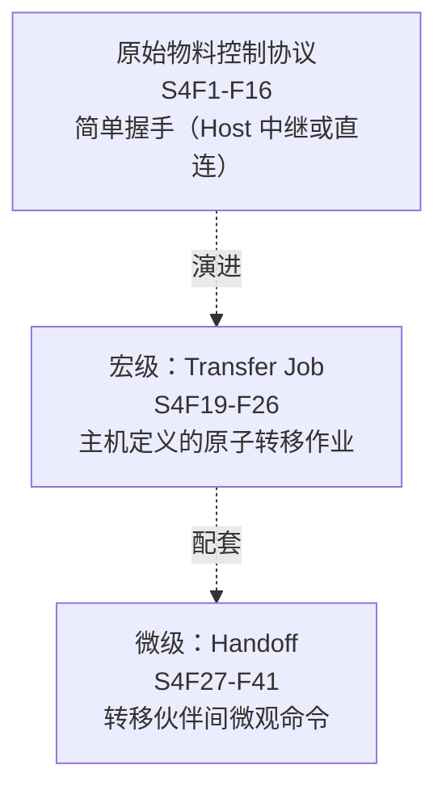
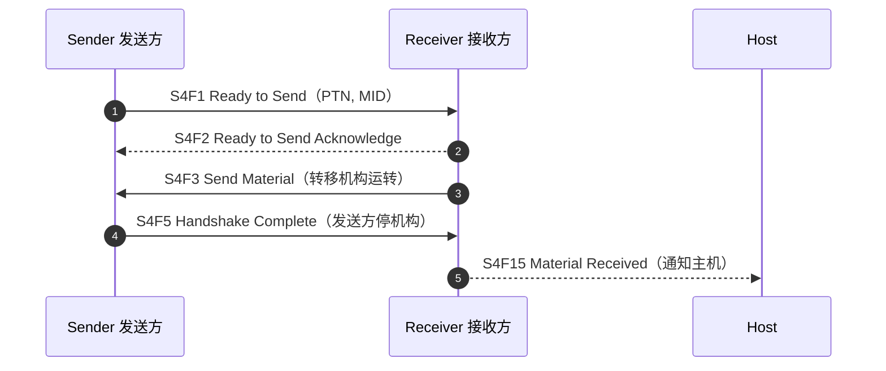

# `S3` 物料状态 / `S4` 物料控制（`Material Status & Control`）

> `S3` 管"物料（含 `Carrier`、在制晶圆）的状态信息与非常规事件"，`S4` 管"设备之间物料的自动搬运"。`S4` 是 `E5` 里**唯一定义了完整设备间握手协议**的流——早期是简单 `Handshake`，后来加入了 `Transfer Job`（宏级）与 `Handoff`（微级）机制。

## 1. `S3` 物料状态（§10.7）

"本流的功能用于交流与物料相关的信息和动作，包括 `Carrier` 与在制物料、完工时间信息、以及非常规物料事件。"

### 1.1 消息总表

| 功能号 | 名称（助记符） | 方向 | 用途 |
| --- | --- | --- | --- |
| `S3F0` | `Abort Transaction` | H↔E | 中止事务 |
| `S3F1` | `Material Status Request`（`MSR`） | H→E, 回复 | 请求全部在制物料状态 |
| `S3F2` | `Material Status Data`（`MSD`） | H←E | 返回位置/数量/物料 ID 列表 |
| `S3F3` | `Time to Completion Request`（`TCR`） | H→E, 回复 | 请求全部物料完工时间 |
| `S3F4` | `Time to Completion Data`（`TCD`） | H←E | 返回 `TTC` + 数量 + 物料 ID |
| `S3F5` | `Material Found Send`（`MFS`） | H←E, [回复] | 设备发现非预期物料（传感器处） |
| `S3F6` | `Material Found Acknowledge`（`MFA`） | H→E | 确认（`<ACKC3>`） |
| `S3F7` | `Material Lost Send`（`MLS`） | H←E, [回复] | 设备发现物料从传感器消失 |
| `S3F8` | `Material Lost Acknowledge`（`MLA`） | H→E | 确认 |
| `S3F9` | `Material ID Equate Send`（`IES`） | H←E, [回复] | 建立物料 ID 与另一 ID 的关联 |
| `S3F10` | `Material ID Equate Acknowledge`（`IEA`） | H→E | 确认 |
| `S3F11` | `Material ID Request`（`MIDR`） | H→E, 回复 | 请求指定物料的 ID |
| `S3F12` | `Material ID Request Acknowledge`（`MIRA`） | H←E | 确认（含可否返回信息） |
| `S3F13` | `Material ID Send`（`MIS`） | H→E | 把物料 ID 发送给设备 |
| `S3F14` | `Material ID Acknowledge`（`MIA`） | H←E | 确认 |
| `S3F15` | `Materials Multi-Block Inquire`（`MMBI`） | H→E, 回复 | 多块询问 |
| `S3F16` | `Materials Multi-Block Grant`（`MMBG`） | H←E | 多块许可 |
| `S3F17` | `Carrier Action Request` | H→E, 回复 | 请求对 `Carrier` 执行动作（`LOAD`/`UNLOAD`/`DOCK`/`UNDOCK`…） |
| `S3F18` | `Carrier Action Acknowledge` | H←E | 确认 |
| `S3F19` | `Cancel All Carrier Out Request` | H→E, 回复 | 取消所有"送出 `Carrier`"请求 |
| `S3F20` | `Cancel All Carrier Out Acknowledge` | H←E | 确认 |
| `S3F21` | `Port Group Definition` | H→E, 回复 | 定义端口组 |
| `S3F22` | `Port Group Definition Acknowledge` | H←E | 确认 |
| `S3F23` | `Port Group Action Request` | H→E, 回复 | 对端口组执行动作 |
| `S3F24` | `Port Group Action Acknowledge` | H←E | 确认 |
| `S3F25` | `Port Action Request` | H→E, 回复 | 对单个端口执行动作 |
| `S3F26` | `Port Action Acknowledge` | H←E | 确认 |
| `S3F27` | `Change Access` | H→E, 回复 | 修改 `Load Port` 访问模式（`ACCESSMODE`） |
| `S3F28` | `Change Access Acknowledge` | H←E | 确认 |
| `S3F29` | `Carrier Tag Read Request` | H→E, 回复 | 读 `Carrier` 标签 |
| `S3F30` | `Carrier Tag Read Data`（`CTRD`） | H←E | 返回标签数据 |
| `S3F31` | `Carrier Tag Write Data Request`（`CTWDR`） | H→E, 回复 | 写 `Carrier` 标签 |
| `S3F32` | `Carrier Tag Write Data Acknowledge`（`CTWDA`） | H←E | 确认 |
| `S3F35` | `Reticle Transfer Job Request` | H→E, 回复 | 光罩（`Reticle`）转移作业 |
| `S3F36` | `Reticle Transfer Job Request Acknowledgement` | H←E | 确认 |

### 1.2 关键结构

- **`S3F2`**：`L,2`：`1. <MF>`（物料格式）、`2. L,m`（每个位置 `L,3`：`LOC` + `QUA` + `MID`）。零长度列表 = 无此类数据。
- **`S3F4`**：同构：`L,2`：`1. <MF>`、`2. L,m`（每个 `L,3`：`TTC` + `QUA` + `MID`）。
- **`S3F13`（`Material ID Send`）**：将 `MID` 与位置关联，是 `Carrier ID` 关联的重要消息（`E87` 载具管理的消息基础之一）。

## 2. `S4` 物料控制（§10.8）

"本流功能用于实现设备之间物料的自动转移。通过简单的握手达成，并覆盖多种优雅终止握手的错误条件；另有独立消息通知主机错误与完成的物料转移。"

`S4` 分为三个层次（§10.8）：

### 2.1 原始握手协议（`S4F1`-`F16`）

| 功能号 | 名称（助记符） | 方向 | 用途 |
| --- | --- | --- | --- |
| `S4F1` | `Ready to Send Materials`（`RSN`） | S↔R, 回复 | 发送方告知"有物料待转移"（`PTN` + `MID`） |
| `S4F2` | `Ready to Send Acknowledge`（`RSA`） | S↔R | 确认（`<RSACK>`） |
| `S4F3` | `Send Material`（`SMN`） | S→R | 接收方就绪、转移机构运转，发送方开始送料 |
| `S4F5` | `Handshake Complete`（`HCN`） | S←R | 接收方告知"握手完成"，发送方可停转移机构 |
| `S4F7` | `Not Ready to Send`（`ABN`） | S→R | 发送方改变主意不送了，接收方可停机构 |
| `S4F9` | `Stuck in Sender`（`SSN`） | S→H | 发送方 `t1` 超时（料没离开发送方传感器），进入 `Hold` |
| `S4F11` | `Stuck in Receiver`（`SRN`） | R→H | 接收方 `t2` 超时（料没到接收方），进入 `Hold` |
| `S4F13` | `Send Incomplete Timeout`（`SIN`） | S→H | 发送方 `t3` 超时（`SMN` 后没等到 `HCN`），机构关断 |
| `S4F15` | `Material Received`（`MRN`） | R→H | 物料已转移到接收方（通知主机） |
| `S4F17` | `Request to Receive`（`RTR`） | R↔S, 回复 | 接收方主动请求发送方发起送料对话 |
| `S4F18` | `Request to Receive Acknowledge`（`RRA`） | R↔S | 确认（`<RRACK>`） |

**握手时序**（正常情况）：

**定时器**（§10.8.1.3，与 `E4` 的 `T1-T4` 无关）：

| 定时器 | 默认 | 范围 | 含义 |
| --- | --- | --- | --- |
| `t1` | 10 s | — | 离开发送方的时间上限 |
| `t2` | 60 s | `t1+10 ≤ t2 ≤ 60` | 接收方接收时间上限 |
| `t3` | 70 s | `t2+10 ≤ t3 ≤ 70` | 发送方等待"物料收到"的上限 |

**错误处理**：物料卡住（`Stuck`）时，卡住方给主机发错误消息并进入 `Hold`，需人工干预；物料丢失则发"丢失"错误消息后恢复。

> 握手消息可由主机中继（设备只需一个端口）或设备直连（至少三个端口，接收方对发送方而言"看起来像主机"）。

### 2.2 宏级：`Transfer Job`（`S4F19`-`F26`）

| 功能号 | 名称（助记符） | 方向 | 用途 |
| --- | --- | --- | --- |
| `S4F19` | `Transfer Job Create`（`TJ`） | H→E, 回复 | 主机请求设备执行一个或多个**原子转移**（`Atomic Transfer`）达成目标 |
| `S4F20` | `Transfer Job Acknowledge`（`TJA`） | H←E | 接受/拒绝（`TRJOBID` + 各原子转移确认） |
| `S4F21` | `Transfer Job Command`（`TC`） | H→E, 回复 | 修改当前转移作业（`TRJOBID` + `TRCMDNAME`） |
| `S4F22` | `Transfer Command Acknowledge`（`TCA`） | H←E | 确认（`TRACK` + 错误列表） |
| `S4F23` | `Transfer Job Alert`（`TJA`） | H←E, [回复] | 转移作业里程碑通知（开始/完成；完成后释放资源） |
| `S4F24` | `Transfer Alert Acknowledge`（`TLA`） | H→E | 确认 |
| `S4F25` | `Multi-block Inquire`（`MB14`） | H→E, 回复 | 多块询问 |
| `S4F26` | `Multi-block Grant`（`MBG4`） | H←E | 多块许可 |

**要点**：不同端口的原子转移可并行；同一端口的原子转移必须串行（或按条件并发）。转移双方都需收到合适的 `Transfer Job` 消息才能执行。

### 2.3 微级：`Handoff`（`S4F27`-`F41`）

`P`（`Primary` 主转移伙伴）与 `S`（`Secondary` 次转移伙伴）之间的微观命令：

| 功能号 | 名称（助记符） | 方向 | 用途 |
| --- | --- | --- | --- |
| `S4F27` | `Handoff Ready`（`HR`） | P↔S | 双方就绪声明（`TRLINK` 必须匹配） |
| `S4F29` | `Handoff Command`（`HC`） | P→S | 主方向次方发物理动作命令 |
| `S4F31` | `Handoff Command Complete`（`HCC`） | P←S | 次方报告命令完成/终止状态 |
| `S4F33` | `Handoff Verified`（`HV`） | P↔S | 验证转移完整成功 |
| `S4F35` | `Handoff Cancel Ready`（`HCR`） | P↔S | 取消之前的 `Handoff Ready`（仅在转移开始前有效） |
| `S4F37` | `Handoff Cancel Ready Acknowledge`（`HCA`） | P↔S | 确认取消 |
| `S4F39` | `Handoff Halt`（`HH`） | P↔S | 暂停微命令序列 |
| `S4F41` | `Handoff Halt Acknowledge`（`HHA`） | P↔S | 确认暂停 |

> `Handoff` 是 `E84` 并行 `I/O` 握手之外的**软件级**转移协商；`E84` 负责物理信号交接（见主页 `E84` 介绍）。

## 3. 数据项速查

| 数据项 | 格式 | 说明 |
| --- | --- | --- |
| `MF` | 51 | 物料格式 |
| `LOC` | 见字典 | 物料位置 |
| `QUA` | 见字典 | 数量 |
| `MID` | 20 | 物料 ID |
| `TTC` | 见字典 | 完工时间 |
| `PTN` | 20 | 端口名 |
| `RSACK` / `RRACK` / `ACKC3` | 51 | 确认码 |
| `TRJOBNAME` / `TRJOBID` / `TRATOMICID` | 见字典 | 转移作业标识 |
| `TRCMDNAME` / `TRACK` / `TRLINK` | 见字典 | 转移命令标识/确认/链路 |
| `ACCESSMODE` | 51 | `Load Port` 访问模式（`0`=手动、`1`=自动） |
