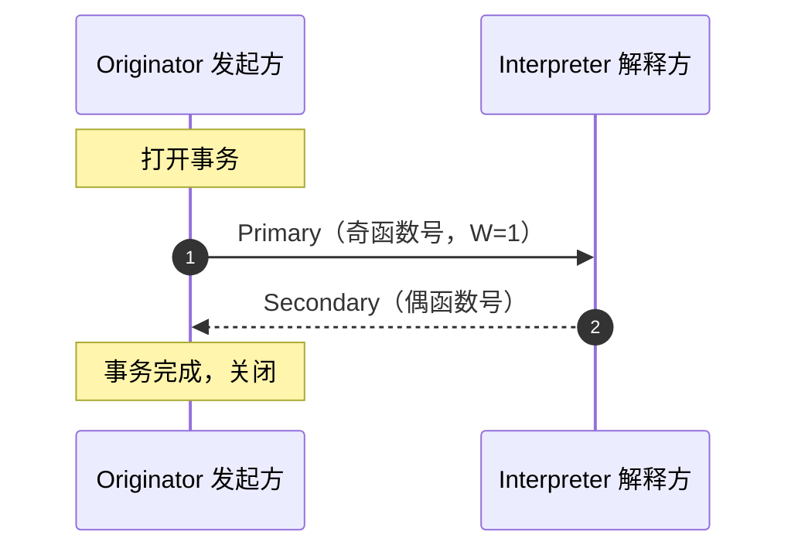

# 事务与对话协议

> `SECS-II` 的所有信息交换都建立在**事务（`Transaction`）**之上；一组相关事务串起来完成一个任务，就是**对话（`Conversation`）**。本页先讲事务，再讲七种对话类型，最后给最小合规要求。

## 1. 事务的定义（§8.2）

**一个事务（`Transaction`）** 由以下两种形式之一构成：

1. 一条**不期待回复**的主消息（`Primary`）；
2. 一条**期待回复**的主消息 + 其对应的**次消息**（`Secondary`，即回复）。

**规则：**

- 主消息用**奇函数号**，次消息用**偶函数号**（= 主 + 1，见 [消息格式](message-format.md)）。
- **次消息不能请求回复**——事务到此为止。
- 术语：发起事务的一方叫 **`Originator`**，解释主消息并按需生成回复的一方叫 **`Interpreter`**（§6.2）。



## 2. 事务级合规要求（§8.3）

想要"合规于 `SECS-II`"，**最少**必须满足以下五条：

| # | 要求 | 说明 |
| --- | --- | --- |
| 1 | 收到 `S1F1` 按 §10.5 回 `S1F2` | 在线探测必须应答 |
| 2 | 收到无法处理的消息，发 `S9F1`/`F3`/`F5`/`F7`/`F11` | 见 [S9 系统错误](stream-9-13.md) |
| 3 | 其余支持的消息按 §10 定义格式 | 消息体结构必须精确 |
| 4 | 检测到事务超时，设备向 `Host` 发 `S9F9` | 通知"事务没完成" |
| 5 | 收到函数 0 回复 → 终止事务，**不发**错误消息 | 函数 0 是优雅关闭 |

**函数 0（`Abort Transaction`）**：当解释方因传输错误等原因无法给出期待的回复时，用函数 0 关闭事务，让发起方**不必等到事务超时**。它不是强制性的（§10.4.1）。

## 3. 对话（§8.4）

**对话（`Conversation`）** = 一系列一个或多个相关事务，共同完成一个特定任务；结束时双方都应释放占用的资源。

- **对话超时**（`Conversation Timeout`）：对话没有正常完成时触发，与应用相关（检测方法标准不规定）。设备侧检测到对话超时，发 `S9F13` 给 `Host`（§8.4.1）。
- 对话超时会终止该对话的后续动作，并允许清理已承诺的资源。

## 4. 七种对话类型（§8.4.2）

`SECS-II` 的全部信息交换归纳为七种对话模式。函数名里的 `request`、`data`、`send`、`acknowledge`、`inquire`、`grant` 等关键词，就是为了让人一眼看出消息属于哪种对话（§8.4.3）。

### ① 无回复单发（最简单）

主消息不期待回复，必须单块。发起方假定解释方已收到消息。用于"即使被拒绝也没办法"的场景。

```
Originator ── Primary（无 W）──▶ Interpreter
```

### ② 请求 / 数据（request/data）

发起方想要解释方的数据：主消息请求，解释方把数据放在回复里返回。发起方必须准备好接收返回的数据量。

```
Originator ── 请求 ──▶ Interpreter
Interpreter ── 数据（回复）──▶ Originator
```

### ③ 发送 / 确认（send/acknowledge）

发起方单块发送数据，期待解释方的确认。

```
Originator ── 数据 ──▶ Interpreter
Interpreter ── 确认（回复）──▶ Originator
```

### ④ 询问 / 许可 / 发送 / 确认（inquire/grant/send/acknowledge）

**多块发送**的必经之路：发送方先请求许可（`inquire`），解释方同意（`grant`）后发送方才能发多块数据，最后确认。解释方可以在 `inquire` 与 `send` 之间预留资源。

```
Originator ── 询问（请求许可）──▶ Interpreter
Interpreter ── 许可（回复）──▶ Originator
Originator ── 发送（多块）──▶ Interpreter
Interpreter ── 确认（回复）──▶ Originator
```

> 对话超时可能由解释方设置（取决于预留资源的时间）；超时后解释方释放资源并发 `S9F13`。

### ⑤ 未格式化数据集传输对话（Stream 13）

设备和 `Host` 之间传输未格式化数据集（`Data Set`）的专用对话，详见 [S13 数据集传输](stream-9-13.md)。

### ⑥ 物料处理对话（Stream 4）

设备之间搬运物料的专用对话（`Ready to Send` → `Send Material` → `Handshake Complete`…），详见 [S4 物料控制](stream-3-4.md)。

### ⑦ 请求 / 确认 / 发送 / 确认（request/acknowledge/send/acknowledge）

发起方请求的信息需要解释方花时间获取（如等待操作员输入）。解释方有三种回应方式：

1. **直接返回**信息；
2. 表示**无法/不会**获取；
3. 表示**稍后**获取并在后续事务中返回（此时解释方在信息就绪时主动发起后续事务）。

```
Originator ── 请求 ──▶ Interpreter
Interpreter ── 确认：稍后返回（回复）──▶ Originator
...信息就绪后...
Interpreter ── 发送（后续事务，主动发起）──▶ Originator
Originator ── 确认（回复）──▶ Interpreter
```

> 这种对话的发起方也可能预留资源（等待后续发送），对话超时后发起方释放资源并**从"请求"重开对话**，或发 `S9F13`（§8.4.2.1/§8.4.2.2）。注意：按标准定义，`S9F13` 只有**设备**应向 `Host` 发送。

## 5. 速记表

| 对话 | 事务序列 | 典型消息 |
| --- | --- | --- |
| ① 无回复单发 | `Primary` | `S1F1`、`S2F21`（无回复时） |
| ② 请求/数据 | `Request` → `Data` | `S1F3`→`S1F4`、`S1F13`→`S1F14` |
| ③ 发送/确认 | `Send` → `Acknowledge` | `S2F15`→`S2F16`、`S5F1`→`S5F2` |
| ④ 询问/许可/发送/确认 | `Inquire` → `Grant` → `Send` → `Ack` | `S2F39`→`S2F40` → `S2F33`(多块)→`S2F34` |
| ⑤ 数据集传输 | 见 [S13](stream-9-13.md) | `S13F1`-`F16` |
| ⑥ 物料搬运 | 见 [S4](stream-3-4.md) | `S4F1`-`F41` |
| ⑦ 请求/确认/发送/确认 | `Request` → `Ack`(稍后) → `Send` → `Ack` | 如 `S1F19`→`S1F20` 变体 |

## 6. 与 E30 GEM 的关系

- `E5` 只定义**事务/对话的机械规则**（谁发、回复什么、超时怎么办）；`E30` 定义**什么时候该发起哪个场景**。
- `E30` 笔记中反复出现的 `S1F13/F14` 握手、`S6F11/12` 事件上报、`S2F41/42` 远程命令，在 `E5` 里就是 ②③ 类对话的具体实例。
- "多开事务"（§6.6）在 `E30` 的建立通信场景里有明确应用：设备发起的 `S1F13` 与主机发起的 `S1F13` 可以同时打开（见 [E30 状态模型](../e30/state-models.md)）。
