# 交接序列：从握手到完成

> `E84` 的核心是**信号时序**：主动设备与被动设备按定义的边界（`Boundary`）与区域（`Zone`）一步步握手，完成装载（`Load`）或卸载（`Unload`）。本页讲三种交接——**单次**（`Single`）、**同时**（`Simultaneous`）、**连续**（`Continuous`）——以及它们共用的 `Zone` 模型（§6.2）。

## 1. 时序图读法

- 每个信号状态变化称为一个**边界（`Boundary`）**，用字母 `A`-`N` 标记（表 5）；
- 特定的时间区间用嵌套结构定义为**区域（`Zone`）**（表 6）；
- 时序图中的**步骤编号仅供引用**，不一定与交接步骤或信号顺序要求一一对应（§6.2.1）。

## 2. 边界（表 5）

| 边界 | 描述 |
| --- | --- |
| `A` | 主动设备开始指定端口 |
| `B` | 主动设备尝试与被动设备接洽、验证其请求 |
| `C` | 被动设备基于 `Load Port` 条件（装载或卸载）表示接受接洽 |
| `D` | 主动设备同意被动设备的意图，表示准备好交接 |
| `E` | 被动设备回复"也准备好交接" |
| `F` | 物理交接开始（指定/解除连续交接） |
| `G` | 被动设备检测到载具已放置/已取走 |
| `H` | 主动设备发出物理交接结束信号 |
| `I` | 主动设备终止交接请求 |
| `J` | 主动设备表示交接接洽已完成 |
| `K` | 被动设备表示双方之间不再有交接活动 |
| `L` | 主动设备确认交接意图完成 |
| `M` | 主动设备表示不再有握手意图 |
| `N` | 主动设备撤下端口请求信号离开 |

## 3. 区域模型（`Zone`，表 6）

五个 `Zone` 层层嵌套：

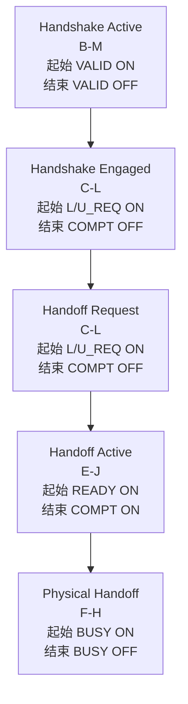

| `Zone` | 区间 | 起始 | 结束 | 关键要求 |
| --- | --- | --- | --- | --- |
| **`Handshake Active`** | `B`-`M` | `VALID ON` | `VALID OFF`（连续交接为最后一次） | 被动设备此前/此后不受交接活动约束 |
| **`Handshake Engaged`** | `C`-`L` | `L_REQ ON` 或 `U_REQ ON` | `COMPT OFF`（连续交接为最后一次） | 被动设备置 `L_REQ`/`U_REQ` 后**不得**改变装载/卸载条件的物理动作；装载后需夹紧/对接的操作只能在 `READY OFF` 之后做 |
| **`Handoff Request`** | `C`-`L` | `L_REQ ON` 或 `U_REQ ON` | `COMPT OFF` | `FOUP` 在此请求激活期间保持 `Docked/Clamped`；物理交接中被动设备只做"准备交接"的动作 |
| **`Handoff Active`** | `E`-`J` | `READY ON` | `COMPT ON` | 卸载时若 `FOUP` 不在端口，须先 `Undock/Unclamp` 并放到 `Load Port`；装载期间**不得**激活 `Dock/Undock`、`Clamp/Unclamp` 动作 |
| **`Physical Handoff`** | `F`-`H` | `BUSY ON` | `BUSY OFF` | `CS_0` 或 `CS_1` `ON` = 交接一个载具；两者都 `ON` = 交接两个载具；主动设备须完成移入并**完全移出冲突区** |

> 定时器（`TDx`/`TAx`/`TPx`）分别关联主动设备、被动设备与延迟（详见图 10、[错误检测与定时器](errors-timers.md)）。

## 4. 单次交接（`Single Handoff`，§6.2.4）

**单次交接（`Single Handoff`）** = 一次交接操作搬运**一个**载具（装载或卸载）。这是 E84 最基本的交接形态，`Simultaneous`/`Continuous` 都是它的组合或变体。标准给出两种场景：**常规**（`AGV`/`RGV`/`OHT` ↔ 被动设备，§6.2.4.1）与 **`Interbay`**（被动 `OHS` ↔ `Stocker`，§6.2.4.2）。

### 4.1 常规场景（`AGV`/`RGV`/`OHT` ↔ 被动设备）

装载（`Figure 12`）与卸载（`Figure 13`）的时序一致，共 **13 步**（§6.2.4.1）：

| 步 | 发送方→接收方 | 动作 | 说明 |
| --- | --- | --- | --- |
| 1 | 主动→被动 | 用 `CS_0`/`CS_1` 指定端口号 | 主动设备到达 `Load Port` 前 |
| 2 | 主动→被动 | `VALID ON` | `CS_0/1` 转换**有效**；被动设备此前**不应**验证 `CS_0/1`（注 2） |
| 3 | 被动→主动 | `L_REQ ON`（装载就绪）/ `U_REQ ON`（卸载就绪） | 按 `Load Port` 条件选择 |
| 4 | 主动→被动 | `TR_REQ ON` | 请求开始交接 |
| 5 | 被动→主动 | `READY ON` | 被动设备交接就绪 |
| 6 | 主动→被动 | 确认 `READY ON` 后 `BUSY ON` | 主动设备开始物理交接 |
| 7 | 被动→主动 | `L_REQ OFF`（载具放对位）/ `U_REQ OFF`（载具取走） | 载具位置正确 |
| 8 | 主动→被动 | `BUSY OFF` | 交接完成**且主动设备离开冲突区**；须**先确认** `L_REQ`/`U_REQ` 已 `OFF` |
| 9 | 主动→被动 | `TR_REQ OFF` | `BUSY OFF` 之后 |
| 10 | 主动→被动 | `COMPT ON` | 通知被动设备交接完成 |
| 11 | 被动→主动 | `READY OFF` | 确认 `COMPT ON` 之后 |
| 12 | 主动→被动 | `COMPT`/`VALID`/`CS_0`/`CS_1` 全部 `OFF` | `READY OFF` 之后 |
| 13 | — | `VALID OFF` | 握手关闭 |

**辅助信号在单次交接中的角色**（图 12/13 中恒定状态）：这三个信号不参与交接握手，但在整个过程中保持固定状态，异常时才会变化：

| 信号 | 单次交接中的状态 | 作用 |
| --- | --- | --- |
| `HO_AVBL` | 保持 `ON` | 被动设备"交接可用"指示；异常时 `OFF`（见 [§7](#7-ho_avbl-操作序列6227)） |
| `ES`（`Emergency Stop`） | 保持 `ON` | 急停信号；危险情况下 `OFF` 请求立即停止 |
| `CONT` | 保持 `OFF` | 单次交接**不是**连续交接，恒为 `OFF`（仅 [连续交接](#6-连续交接continuous-handoff6226) 用） |
| `CS_1` | 保持 `OFF` | 单次交接只指定一个端口（`CS_0`），`CS_1` 恒 `OFF`（仅 [同时交接](#5-同时交接simultaneous-handoff6225) 时 `CS_0`+`CS_1` 同 `ON`） |

**交接结束后的状态**：步骤 12-13 之后，`Load Port` 回到可用状态，等待下一次交接。若此时设备需要处理载具（如 `Dock`/加工），那是交接之后的事，不属于 E84 握手范围。

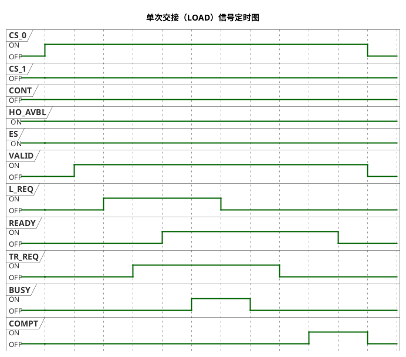

**同一过程的动作视角**（信号 + 动作一起看）：

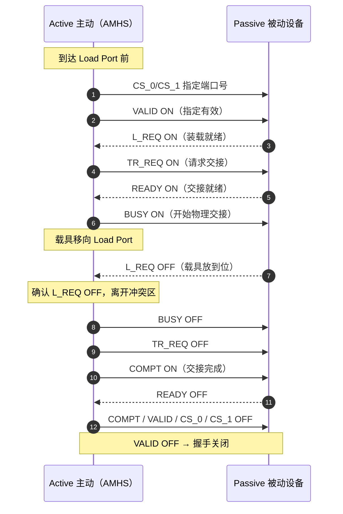

**注**：被动设备若校验 `BUSY`/`TR_REQ` 为 `OFF`，应只在主动设备 `COMPT ON` 之后校验（注 3）；若检查 `COMPT`/`VALID`/`CS_0`/`CS_1`，应允许任意顺序 `OFF` 而不报错（注 4）。

**卸载（`UNLOAD`）** 的信号波形与装载相同，仅把 `L_REQ` 换成 `U_REQ`（`U_REQ ON` = 卸载就绪，`U_REQ OFF` = 载具被取走）：

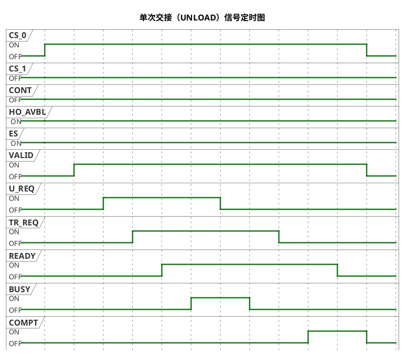

**卸载的动作视角**（`U_REQ` 对应"被动设备请求取走载具"）：

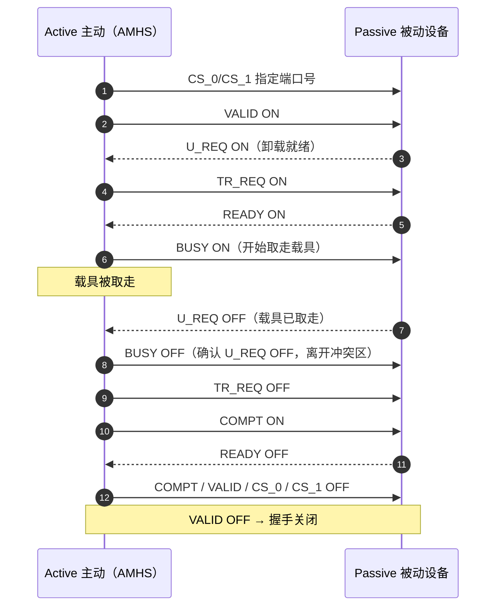

### 4.2 `Interbay` 场景（被动 `OHS` ↔ `Stocker`，§6.2.4.2）

**角色互换**：与 4.1 相反，`Interbay` 中**被动 `OHS` 车辆**是交接的发起方（主动指定位置），**`Stocker`** 是响应方。信号用 `VS_0`/`VS_1`/`VA`（被动 `OHS` 侧）与 `AM_AVBL`/`TR_REQ`/`BUSY`（主动 `Stocker` 侧），不再使用 `CS_0/1`、`VALID`、`CONT`。装载（`Figure 14`）与卸载（`Figure 15`）共 **14 步**（§6.2.4.2）：

| 步 | 发送方→接收方 | 动作 | 说明 |
| --- | --- | --- | --- |
| 1 | 被动 `OHS`→主动 `Stocker` | 用 `VS_0`/`VS_1` 指定交接位置 | 被动 `OHS` 到达 `Stocker` 时 |
| 2 | 被动 `OHS`→主动 `Stocker` | `L_REQ ON`（装载就绪）/ `U_REQ ON`（卸载就绪） | 与步骤 1 设置 `VS` 同时进行 |
| 3 | 被动 `OHS`→主动 `Stocker` | `VA ON` | `VS_0/1`、`L_REQ`/`U_REQ` 转换**有效** |
| 4 | 主动 `Stocker`→被动 `OHS` | 检查 `VS_0/1`、`L_REQ`/`U_REQ` 后 `TR_REQ ON` | 识别到 `VA` 之后 |
| 5 | 被动 `OHS`→主动 `Stocker` | `READY ON` | 交接就绪 |
| 6 | 主动 `Stocker`→被动 `OHS` | 确认 `READY ON` 后 `BUSY ON` | `Stocker` 机械臂开始交接 |
| 7 | 被动 `OHS`→主动 `Stocker` | `L_REQ OFF`（载具放对位）/ `U_REQ OFF`（载具取走） | |
| 8 | 主动 `Stocker`→被动 `OHS` | `BUSY OFF` | 交接完成且离开冲突区；须**先确认** `L_REQ`/`U_REQ` 已 `OFF` |
| 9 | 主动 `Stocker`→被动 `OHS` | `TR_REQ OFF` | `BUSY OFF` 时 |
| 10 | 主动 `Stocker`→被动 `OHS` | `COMPT ON` | 交接完成 |
| 11 | 被动 `OHS`→主动 `Stocker` | `READY OFF` | 确认 `COMPT ON` 之后 |
| 12 | 主动 `Stocker`→被动 `OHS` | `COMPT OFF` | `READY OFF` 之后 |
| 13 | 被动 `OHS`→主动 `Stocker` | `VS_0`、`VS_1`、`VA` 全 `OFF` | 确认 `COMPT OFF` 之后 |
| 14 | — | `VA OFF` | 握手关闭 |

**与 4.1 常规场景的差异**：

| 对比点 | 4.1 常规 | 4.2 `Interbay` |
| --- | --- | --- |
| 发起方 | 主动设备（`AMHS`）指定端口 | **被动 `OHS`** 指定位置 |
| 有效信号 | `VALID` | `VA` |
| 端口信号 | `CS_0`/`CS_1` | `VS_0`/`VS_1` |
| 主动方可用指示 | （无对应） | `AM_AVBL`（`Stocker` 机械臂可用） |
| 步数 | 13 | 14 |
| 结束信号 | `VALID OFF` | `VA OFF` |

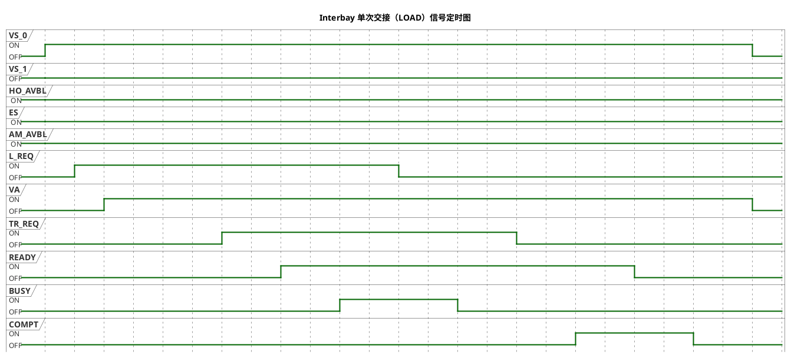

**`Interbay` 场景的动作视角**（角色互换——被动 `OHS` 车辆主动，`Stocker` 响应）：

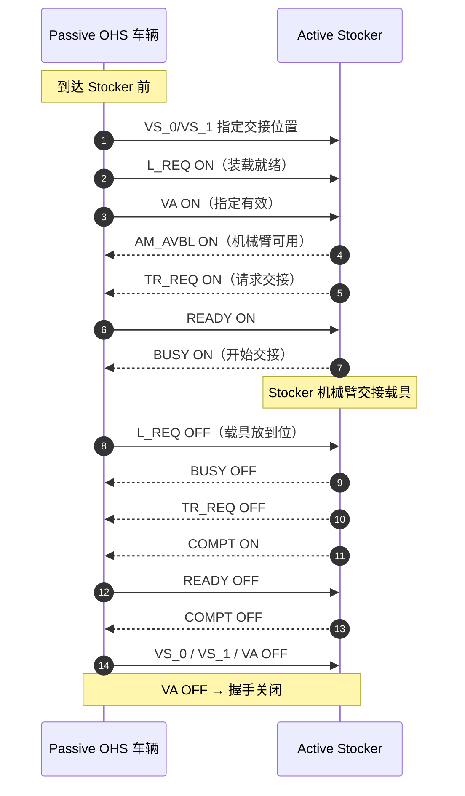

## 5. 同时交接（`Simultaneous Handoff`，§6.2.5）

**同时交接** = 主动设备在一次交接操作中**同时**向两个 `Load Port` 交接两个载具（单臂双叉 `AMHS` 适用，可提升吞吐）。

与单次交接的差异只在端口指定与 `L_REQ`/`U_REQ` 的 `ON/OFF` 定义：

1. 主动设备 `CS_0` 与 `CS_1` **都 `ON`**，告知被动设备是同时交接；
2. `CS_0/1` 转换生效后 `VALID ON`；
3. 被动设备在**两个**指定端口都就绪时才 `L_REQ`（`U_REQ`）`ON`；
4. **两个**端口都检测到（取走）载具时 `L_REQ`（`U_REQ`）`OFF`。

`Interbay` 同时交接用 `VS_0` 与 `VS_1` 都 `ON` 表达（图 17）。

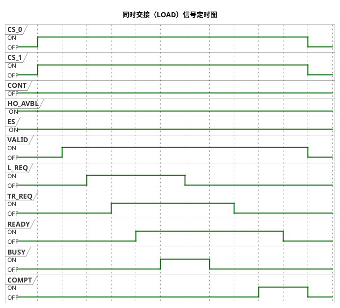

> `CS_0` 与 `CS_1` **同时 `ON`** 是同时交接的标志；`L_REQ`（`U_REQ`）在**两个**端口都就绪/都到位时才切换（§6.2.5.2）。

**同时交接的动作视角**（一次交接同时搬运两个载具到两个端口）：

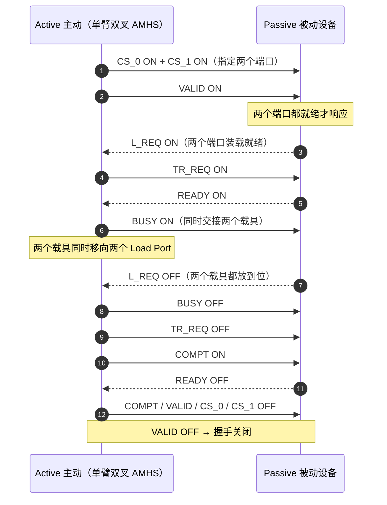

## 6. 连续交接（`Continuous Handoff`，§6.2.6）

**连续交接** = 主动设备在一次交接操作中**连续**（串行）交接两个及以上载具。当被动设备 `Load Port` 前有门时，多个载具交接无需反复开关门，门在交接期间保持打开（§6.2.6.2）。

- 每次子交接 = 一次单次交接序列的组合，另加 `CONT` 信号标记连续交接（§6.2.6.3）：
  - **第一个**载具交接的 `BUSY ON` 时 `CONT ON`（标记"这是连续交接"）；
  - **最后一个**载具交接的 `BUSY ON` 时 `CONT OFF`（标记"连续交接结束"）。
- 同一端口的连续交接（如 `Unload → Load`）用相同端口号（如 `CS_0`）指定（图 18）；不同端口（`Load → Load`）则换 `CS_1`（图 19）。
- `TD1` 延迟定时器约束两个 `VALID` 之间的间隔（见 [错误检测与定时器](errors-timers.md)）。

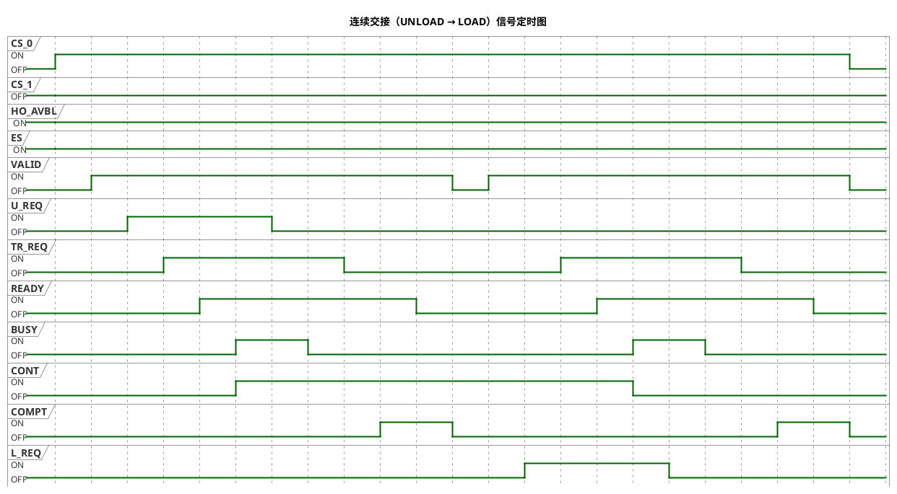

> `CONT` 信号：**第一个**载具交接的 `BUSY ON` 时 `ON`（@50），**最后一个**载具交接的 `BUSY ON` 时 `OFF`（@160）——两次交接之间 `VALID` 短暂 `OFF` 再 `ON`（受 `TD1` 延迟定时器约束），门保持打开。

**连续交接的动作视角**（门保持打开，一次交接接一次）：

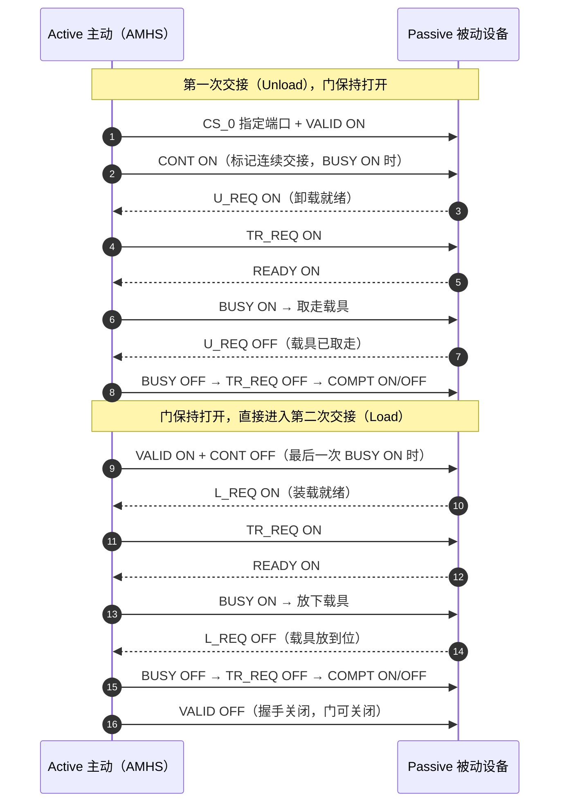

## 7. `HO_AVBL` 操作序列（§6.2.7）

- `HO_AVBL` 在被动设备正常操作期间 `ON`，检测到交接异常时 `OFF`；可能独立于其他信号、在交接前或交接中变 `OFF`。
- 主动设备应在以下时段确认 `HO_AVBL`（§6.2.7.1）：
  - `a)` 从 `VALID ON` 到 `L_REQ`/`U_REQ ON`；
  - `b)` 从 `TR_REQ ON` 到 `READY ON`。
- 主动设备检测到 `HO_AVBL OFF` 时**停止交接**，`VALID OFF` 关闭握手（`CS_0/1` 必须 `OFF`）；被动设备在 `VALID OFF` 后 `HO_AVBL ON`（`L_REQ`/`U_REQ` 必须 `OFF`）。
- `Interbay` 场景（§6.2.8）：主动 `Stocker` 在 `TR_REQ ON` 到 `READY ON` 期间确认；`HO_AVBL OFF` 时通过 `AM_AVBL OFF` 关闭交接序列（`TR_REQ` 必须 `OFF`，被动 `OHS` 须 `VS_0/1 OFF`；`VA OFF` 后被动方 `HO_AVBL ON`）。

**异常示例**（`HO_AVBL` 在握手期间变 `OFF`，对应图 24-26）：主动设备在 `TR_REQ ON` 后确认 `HO_AVBL` 时发现其 `OFF` → 停止交接、`VALID OFF` 关闭握手：

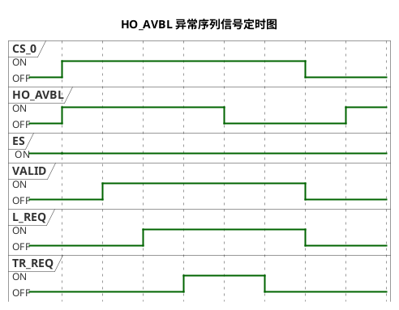

> 主动设备在 `TR_REQ ON` 到 `READY ON` 期间确认 `HO_AVBL`（§6.2.7.1 `b`）：此处 `HO_AVBL` 在 @40 变 `OFF`，主动设备随即停止（`TR_REQ OFF`）、`VALID OFF` 关闭握手（`CS_0/1` 必须 `OFF`）；被动设备在 `VALID OFF` 后恢复 `HO_AVBL ON`（`L_REQ`/`U_REQ` 必须 `OFF`，§6.2.7.2）。

**异常动作视角**（`HO_AVBL OFF` → 主动设备中止交接）：

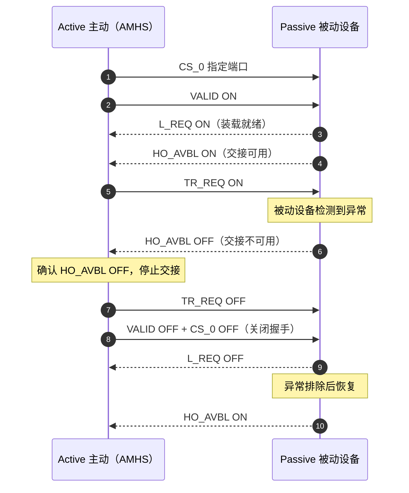

