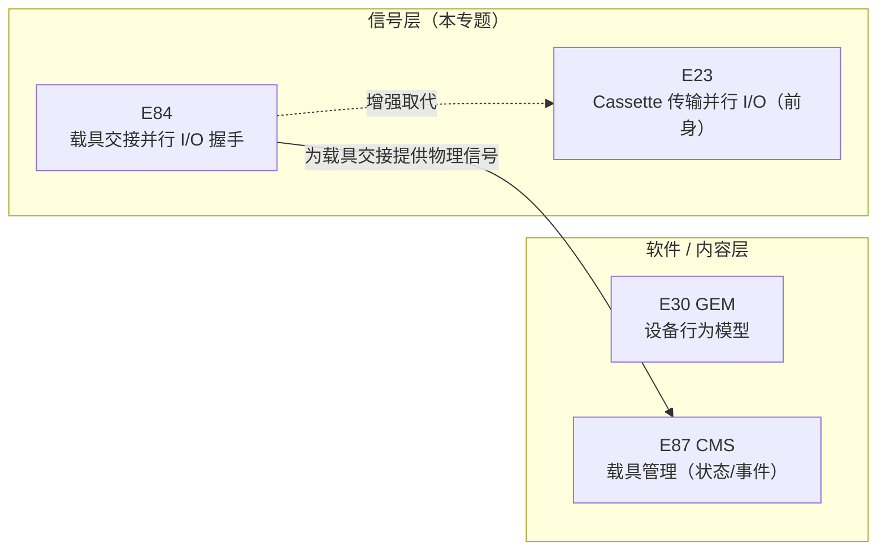
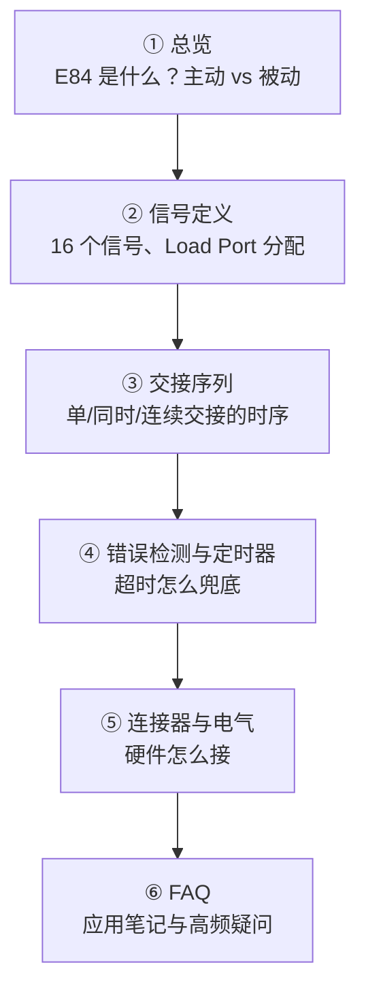
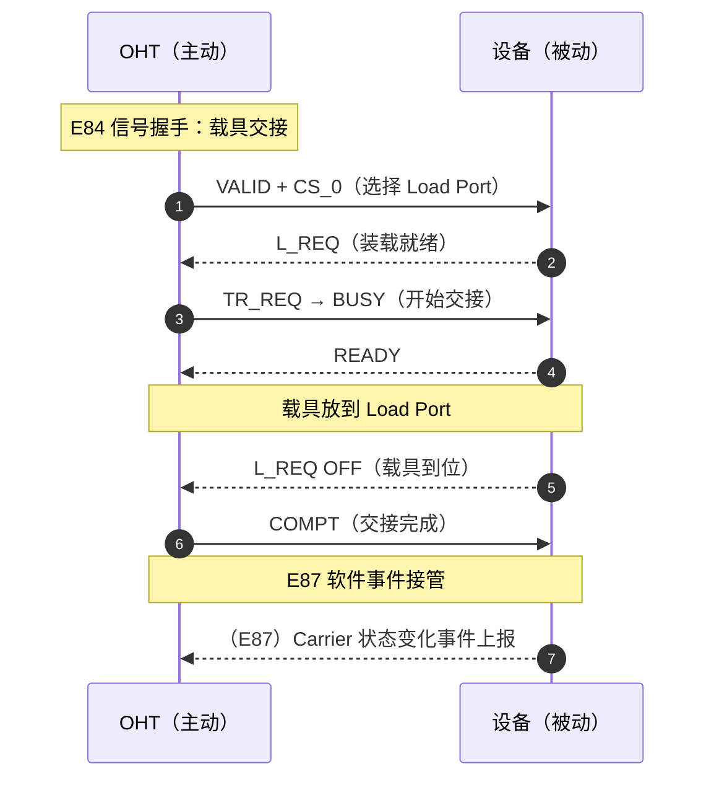

# 总览：`E84` 载具交接并行 `I/O` 接口

> **`E84`**（`SEMI` **`E84-0305`**，`Specification for Enhanced Carrier Handoff Parallel I/O Interface`）定义**主动搬运设备**（`AMHS`：`OHT`/`AGV`/`RGV` 等）与**被动设备**（工艺设备、`Stocker` 等）之间，在 `Load Port` 交接晶圆载具（`FOUP` 等）时的**并行 `I/O` 信号握手**。它是 `EFEM` 集成中"信号层"的核心——`E87` 管"载具状态"（软件事件），`E84` 管"交接握手"（硬件信号）。

## 1. `E84` 的定位

`E84` 在标准家族中的位置

**要点：**

- **`E84` 管"交接握手"**：`FOUP` 怎么从 `OHT` 安全放到 `Load Port` 上、怎么从 `Load Port` 取走——用一组**并行 `I/O` 信号**（如 `VALID`、`TR_REQ`、`BUSY`、`COMPT`）协商每一步。
- **`E87` 管"载具状态"**：`FOUP` 在装载端口上的状态机与事件（`Carrier ID`、`Dock`/`Undock` 等），是软件层面；两者常配套部署。
- **`E84` 只定义"自动交接"**：工厂层控制器（`Host`）**不参与**握手过程，交接由主动设备与被动设备双方自己管理（§2.3）。
- **`E84` 增强自 `E23`**：在 `E23`（`Cassette Transfer Parallel I/O`）基础上增加 `continuous handoff`（连续交接）、`simultaneous handoff`（同时交接）、错误检测能力；但**独立于 E23**（注 1：使用本规范不要求 E23）。

## 2. 为什么需要 `E84`

大晶圆尺寸（300 mm）时代，`FOUP` 越来越重，工厂大量依赖 `AMHS` 自动搬运。生产设备与 `AMHS` 之间的并行 `I/O` 控制信号必须**更精确定义**，才能实现**可靠、高效**的载具交接（load/unload）（§1.1）：

| 能力 | 说明 | 解决的问题 |
| --- | --- | --- |
| `Single Handoff` | 单个载具的装载/卸载 | 基本交接 |
| `Continuous Handoff` | 两个及以上载具**连续**交接（串行） | 避免门反复开关、提升效率 |
| `Simultaneous Handoff` | 两个载具**同时**交接（并行） | 双叉/双手 `AMHS` 一次搬运两个载具 |

## 3. 两类角色：主动设备 `vs` 被动设备

| 角色 | 定义（§5.1.2、§5.1.18） | 典型设备 |
| --- | --- | --- |
| **主动设备**（`Active Equipment`） | 把载具装载到另一设备、或从另一设备卸载载具的一方 | `OHT`、`AGV`、`RGV`、带传输机构的 `Stocker`、主动型 `OHS` |
| **被动设备**（`Passive Equipment`） | 被主动设备装载/卸载的一方 | 工艺设备（加工、计量）、`Stocker`、被动型 `OHS` 车辆 |

- **`AMHS` 设备**（§5.1.4）：拥有载具搬运机器人的设备，包括 `RGV`、`AGV`、`OHT`、`OHS`（天车穿梭车）、`Stocker`。
- **`Interbay`（跨区）场景**：`OHS` 与 `Stocker` 之间可互换角色——`OHS` 主动时 `Stocker` 被动，反之亦然（§6.4.1）。

## 4. 标准正文结构

| 章节 | 内容 | 笔记对应页 |
| --- | --- | --- |
| §1-4 | 目的、范围、限制、引用标准 | 本页 |
| §5 术语 | `handoff`、`continuous/simultaneous handoff`、`access mode`… | 本页及各处 |
| §6.1 信号定义 | 16 个信号的名称/方向/含义 | [信号定义](signals.md) |
| §6.2 交接序列 | 边界、`Zone`、单/同时/连续交接时序 | [交接序列](handoff-sequences.md) |
| §6.3 错误指示与检测 | `TAx`/`TPx`/`TDx` 定时器 | [错误检测与定时器](errors-timers.md) |
| §6.4-6.5 连接器与电气 | `DB-25` 连接器、引脚、电气规格、传感器尺寸 | [连接器与电气规格](interface.md) |
| 附录 A1 应用笔记 | 配置选择、错误恢复、`HO_AVBL`/`ES` 场景 | [FAQ](faq.md) 及各处 |

## 5. 阅读路线

- [**① 总览**](index.md)：E84 定位、主动/被动角色、核心能力。
- [**② 信号定义**](signals.md)：`VALID`、`CS_0/1`、`TR_REQ`、`L/U_REQ`、`READY`、`BUSY`、`COMPT`、`CONT`、`HO_AVBL`、`ES` 等 16 个信号逐一拆解；`Load Port` 分配信号（`CS_0/CS_1`、`VS_0/VS_1`）的用法。
- [**③ 交接序列**](handoff-sequences.md)：边界（`Boundary`）与 `Zone` 模型；`Single`/`Simultaneous`/`Continuous` 三种交接的完整握手时序。
- [**④ 错误检测与定时器**](errors-timers.md)：`TA1`-`TA3`（主动）、`TP1`-`TP6`（被动）、`TD0`/`TD1`（延迟）定时器表；错误指示与恢复原则。
- [**⑤ 连接器与电气规格**](interface.md)：`DB-25` 连接器、引脚分配表、电气规格（`+24 Vdc`）、光电隔离、传感器尺寸。
- [**⑥ FAQ**](faq.md)：附录 A1 应用笔记要点（`PI/O` 配置选择、`HO_AVBL`/`ES` 场景、自动恢复）与高频疑问。

## 6. 与 `E87` 的配合（信号层 `vs` 软件层）

- **`E84`**：信号级握手，负责"物理上把载具安全交接"；
- **`E87`**（`Carrier Management`）：交接完成后，`Load Port` 的载具状态、`Carrier ID` 读取、`Dock/Undock` 等由 E87 管理并产生事件。
- 两者是 `EFEM` 自动化的黄金搭档：`E84` 保证交接不出错，`E87` 让 `Host` 知道载具在哪儿、状态如何。
