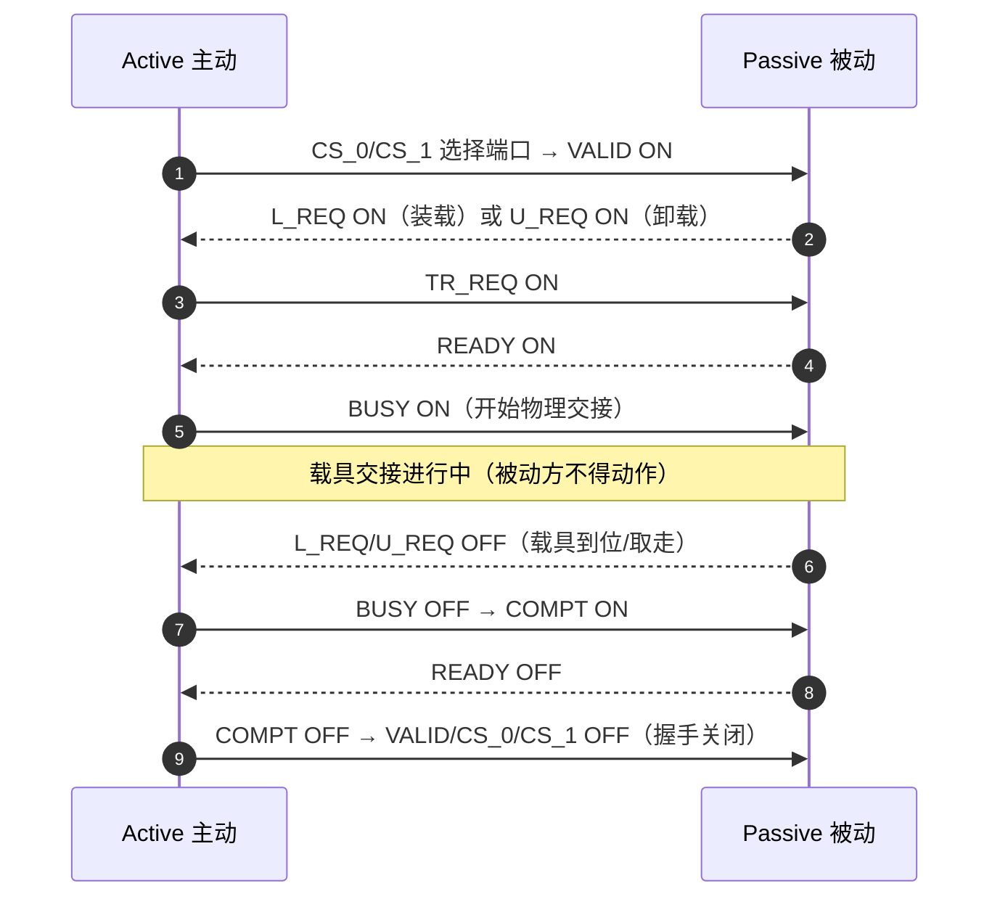

# 信号定义：16 个并行 `I/O` 信号

> `E84` 用一组并行 `I/O` 信号在主动设备（`A`，`Active`）与被动设备（`P`，`Passive`）之间握手。信号分两类方向：`A -> P`（主动发给被动）与 `P -> A`（被动发给主动）。本页是信号字典（§6.1）。

## 1. 信号总表（表 1）

| 信号 | 方向 | 名称 | 用途 |
| --- | --- | --- | --- |
| `VALID` | A→P | 有效 | 接口通信有效：`ON` = 通信有效（`CS_0/1` 选好端口后置 `ON`） |
| `CS_0` | A→P | `Carrier Stage 0` | 选择左 `Load Port` |
| `CS_1` | A→P | `Carrier Stage 1` | 选择右 `Load Port` |
| `TR_REQ` | A→P | `Transfer Request` | 请求开始交接（`BUSY` 转 `OFF` 时随之 `OFF`） |
| `L_REQ` | A←P | `Load Request` | 装载请求：`Load Port` 被指定用于装载载具（`Active`→`Passive`） |
| `U_REQ` | A←P | `Unload Request` | 卸载请求：`Load Port` 被指定用于卸载载具（`Passive`→`Active`） |
| `READY` | A←P | 交接就绪 | 被动设备已接受交接请求 |
| `BUSY` | A→P | 交接进行中 | 主动设备正在执行交接 |
| `COMPT` | A→P | 交接完成 | 主动设备完成交接 |
| `CONT` | A→P | 连续交接 | `ON` = 连续交接（第一个载具 `BUSY ON` 时 `ON`，最后一个 `BUSY ON` 时 `OFF`） |
| `HO_AVBL` | A←P | 交接可用 | 被动设备可用于交接（含错误指示） |
| `ES` | A←P | 急停 | 请求立即停止主动设备活动 |
| `VA` | A←P | 车辆到达 | 通知主动实体被动 `OHS` 车辆到达（`Interbay` 专用） |
| `AM_AVBL` | A→P | 机械臂可用 | 主动 `Stocker` 交接可用性（`Interbay` 专用） |
| `VS_0` | A←P | 车辆 `Stage 0` | 被动 `OHS` 车辆通知装载/卸载位置（`Interbay` 专用） |
| `VS_1` | A←P | 车辆 `Stage 1` | 同上（右端口） |

> `VA`、`AM_AVBL`、`VS_0`、`VS_1` 四个信号**仅用于 `Interbay AMHS`**（被动 `OHS` 车辆场景）；`VALID`、`CS_0`、`CS_1` **不**用于该场景（§6.1.1）。

## 2. `Load Port` 分配信号（§6.1.2）

主动设备用 `CS_0`/`CS_1` 选择交接所用的 `Load Port`。

### 2.1 一个 `PI/O` 管一个 `Load Port`

- `CS_0` = `ON`，`CS_1` = `OFF`（固定）。

### 2.2 一个 `PI/O` 管两个 `Load Port`（本标准的假设能力）

本规范要求具备用一个公共 `PI/O` 接口控制两个 `Load Port` 交接的能力（§6.1.2.2）：

| `CS_0` | `CS_1` | 选择的 `Load Port` | 交接类型 |
| --- | --- | --- | --- |
| `ON` | `OFF` | 左 `Load Port`（`LP1`） | `Single` 或 `Continuous` |
| `OFF` | `ON` | 右 `Load Port`（`LP2`） | `Single` 或 `Continuous` |
| `ON` | `ON` | **左右两个**（`LP1` + `LP2`） | **`Simultaneous`（同时交接）** |

- `CS_0` 选**左**端口、`CS_1` 选**右**端口（以正对设备 `Load Port` 的方向为准，§6.1.2.3）。
- 同时交接时，交接中 `CS_0` 与 `CS_1` 必须都 `ON`（§6.1.2.4）。

### 2.3 `Interbay` 场景的 `VS_0`/`VS_1`（§6.1.3）

被动 `OHS` 车辆用 `VS_0`/`VS_1` 选择交接端口（方向与 `CS_0`/`CS_1` 相反：被动方发起）：

| `VS_0` | `VS_1` | 选择 |
| --- | --- | --- |
| `ON` | — | 左 `Load Port` |
| — | `ON` | 右 `Load Port` |
| `ON` | `ON` | 两个端口（同时交接） |

- `VS_0`、`VS_1` **各自独立控制**（§6.1.3.2）。

## 3. 各信号行为详解

### 3.1 主动方信号（`A -> P`）

**`VALID`**：表明接口通信有效。`ON` 之前必须先用 `CS_0`/`CS_1` 指定好 `Load Port`；`OFF` 表示通信无效。被动设备在 `VALID ON` 之前不应验证 `CS_0`/`CS_1`（注 2）。

**`TR_REQ`**：请求被动设备执行交接。`ON` = 主动设备请求了交接；`BUSY` 转 `OFF` 时 `TR_REQ` 随之 `OFF`。

**`BUSY`**：主动设备正在交接。`READY` 必须 `ON` 时才能 `BUSY ON`；主动设备完成交接且其资源**离开 `Handoff Conflict Area`** 后 `BUSY OFF`（确认 `L_REQ`/`U_REQ` 已 `OFF`）。`BUSY ON` 期间被动设备**不得**在冲突区内做任何机械动作。

**`COMPT`**：主动设备完成交接。`BUSY OFF` 后 `ON`；被动设备完成交接（`READY OFF`）后 `OFF`。

**`CONT`**：标记连续交接。第一个载具交接的 `BUSY ON` 时 `ON`，最后一个载具交接的 `BUSY ON` 时 `OFF`。被动设备若有会干扰交接的机构（如快门门），连续交接期间必须保持不干扰状态（门保持打开，§6.2.6.2）。

### 3.2 被动方信号（`P -> A`）

**`L_REQ`**：`Load Port` 被指定装载载具（`Active`→`Passive` 方向）。`CS_0/1` 指定端口且 `VALID ON` 后 `ON`；`Load Port` 检测到载具到位后 `OFF`。**同时交接**时：`ON` 时两个端口都不得有载具，`OFF` 时两个端口都必须到位。

**`U_REQ`**：`Load Port` 被指定卸载载具（`Passive`→`Active`）。`CS_0/1` + `VALID ON` 后 `ON`；载具被取走后 `OFF`。**同时交接**时：`ON` 时两个端口都必须有载具，`OFF` 时两个端口都不得有载具。

**`READY`**：被动设备接受交接请求。接受时 `ON`，`COMPT ON` 时 `OFF`。

**`HO_AVBL`**：被动设备交接可用性（也可能指示被动设备错误）。正常时 `ON`；检测到交接异常时 `OFF`。异常包括：载具检测不正确、被动设备进入**手动访问模式**（`Manual Access Mode`）、被动设备处于**交接不可用**（`Handoff Unavailable`）状态。其他 `Load Port` 异常时本信号也可能保持 `OFF`（§6.1、§6.2.7）。

**`ES`**（`Emergency Stop`）：请求立即停止主动设备活动。正常时 `ON`；被动设备检测到危险情况（可能伤害物料、产品或操作）时 `OFF`。按下 `ES` 按钮或发生 `Handoff Interlock Abnormal` 时可能 `OFF`（§6.1）。

## 4. 关键时序关系速记

## 5. 与 `E87` 的衔接

- `HO_AVBL` 反映 `Load Port` 的**可用性状态**，`L_REQ`/`U_REQ` 反映**访问模式**——这些状态在 E87（`Carrier Management`）中有对应的定义与要求（§6.1 `HO_AVBL` 注、§5.1.1 `access mode`）。
- `E84` 的 `L_REQ`/`U_REQ` `OFF` 与 `Presence/Placement Sensor` 状态对应（附录 A1-4.6），是 E87 事件的基础物理条件。
