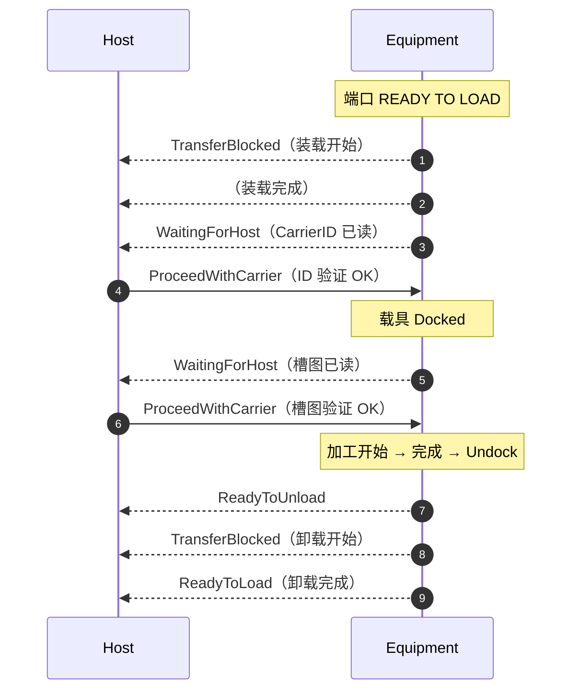

# FAQ：高频疑问答疑

> 学习 `E87`（`Carrier Management`）过程中的高频疑问，按主题归类，答案标注标准出处。附录 `R1` 的典型场景（`Normal Roundtrip`、异常验证、`Carrier-Out` 排队）也集中放在这里。

## 1. 概念与定位

**Q1: `E87` 和 `E84` 是什么关系？**

`E84` 管**信号级交接握手**（`FOUP` 物理上如何放到/取走 `Load Port`，见 [E84 总览](../e84/index.md)）；`E87` 管**软件级载具状态**（`CarrierID` 验证、`Slot Map`、访问模式、内部缓冲）。`E84` 完成交接后，`E87` 接管载具状态管理并上报事件。`Load Port Transfer` 状态模型的自动触发直接引用 `E84` 的 `PIO READY`/`COMPT` 信号（表 8、§9.5.4）。

**Q2: `E87` 和 `E30`（`GEM`）是什么关系？**

`E87` 建立在 `GEM` 之上（§6.2）：事件上报、状态采集、设备常数、报警管理、设备控制都按 `E30` 实现。`E87` 的**状态迁移 = 采集事件**，通过 `E30` 的事件上报机制发给主机（§7.2.2.1）。

**Q3: `Host` 必须用 `E87` 专用连接吗？**

**不用**。`E87` 要求与 `GEM` 接口**同一条通信连接**实现（单连接要求，§8.2）——不另开连接。消息走标准 `SECS-II`（`E87.1` 映射到 `S3` 流）。

**Q4: 固定缓冲设备和内部缓冲设备有什么区别？**

- **固定缓冲**（§5.2.11）：只有固定 `Load Port`，无内部缓冲；晶圆直接在端口处理。
- **内部缓冲**（§5.2.14）：设备内有缓冲位存放载具，`CarrierIn`/`CarrierOut` 进出缓冲。
- 差异影响：预留状态模型（内部缓冲**必须**、固定缓冲**可选**，§12.1.2/12.1.3）、`CarrierOut` 排队、缓冲分区变量（§19.2.3）。

## 2. 状态与对象

**Q5: 五个状态模型分别管什么？一句话记住？**

| 模型 | 一句话 |
| --- | --- |
| `Load Port Transfer` | 端口能不能交接？（`READY TO LOAD`/`READY TO UNLOAD`/`TRANSFER BLOCKED`…） |
| `Carrier` | 载具有效吗？（`ID` 验证 + 槽图验证 + 访问状态，三个并行子状态） |
| `Access Mode` | 谁允许交接？（`MANUAL`/`AUTO`） |
| `Reservation` | 端口被预留了吗？（`NOT RESERVED`/`RESERVED`） |
| `Association` | 端口关联载具了吗？（`NOT ASSOCIATED`/`ASSOCIATED`） |

**Q6: `Carrier` 对象怎么创建的？**

三种方式（§10.2.3）：① `Bind`/`CarrierNotification`/`CarrierReCreate` 服务；② `CarrierID` 读到当前不存在的 `ID`；③ `ProceedWithCarrier`/`CancelCarrier`（`NOT ASSOCIATED` 端口，`ID` 读失败场景）。`ObjID` = `CarrierID`。

**Q7: `Carrier` 对象什么时候销毁？**

（§10.2.5）：① 载具卸载离机；② `CancelBind`/`CancelCarrierNotification`；③ 设备侧验证失败后设备自发 `CancelBind`；④ `CarrierReCreate`。

**Q8: 为什么 `CarrierIDStatus` 有 `ID NOT READ` 这个初始状态？**

因为实例化方式不同初始状态不同（§10.7.3.3）：`Bind`/`Notification` 提供 `ID` → `ID NOT READ`（还没读实际载具）；读取器读到 → `WAITING FOR HOST`；`ProceedWithCarrier` → `ID VERIFICATION OK`；`CancelCarrier` → `ID VERIFICATION FAILED`。

## 3. 验证

**Q9: 设备侧验证和主机侧验证怎么选？**

- 主机在设备读取前提供期望值（`Bind` 带 `CarrierID`/`SlotMap`）→ **设备侧验证**（§14.1.1）。
- 主机未提供期望值 → 设备上报读取结果，**主机侧验证**（§14.1.2）。
- 不需要严格槽图管理的工厂可用主机侧验证（§14.3）。

**Q10: 设备侧验证失败时会发生什么？**

设备自发 `CancelBind`（销毁 `Bind` 创建的对象）、按读到的 `CarrierID` 新建对象，**不得**开门或移入内部缓冲，等待 `ProceedWithCarrier`（继续，用读到 `ID`）或 `CancelCarrier`（强制载具到卸载位）（表 12、§10.2.5）。

**Q11: `ProceedWithCarrier` #1 和 #2 是什么？**

主机侧验证时：`ID` 读后第一个 `ProceedWithCarrier` 是 **#1**（确认 `CarrierID`），槽图读后的是 **#2**（确认 `Slot Map`）（§16.4.19.2）。

**Q12: `BypassReadID` 是什么？**

`CarrierID` 读取器不可用（停用/未装/故障）时的用户可配置变量（§10.7.7）：`TRUE` = 自动接受 `Bind` 提供的 `ID`（跳过 `ID` 读）；`FALSE`（默认）= 载具到达后进入 `WAITING FOR HOST`，等 `ProceedWithCarrier`（用其中 `ID`）。注意它**不是**绕过读取器本身。

## 4. 服务

**Q13: `CarrierOut` 和 `CarrierRelease` 有什么区别？**

- `CarrierOut`（表 28）：把载具从内部缓冲**移到端口**（可排队）。
- `CarrierRelease`（表 29）：告知设备载具可**离开读/写位置**（标签读写完成后）。
- 两者目的不同、可配合使用（§17.1 图 7 注）：`CarrierHold` = `Host Release` 时载具保持写位直到 `CarrierRelease`，无论 `CarrierOut` 何时发出。

**Q14: `CarrierOut` 怎么排队？**

队列大小 = 缓冲位数 + 内部 `FIMS` 口数（§16.4.12.2）；每端口 `FIFO`；端口未指定时设备自选。排队服务在当前晶圆处理完成、端口 `NOT ASSOCIATED` 后才生效；排队期间端口保持 `TRANSFER BLOCKED`。可用 `CancelCarrierOut`/`CancelAllCarrierOut` 取消。

**Q15: `Bind` 和 `ReserveAtPort` 有什么区别？**

- `Bind`（表 18）：关联 `CarrierID` 到端口（带期望 `ID`）→ 端口 `RESERVED` + 关联 `ASSOCIATED` + 实例化对象 → **设备侧验证**。
- `ReserveAtPort`（表 36）：只预留端口（不带 `CarrierID`）→ 端口 `RESERVED` → **主机侧验证**。
- `CarrierNotification`：告知未来到达但**不指定端口**（无关联）→ 设备侧或主机侧验证（表 14）。

**Q16: `ChangeAccess` 换到一半失败怎么办？**

部分端口无法切换时，设备**接受命令**（恰当响应确认），只改变允许的端口，并在响应中指示"并非所有端口都切换成功"（§16.4.17）。

## 5. 事件与报警

**Q17: `Carrier Clamped` 和 `Carrier Unclamped` 事件什么时候发？**

- `Clamped`：第一个夹紧装置接合时（多个夹紧装置只发一次）（§18.4）。
- `Unclamped`：**全部**夹紧/锁定装置脱开时（§18.8）。
- 无夹紧功能的端口不发这些事件。

**Q18: `Duplicate CarrierID` 怎么处理？**

（§20.3）：① 第二个同 `ID` 载具**不处理**；② 第一个未开始处理也不处理；③ 第一个已开始处理 → 发 `Duplicate Carrier ID In Process` 事件通知主机。

**Q19: 必装报警有哪些？**

`PIO Failure`、`Access Mode Violation`、`Carrier Verification Failure`、`Slot Map Read/Verification Failed`、`Attempt To Use Out Of Service Load Port`、`Carrier Presence/Placement Error`、`Carrier Dock/UnDock Failure`、`Carrier Open/Close Failure`、`Duplicate CarrierID`、`Carrier Removal Error`，以及内部缓冲设备的 `Internal Buffer Carrier Move Failure`（§20.2 表 38）。

## 6. 典型场景（附录 R1-2）

**Q20: 主机侧验证的完整往返流程（`Normal Roundtrip 1`，表 `R1-2`）？**

固定缓冲设备 + `FOUP` + 主机侧验证：

**Q21: 设备侧验证的完整往返流程（`Normal Roundtrip 2`，表 `R1-3`）？**

固定缓冲 + 设备侧验证 + `Bind`：

1. `Host` 发 `Bind`（关联 + 预留）→ 端口 `READY TO LOAD`；
2. 装载开始（`TransferBlocked`）→ 完成；
3. 设备读 `CarrierID` → 验证成功 → 发 `IDVerificationOK`；
4. 载具 `Dock` → 读槽图 → 验证成功 → `SlotMapVerificationOK`；
5. 加工 → 完成 → `Undock` → `ReadyToUnload`；
6. 卸载开始（`TransferBlocked`）→ 完成（`ReadyToLoad`，预留/关联解除）。

> 设备侧验证**不需要** `ProceedWithCarrier`（§16.4.19.1）——验证成功直接继续。

**Q22: 内部缓冲设备的往返流程（`Normal Roundtrip 3`，表 `R1-4`）？**

内部缓冲 + 主机侧验证：装载 → `ID` 读 → `WaitingForHost` → `ProceedWithCarrier` → **`CarrierIn` 开始**（`BufferCapacityChange`）→ 完成 → 加工 → 槽图在 `FIMS` 口读 → 验证 → `CarrierComplete` → `Host` 发 `CarrierOut` → 载具移到端口（`ReadyToUnload`）→ 卸载。

**Q23: `CarrierOut` 排队场景（表 `R1-15`）？**

两台载具在设备内：`CarrierOut #1` → 开始（`TransferBlocked`）→ `Host` 再发 `CarrierOut #2`（**排队**）→ #1 完成（`ReadyToUnload`）→ 卸载 #1 → #2 开始 → 完成 → 卸载 #2 → `ReadyToLoad`。队列 `FIFO`、每端口独立。

**Q24: 错误载具送到错误端口（`R1-2.20/2.21`）？**

设备侧验证：`Bind (CA, LP1)` 但载具 A 送到 `LP2`——`LP2` 读到 A 后设备侧验证发现与 `LP2` 无关联；正确设备验证通过 → `LP1` 解除关联、`LP2` 建立关联（迁移 4 场景）；或错误端口验证失败 → 报警 + `WAITING FOR HOST`，等 `ProceedWithCarrier`/`CancelCarrier`（§`R1-2.21` 步骤 4-5）。

**Q25: `CarrierID` 读取失败场景（`R1-2.22`-`2.26`）？**

- 已 `Bind`（设备侧验证）+ 读失败 → `WaitingForHost` → `ProceedWithCarrier`（用 `Bind` `ID` 继续）或 `CancelCarrier`（`ID VERIFICATION FAILED`）。
- 未 `Bind`（主机侧验证）+ 读失败 → `CarrierID Read Fail` 事件 → `ProceedWithCarrier`（按服务 `ID` 实例化 + `ID VERIFICATION OK`）、`CancelCarrier`（按服务 `ID` 实例化 + 验证失败 + 准备卸载）、或 `CancelCarrierAtPort`（不建对象，直接准备卸载）。

## 7. 硬件与工程

**Q26: `PortID` 和 `Load Port` 号怎么对应？**

`PortID` 数字 = `Load Port` 号；`Load Port` 号从**正面看设备左下到右下、再左上到右上**递增编号（§9.2.1）。`Carrier` 槽号从底部起为 `1` 递增（§9.3.1）。

**Q27: 预留可见信号（`Reservation Visible Signal`）必须吗？**

**可选**（§12.2、§21）：端口预留时闪烁 `LED`/旗帜/颜色指示；`NOT RESERVED` 时熄灭。不是基础合规要求。

**Q28: `Access Mode` 什么时候不能切换？**

端口预留状态为 `RESERVED` 或正在载具交接时**不能**切换（§11.1.2）。交接边界（表 8）：自动交接 = `PIO READY`（`E84`）到 `PIO COMPT`；手动交接的起止由用户配置。

**Q29: 设备重启后访问模式是什么？**

**记忆重启前模式**（§11.3.1）——`Access Mode` 状态模型重启时按历史（`History`）回到重启前状态；首次加载软件时的默认值由厂商自定。
