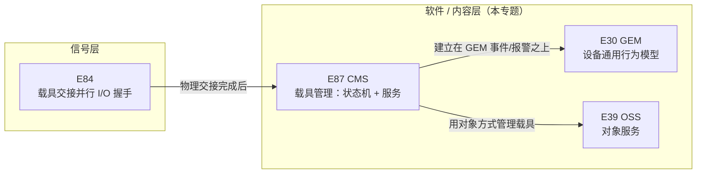
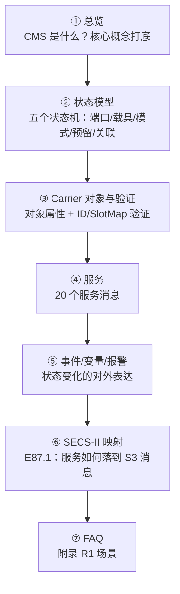

# 总览：`E87` 载具管理（`CMS`）

> **`E87`**（`SEMI` **`E87-0705`**，`Specification for Carrier Management`，**`CMS`**）规定 `Host` 视角下**载具（`Carrier`）在设备上的生命周期**：从 `Load Port` 装载/卸载、`CarrierID` 与 `Slot Map` 验证、访问模式切换，到内部缓冲（`Internal Buffer`）的进出。它是 `EFEM` 集成中"软件层"的核心——**`E84` 管"交接握手"（信号层），`E87` 管"载具状态"（软件层）**。

## 1. `E87` 的定位

`E87` 在标准家族中的位置

**要点：**

- **`E87` 管"载具状态"**：`FOUP` 在 `Load Port` 上处于什么状态、`CarrierID` 是否验证通过、`Slot Map` 是否正确、访问模式是手动还是自动——通过**状态模型 + 事件 + 服务**与 `Host` 交互。
- **`E87` 建立在 `GEM`（`E30`）之上**：事件上报、状态数据采集、设备常数、报警管理、设备控制都按 `E30` 实现（§6.2）。
- **`E87` 用对象模型（`E39`）管理载具**：`Carrier` 是一个对象，属性可通过 `GetAttr` 查询；服务消息按 `E39` 对象服务标准的约定定义（§7.1）。
- **`E84` 与 `E87` 是搭档**：`E84` 完成物理交接（信号握手），交接完成后 `E87` 管理载具状态并上报事件（见 [E84 总览](../e84/index.md)）。

## 2. 为什么需要 `E87`

大晶圆尺寸时代，`AMHS` 自动搬运 `FOUP` 越来越普遍。`Host` 需要知道：

- 哪个载具在哪个端口？（`Carrier` 与 `Load Port` 的关联）
- 载具的 `CarrierID` 与预期是否一致？（**验证**，防止送错）
- 载具里晶圆的位置是否正确？（`Slot Map` 验证，防止 `Cross Slot`/`Double Slot`）
- 端口现在是手动还是自动模式？（访问模式）

`E87` 用**状态模型 + 服务 + 事件**统一回答这些问题（§1.1、§2.2）。

## 3. 核心概念速览

| 概念 | 含义 |
| --- | --- |
| **载具**（`Carrier`） | 容纳晶圆的容器（`FOUP`、开放式 `Cassette` 等） |
| **`CarrierID`** | 载具的可读唯一标识 |
| **`Slot Map`** | 载具内各槽位（`Slot`）的晶圆位置信息（正确/错误放置） |
| **`Load Port`** | 设备上载具装载/卸载的接口位置（按 `E15.1`） |
| **访问模式**（`Access Mode`） | `MANUAL`（手动）或 `AUTO`（自动）——决定允许谁交接 |
| **内部缓冲**（`Internal Buffer`） | 设备内部的载具存放位置（非 `Load Port`），内部缓冲设备特有 |
| **验证**（`Verification`） | 实际值对比期望值（`CarrierID` 验证、`Slot Map` 验证） |

**两类设备配置**（§5.2.11、§5.2.14）：

| 类型 | 特点 |
| --- | --- |
| **固定缓冲设备**（`Fixed Buffer Equipment`） | 只有固定 `Load Port`，无内部缓冲；晶圆直接在端口处理 |
| **内部缓冲设备**（`Internal Buffer Equipment`） | 设备内部有缓冲位存放载具；`CarrierIn`/`CarrierOut` 服务进出缓冲 |

## 4. 标准正文结构

| 章节 | 内容 | 笔记对应页 |
| --- | --- | --- |
| §1-5 | 目的、范围、限制、引用标准、术语 | 本页 |
| §6-8 | 基于 `GEM` 的要求、对象约定、单连接要求 | 本页及各处 |
| §9 | `Load Port`（编号、传输状态模型） | [状态模型](state-models.md) |
| §10 | `Carrier` 对象（实例化、属性、状态模型） | [Carrier 对象与验证](carrier-object.md) |
| §11 | 访问模式状态模型 | [状态模型](state-models.md) |
| §12-13 | 预留状态模型、关联状态模型 | [状态模型](state-models.md) |
| §14 | `CarrierID` / `Slot Map` 验证 | [Carrier 对象与验证](carrier-object.md) |
| §15 | `Carrier` 释放控制（`CarrierHold`/`UnclampControl`） | [Carrier 对象与验证](carrier-object.md) |
| §16 | 服务定义（`Bind`/`CarrierOut`/`ProceedWithCarrier`…） | [服务](services.md) |
| §17 | `Carrier` 标签读写 | [服务](services.md) |
| §18-20 | 附加事件、变量数据、报警 | [事件/变量/报警](events-alarms.md) |
| §21 | 合规声明表 | [事件/变量/报警](events-alarms.md) |
| 附录 `R1` | `CarrierID` 派生、场景（`Normal Roundtrip` 等）、设备逻辑 | [FAQ](faq.md) |
| `E87.1` | `CMS` 的 `SECS-II` 协议映射（服务→`S3` 消息） | [SECS-II 映射](secs2-mapping.md) |

## 5. 阅读路线

- [**① 总览**](index.md)：`E87` 定位、核心概念、两类设备配置。
- [**② 状态模型**](state-models.md)：**五个状态模型**——`Load Port Transfer`、`Carrier`（三个并行子状态）、`Access Mode`、`Reservation`、`Association`。
- [**③ Carrier 对象与验证**](carrier-object.md)：`Carrier` 对象的实例化/销毁、属性表（`Capacity`、`ContentMap`、`SlotMap`…）、两种验证方法（设备侧/主机侧）。
- [**④ 服务**](services.md)：20 个服务消息逐一拆解（`Bind`、`CarrierNotification`、`ProceedWithCarrier`、`CancelCarrier`、`CarrierIn/Out`、`ReserveAtPort`、`ChangeAccess`…）。
- [**⑤ 事件/变量/报警**](events-alarms.md)：附加事件（`Carrier Clamped`、`CarrierLocationChange`…）、变量数据表、必备报警、合规声明表。
- [**⑥ SECS-II 映射**](secs2-mapping.md)：`E87.1`——服务映射到 `S3` 流消息、参数映射到 `SECS-II` 数据项、变量映射到 `DVVAL`/`SV`。
- [**⑦ FAQ**](faq.md)：附录 `R1` 的典型场景（`Normal Roundtrip`、异常验证、`Carrier-Out` 排队）与高频疑问。

## 6. 最小合规（§21 表 39）

**基础 `CMS` 要求**（必须实现）：

- `Load Port` 编号、`Carrier` 槽编号
- `Load Port Transfer` 状态模型
- `Carrier` 对象实现
- `Load Port` 预留状态模型（**内部缓冲设备**必须；固定缓冲设备可选）
- `Load Port`/`Carrier` 关联状态模型
- `CarrierID` 验证支持、`Slot Map` 验证支持
- 服务实现、附加事件实现、变量数据定义、报警实现

**附加 `CMS` 能力**（可选）：固定缓冲设备的预留状态模型、预留可见信号（`Reservation Visible Signal`）。
