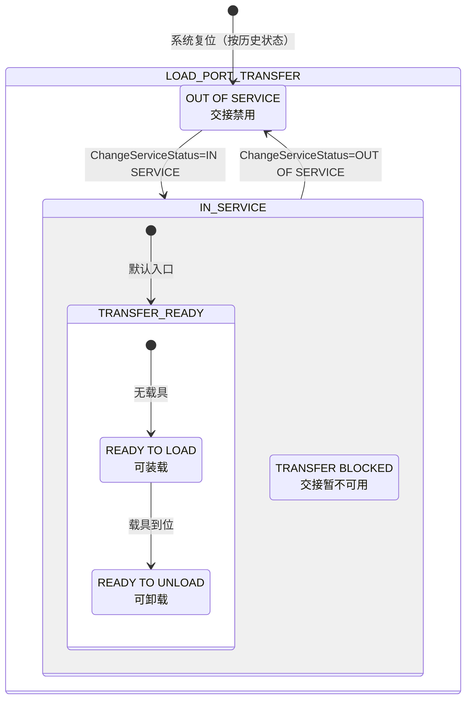
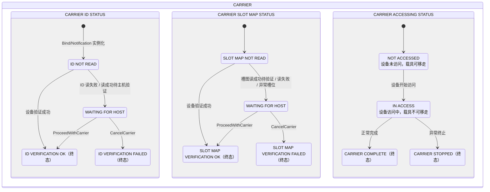
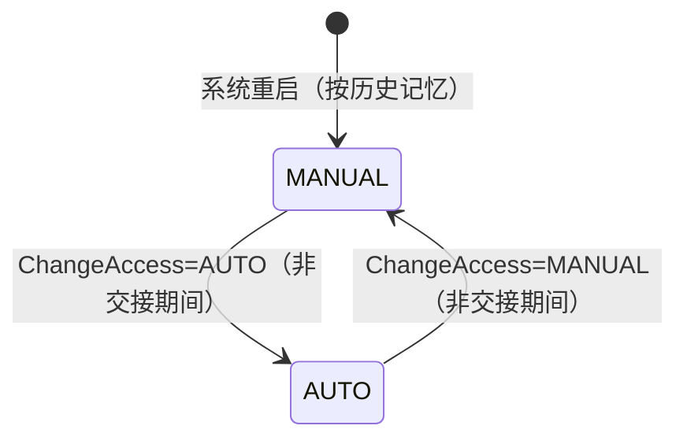
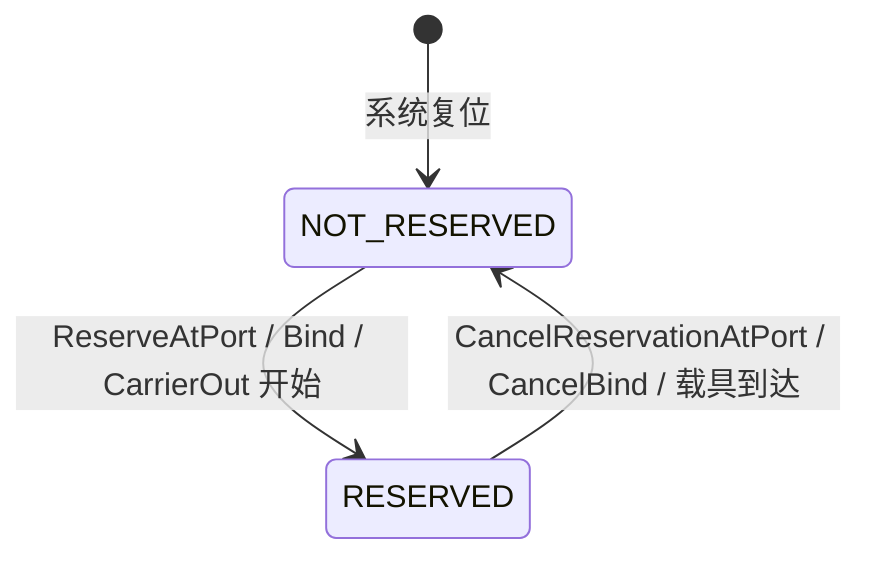
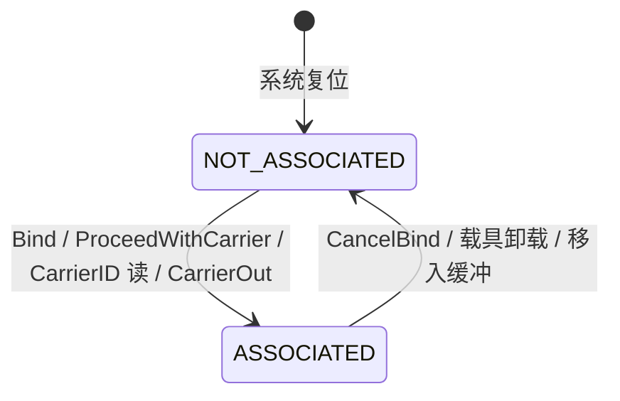
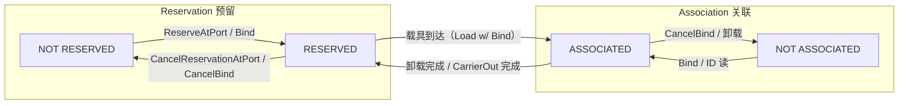

# 状态模型：载具管理的五个状态机

> `E87` 用**五个状态模型**描述 `Host` 视角的设备行为：**`Load Port` 传输**、**`Carrier`**（含三个并行子状态）、**访问模式**、**预留**、**关联**。每个 `Load Port`/`Carrier` 都维护独立实例；**每个状态迁移都必须对应一个唯一的采集事件**（§7.2.2.1）。

## 1. 五个模型的分工

| 状态模型 | 回答的问题 | 章节 | 实例 |
| --- | --- | --- | --- |
| `Load Port Transfer` | 端口能不能交接载具？ | §9.5 | 每个 `Load Port` 一个 |
| `Carrier` | 载具的 `ID` / 槽图 / 访问状态？ | §10.7 | 每个 `Carrier` 一个 |
| `Access Mode` | 端口是手动还是自动模式？ | §11 | 每个 `Load Port` 一个 |
| `Load Port Reservation` | 端口是否被预留？ | §12 | 每个 `Load Port` 一个 |
| `Load Port/Carrier Association` | 端口是否已关联载具？ | §13 | 每个 `Load Port` 一个 |

**通用规则**（§7.2.2）：

- 状态模型 = **状态图 + 状态定义 + 状态迁移表**（三要素）。
- 状态模型表示 **`Host` 视角**，不必然描述设备内部操作；设备把 `CMS` 迁移**顺序映射**为内部采集事件。
- 设备可加子状态，但**不得改变** `CMS` 定义的状态迁移。
- 迁移表列：`Transition number`、`Previous State`、`Trigger`、`New State`、`Actions`、`Comments`。

## 2. `Load Port Transfer` 状态模型（§9.5）

回答"这个端口现在能不能做载具交接"。

**状态定义**（§9.5.3）：

| 状态 | 含义 |
| --- | --- |
| `OUT OF SERVICE` | 端口交接被禁用；须转 `IN SERVICE` 才能继续使用 |
| `IN SERVICE` | 端口交接启用 |
| `TRANSFER READY` | 端口可交接（手动或自动、装载或卸载）；含两个子状态 |
| `READY TO LOAD` | 无载具在端口——可被装载外部载具或内部缓冲载具 |
| `READY TO UNLOAD` | 有载具在端口——可被卸载到物料搬运设备 |
| `TRANSFER BLOCKED` | 既非 `READY TO LOAD` 也非 `READY TO UNLOAD`；因端口相关活动进行中，暂不可交接 |

**关键迁移**（表 5，节选）：

| # | 前一状态 | 触发 | 新状态 |
| --- | --- | --- | --- |
| 1 | （无） | 系统复位 | `OUT OF SERVICE` 或 `IN SERVICE`（按复位前历史） |
| 2 | `OUT OF SERVICE` | `ChangeServiceStatus` = `IN SERVICE` | `IN SERVICE` |
| 3 | `IN SERVICE` | `ChangeServiceStatus` = `OUT OF SERVICE` | `OUT OF SERVICE`（之后使用端口产生报警） |
| 5 | `TRANSFER READY` | 进入（有载具 → `READY TO UNLOAD`；无载具 → `READY TO LOAD`） | 对应子状态 |
| 6 | `READY TO LOAD` | 手动：开始手动装载；自动：`PIO` `READY` 信号（`E84`）；内部缓冲：`CarrierOut` 服务开始 | `TRANSFER BLOCKED` |
| 7 | `READY TO UNLOAD` | 手动：开始手动卸载；自动：`PIO` `READY`（`E84`）；内部缓冲：`CarrierIn` 服务开始 | `TRANSFER BLOCKED` |
| 8 | `TRANSFER BLOCKED` | 卸载完成、端口空（自动：`PIO` `COMPT`；内部缓冲：载具移入缓冲且无排队 `CarrierOut`） | `READY TO LOAD` |
| 9 | `TRANSFER BLOCKED` | 加工完成 / `CancelCarrier`，载具回到装载/卸载位 | `READY TO UNLOAD` |
| 10 | `TRANSFER BLOCKED` | 交接失败（未装载/未卸载） | `TRANSFER READY` |

> 注意迁移 6/7 自动触发的 `PIO READY` 来自 `E84` 信号（见 [E84 信号定义](../e84/signals.md)）——`E87` 状态机与 `E84` 握手在此衔接。

## 3. `Carrier` 状态模型（§10.7）

回答"这个载具处于什么状态"——由**三个并行（`AND`）子状态**组成：

### 3.1 `CARRIER ID STATUS`（§10.7.3.3）

| 子状态 | 含义 |
| --- | --- |
| `ID NOT READ` | 设备尚未读到 `CarrierID`（`Bind`/`Notification` 实例化时的默认状态） |
| `WAITING FOR HOST` | `CarrierID` 已读（成功或失败），等待主机验证 |
| `ID VERIFICATION OK` | `ID` 被接受（设备或主机验证成功，或 `BypassReadID` 为真跳过读取）——**终态** |
| `ID VERIFICATION FAILED` | `ID` 验证失败（`CancelCarrier` 后）——**终态** |

**实例化的初始状态取决于信息来源**（§10.7.3.3）：

| 实例化方式 | 初始 `ID` 子状态 |
| --- | --- |
| `Bind` / `CarrierNotification` 提供 `CarrierID` | `ID NOT READ` |
| 载具 `ID` 读取器提供 | `WAITING FOR HOST` |
| `ProceedWithCarrier` | `ID VERIFICATION OK` |
| `CancelCarrier` | `ID VERIFICATION FAILED` |

### 3.2 `CARRIER SLOT MAP STATUS`（§10.7.3.4）

| 子状态 | 含义 |
| --- | --- |
| `SLOT MAP NOT READ` | 载具刚装上、槽图未读（默认入口） |
| `WAITING FOR HOST` | 槽图已读（或读失败、验证失败、异常槽位），等待主机 |
| `SLOT MAP VERIFICATION OK` | 槽图已验证——**终态** |
| `SLOT MAP VERIFICATION FAILED` | 槽图验证失败——**终态** |

**`Slot Map` 读取要求**（§10.7.5）：所有生产设备在从载具取晶圆**之前**必须读 `Slot Map`。

### 3.3 `CARRIER ACCESSING STATUS`（§10.7.3.2）

| 子状态 | 含义 |
| --- | --- |
| `NOT ACCESSED` | 设备尚未访问载具；**载具可移走**（默认入口） |
| `IN ACCESS` | 设备访问中（已开始未结束）；**载具不可移走** |
| `CARRIER COMPLETE` | 访问正常完成；载具应被移走——**终态** |
| `CARRIER STOPPED` | 访问异常终止；载具应被移走——**终态** |

> `CarrierAccessingStatus` 让 `Host` 知道载具能否被移走；内部缓冲设备可用它决定是否发 `CarrierOut`（§10.6.5）。

### 3.4 `Carrier` 对象的生命周期（§10.2、§10.7.4 迁移 21）

- **实例化**（创建对象）：`Bind` / `CarrierNotification` / `CarrierReCreate`（带 `PropertiesList`）；`CarrierID` 读取成功且无同 `ID` 对象；`ProceedWithCarrier`/`CancelCarrier`（在未关联端口，即 `ID` 读取失败场景）。
- **销毁**（对象终结）：载具卸载离机；`CancelBind` / `CancelCarrierNotification`；设备侧验证失败后设备自发 `CancelBind`；`CarrierReCreate` 重创建。

## 4. `Access Mode` 状态模型（§11）

每个 `Load Port` 一个，两个状态：

| 状态 | 含义（§11.3.3） |
| --- | --- |
| `MANUAL` | 只允许手动（非 `AMHS`）交接；尝试自动交接应产生报警；重复收到 `ChangeAccess=MANUAL` 接受但不发事件 |
| `AUTO` | 只允许自动（`AMHS`）交接；尝试手动交接应产生报警 |

**关键规则**：

- 访问模式**任何时候**都可由主机或操作员切换，**除非**该端口预留状态为 `RESERVED` 或正在载具交接（§11.1.2）。
- **交接边界**（表 8）决定何时允许切换：自动装载 = `PIO READY`（`E84`）到 `PIO COMPT`；手动装载的起止边界由用户配置（传感器、门、开关等）。
- **记忆性**：设备重启后访问模式**恢复为重启前模式**（§11.3.1）。
- 手动交接完成确认：设备厂商必须提供操作员告知设备"交接完成"的软/硬件机制（§11.2）。

## 5. `Load Port Reservation` 状态模型（§12）

回答"端口是否已被预留"：

| 状态 | 含义 |
| --- | --- |
| `NOT RESERVED` | 端口无预留 |
| `RESERVED` | 端口有未来活动预留；**此状态不可切换访问模式** |

**用途**（§12.1.1）：

1. 主机预告未来载具送达（不指定 `CarrierID`，走主机验证）；
2. 设备把操作员的未来送达通知给主机（主机未请求的 `AMHS` 送达）；
3. 内部缓冲设备告知主机"正在物理发起 `CarrierOut`"（已知 `ID`，勿调度 `AMHS`）；
4. `Bind` 触发 `NOT RESERVED → RESERVED`，`CancelBind` 触发反向。

**可见信号**（§12.2，可选）：预留时端口显示闪烁 `LED`/旗帜/颜色指示；`NOT RESERVED` 时熄灭。

**合规差异**：内部缓冲设备**必须**实现预留状态模型与服务；固定缓冲设备**可选**（§12.1.2/12.1.3）。

## 6. `Load Port/Carrier Association` 状态模型（§13）

回答"端口是否已与某个载具关联"：

| 状态 | 含义 |
| --- | --- |
| `NOT ASSOCIATED` | 端口无载具关联 |
| `ASSOCIATED` | 某 `CarrierID` 已关联该端口；端口不可再关联新载具 |

**关键迁移**（表 11）：

- `NOT ASSOCIATED → ASSOCIATED`：正常时 `Bind`（端口空）；异常时 `ProceedWithCarrier`（端口有载具）；或 `CarrierID` 读取时创建关联；或已知载具经 `CarrierOut` 装载。
- `ASSOCIATED → NOT ASSOCIATED`：`CancelBind`（载具到达前/交接开始前）；或载具被卸载/移入内部缓冲。
- **迁移 4**（`ASSOCIATED → ASSOCIATED`）：设备侧验证失败时，原 `Bind` 关联的 `ID` 被解除，换成载具上的新 `ID`，设备**暂停**等待 `CancelCarrier` 或 `ProceedWithCarrier`。

## 7. 状态模型之间的关系（图 6）

- **`Bind`** 同时触发：预留 `NOT RESERVED → RESERVED` + 关联 `NOT ASSOCIATED → ASSOCIATED` + `Carrier` 对象实例化。
- **`CancelBind`** 同时触发：预留 `RESERVED → NOT RESERVED` + 关联 `ASSOCIATED → NOT ASSOCIATED` + `Carrier` 对象销毁。
- **`CarrierOut` 开始**：端口 `TRANSFER BLOCKED` + 关联 `ASSOCIATED`。
- **载具到达**：预留 `RESERVED → NOT RESERVED`。

## 8. 与 `E84` / `E30` 的关系

- **与 `E84`**：`Load Port Transfer` 迁移 6/7 的自动触发（`PIO READY`）与迁移 8 的完成（`PIO COMPT`）直接引用 `E84` 信号（表 8、§9.5.4）。
- **与 `E30`**：所有状态迁移 = 采集事件（`Collection Event`），通过 `E30` 的事件上报机制发给主机；报警按 `E30` 报警管理实现（§6.2）。
